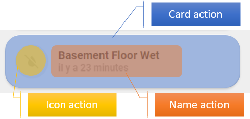

<!-- markdownlint-disable MD046 -->

## Customize tap, double-tap and hold actions

This 'theme' do offer support for customizing actions. Tap, double-tap and hold on different parts (card, icon and name) of the cards could be changed. To achieve this customization follow the instructions on this page.



To change the normal behaviour of tap_action, double_tap_action and hold_action, edit `custom_actions.yaml` file located under `/config/ui_lovelace_minimalist/custom_actions/`.

```yaml
---
ulm_custom_actions:
  variables:
    ulm_card_tap_action: "toggle"
    ulm_card_hold_action: "popup"
    ulm_card_double_tap_action: "more-info"
    ulm_icon_tap_action: "popup"
    ulm_icon_hold_action: "none"
    ulm_icon_double_tap_action: "none"
    ulm_name_tap_action: "more-info"
    ulm_name_hold_action: "toggle"
    ulm_name_double_tap_action: "popup"
```

Possible values for each variables are :

| Value     | Description                                                                                                                    |
| --------- | ------------------------------------------------------------------------------------------------------------------------------ |
| none      | No action                                                                                                                      |
| toggle    | Toggle an entity if available (for binary_sensor and sensor entity, `none` action is used)                                     |
| more-info | Display more-info window                                                                                                       |
| popup     | Display UI LOVELACE MINIMALIST popup if available and enabled on card (if not `more-info` action is used)                      |
| adaptive  | Switch UI LOVELACE MINIMALIST popup on adaptive dashboard<br> if current dashboard is adaptive (if not `popup` action is used) |
| navigate  | Navigate to an other UI LOVELACE MINIMALIST view. Need additional variable (see below)                                         |

## Haptic feedback

Next to the action also the haptic feedback of the actions can be configured in the `custom_actions.yaml` file:

For each action a haptic feedback could be configured:

```yaml
---
ulm_custom_actions:
  variables:
    ulm_card_tap_haptic: "medium"
    ulm_card_hold_haptic: "none"
    ulm_card_double_tap_haptic: "none"
    ulm_icon_tap_haptic: "none"
    ulm_icon_hold_haptic: "none"
    ulm_icon_double_tap_haptic: "none"
    ulm_name_tap_haptic: "medium"
    ulm_name_hold_haptic: "none"
    ulm_name_double_tap_haptic: "none"
```

Possible values for each variables (according to the underlying [button card](https://github.com/custom-cards/button-card)) are :

- `none`
- `success`
- `warning`
- `failure`
- `light`
- `medium`
- `heavy`
- `selection`

!!! tip "Reloading"

    Once you have edited `custom_actions.yaml` file, you must reload `"UI LOVELACE MINIMALIST"` configuration.
    Just go to `"Configuration" --> "Settings"` in Home Assistant and press the `"UI_LOVELACE_MINIMALIST"` button within the "YAML configuration reloading" section.

## Navigate action

To define the path of `navigate` action, add one of the following depending on your action :

- ulm_card_tap_navigate_path
- ulm_card_hold_navigate_path
- ulm_card_double_tap_navigate_path
- ulm_icon_tap_navigate_path
- ulm_icon_hold_navigate_path
- ulm_icon_double_tap_navigate_path
- ulm_name_tap_navigate_path
- ulm_name_hold_navigate_path
- ulm_name_double_tap_navigate_path

```yaml
- type: "custom:button-card"
  template: "card_cover"
  entity: "cover.somfy_portail"
  variables:
    ulm_name_hold_action: "navigate"
    ulm_name_hold_navigate_path: "/adaptive-dash/Livingroom"
```

## Call service action

It is possible to call a service using the custom actions on the icon, name and card.

To define the service and its data of `call-service` action, add one of the following
variables depending on your action :

- ulm_card_tap_service / ulm_card_tap_service_data
- ulm_card_hold_service / ulm_card_hold_service_data
- ulm_card_double_tap_service / ulm_card_double_tap_service_data
- ulm_icon_tap_service / ulm_icon_tap_service_data
- ulm_icon_hold_service / ulm_icon_hold_service_data
- ulm_icon_double_tap_service / ulm_icon_double_tap_service_data
- ulm_name_tap_service / ulm_name_tap_service_data
- ulm_name_hold_service / ulm_name_hold_service_data
- ulm_name_double_tap_service / ulm_name_double_tap_service_data

The following configuration shows the configuration of a service call using the
tap action.

```yaml
- type: "custom:button-card"
  template: "card_cover"
  entity: "cover.somfy_portail"
  variables:
    ulm_name_tap_action: "call-service"
    ulm_name_tap_service: "light.toggle"
    ulm_name_tap_service_data:
      entity_id: light.light_livingroom_2
```

## Overwrite custom actions

When creating a dashboard, custom actions and the haptic feedback can be overwritten on your card definition.
For example, this code will overwrite the tap action on card with `more-info` action :

```yaml
- type: "custom:button-card"
  template: "card_cover"
  entity: "cover.somfy_portail"
  variables:
    ulm_card_tap_action: "more-info"
    ulm_card_tap_haptic: "success"
```

## Custom Popups

The implementation of the custom action now supports the configuration of individual popups. The custom popup
can be easily configured for each card.

To enable a custom popup the variable `ulm_custom_popup` must be set within the card.
This variable have three subvariables `template`, `entity` and `popup_variables`. The template must be the name of the
template that should be loaded. The necessary configuration variables for the popup can be configured in
the variable `popup_variables`.

Usually the popup uses the same entity as the card that calls the popup. It is also possible to overwrite the entity
for the popup. Therefore the entity can be set using the `entity` variable
within the `ulm_custom_popup`. This `entity` variable is optional. It is also possible to disable the entity of the
custom popup it the `entity` variable within the `ulm_custom_popup is set to`none`.

```yaml
- type: "custom:button-card"
  template: card_power_outlet
  entity: switch.power_outlet_livingroom
  variables:
    ulm_card_power_outlet_consumption_sensor: sensor.power_outlet_livingroom_consumption
    ulm_card_power_outlet_name: Power Outlet Livingroom
    ulm_custom_popup:
      template: "popup_power_outlet_stats"
      entity: switch.power_outlet_livingroom
      popup_variables:
        ulm_popup_power_outlet_sensor1: sensor.power_outlet_livingroom
        ulm_popup_power_outlet_sensor2: sensor.power_outlet_livingroom_consumption
        ulm_popup_power_outlet_graph_sensor: sensor.power_outlet_livingroom
        ulm_popup_power_outlet_entity: switch.power_outlet_livingroom
```

The available popup templates `popup_media_player_infos`, `popup_light_brightness`, `popup_thermostat_temperature`
or `popup_power_outlet_stats` can already be used with the custom popups.

This implementation allows the easy creation of custom popups that can be loaded by other cards.

!!! note "Light, Media Player, Thermostat"

    The `card_light`, `card_media_player` and `card_thermostat` uses a different approach. Therefore the popup can
    be simply enabled by setting one of the variables  `ulm_card_light_enable_popup`, `ulm_card_thermostat_enable_popup`
    or  `ulm_card_media_player_enable_popup` to true.

## For developers

To enable action customization on your custom cards, use either the `icon_more_info_new`, `icon_more_info_alert` or
the `extended_card` template. There is no need to implement the `ulm_card_actions` template anymore.

There are three possibilities to include the custom actions into your custom cards:

### Use template `extend_card` as combination of two cards

The simplest way to create a custom card that uses these custom actions is the combination of two cards.

For enabling the feature the custom card must implement the template `extended_card`.
Then two custom fields must be used:

- `item1` must be a card that already implements the template `icon_more_info_new`.
  Most of the core cards already implements this template.
- `item2` can be any Lovelace card that should extend the card.

If you add custom styles to `item2` then following code should be added into the `style` field

```javascript
ha-card {
  box-shadow: none;
  border-radius: var(--border-radius);
}
```

The already available **Graph card** (`card_graph`) is an example for this implementation. As
`item1` a `generic_card` is used. The `item2` provides a mini-graph-card.

??? note "Graph card as example"

    ```yaml title="card_binary_sensor_alert.yaml"
    --8<-- "custom_components/ui_lovelace_minimalist/lovelace/ulm_templates/card_templates/2-line_cards/card_graph.yaml"
    ```

### Use template `icon_more_info_new` or `icon_more_info_alert`

The card must implement the template `icon_more_info_new`or `icon_more_info_alert`. Then it must implement a custom field
`item1` which is also a `custom:button-card`. This card must have the custom fields `item1`which represents the icon and
`item2`which represents the name.

Most of the internal card templates uses this option. Take a look into the code.

??? note "Generic card as example"

    ```yaml title="card_binary_sensor_alert.yaml"
    --8<-- "custom_components/ui_lovelace_minimalist/lovelace/ulm_templates/card_templates/cards/card_generic.yaml"
    ```

### Use template `ulm_actions_card_overlay`

If you implement a custom card that is based on another Lovelace card like the
[weather card](https://ui-lovelace-minimalist.github.io/UI/usage/cards/card_weather/) you can simply enable custom
card actions by using the template `ulm_actions_card_overlay` on the card. This template adds an overlay over the whole card and
reaction on the tap, hold, double tap actions. It also enables the integration of custom popups for the card.
Actions of the underlying card will be disabled by this method.

The [weather card](https://ui-lovelace-minimalist.github.io/UI/usage/cards/card_weather/) gives you an example and
will show the usage of this method.

### Individual implementation

The following script shows the usage off all necessary variables and template that will be used by the custom actions.

The card must implement the templates `ulm_custom_actions` and `ulm_action_card` in the correct order.
The example shows the custom fields `item1` that implements the redirection of an icon field and `item2` that implements the
redirecton of a name field.

```yaml
---
custom_card:
  template:
    - "ulm_custom_actions"
    - "ulm_actions_card"
  custom_fields:
    item1:
      card:
        type: "custom:button-card"
        entity: "[[[ return entity.entity_id ]]]"
        template:
          - "ulm_actions_icon"
        variables:
          ulm_input_select_option: "[[[ return variables.ulm_input_select_option; ]]]"
          ulm_input_select: "[[[ return variables.ulm_input_select; ]]]"
          ulm_icon_tap_action: "[[[ return variables.ulm_icon_tap_action; ]]]"
          ulm_icon_tap_haptic: "[[[ return variables.ulm_icon_tap_haptic; ]]]"
          ulm_icon_tap_navigate_path: "[[[ return variables.ulm_icon_tap_navigate_path; ]]]"
          ulm_icon_tap_service: "[[[ return variables.ulm_icon_tap_service; ]]]"
          ulm_icon_tap_service_data: "[[[ return variables.ulm_icon_tap_service_data]]]"
          ulm_icon_hold_action: "[[[ return variables.ulm_icon_hold_action; ]]]"
          ulm_icon_hold_haptic: "[[[ return variables.ulm_icon_hold_haptic; ]]]"
          ulm_icon_hold_navigate_path: "[[[ return variables.ulm_icon_hold_navigate_path; ]]]"
          ulm_icon_hold_service: "[[[ return variables.ulm_icon_hold_service; ]]]"
          ulm_icon_hold_service_data: "[[[ return variables.ulm_icon_hold_service_data]]]"
          ulm_icon_double_tap_action: "[[[ return variables.ulm_icon_double_tap_action; ]]]"
          ulm_icon_double_tap_haptic: "[[[ return variables.ulm_icon_double_tap_haptic; ]]]"
          ulm_icon_double_tap_navigate_path: "[[[ return variables.ulm_icon_double_tap_navigate_path; ]]]"
          ulm_icon_double_tap_service: "[[[ return variables.ulm_icon_double_tap_service; ]]]"
          ulm_icon_double_tap_service_data: "[[[ return variables.ulm_icon_double_tap_service_data]]]"
          ulm_custom_popup: "[[[ return variables.ulm_custom_popup; ]]]"
    item2:
      card:
        type: "custom:button-card"
        entity: "[[[ return entity.entity_id ]]]"
        template:
          - "ulm_actions_name"
        variables:
          ulm_input_select_option: "[[[ return variables.ulm_input_select_option; ]]]"
          ulm_input_select: "[[[ return variables.ulm_input_select; ]]]"
          ulm_name_tap_action: "[[[ return variables.ulm_name_tap_action; ]]]"
          ulm_name_tap_haptic: "[[[ return variables.ulm_name_tap_haptic; ]]]"
          ulm_name_tap_navigate_path: "[[[ return variables.ulm_name_tap_navigate_path; ]]]"
          ulm_name_tap_service: "[[[ return variables.ulm_name_tap_service; ]]]"
          ulm_name_tap_service_data: "[[[ return variables.ulm_name_tap_service_data]]]"
          ulm_name_hold_action: "[[[ return variables.ulm_name_hold_action; ]]]"
          ulm_name_hold_haptic: "[[[ return variables.ulm_name_hold_haptic; ]]]"
          ulm_name_hold_navigate_path: "[[[ return variables.ulm_name_hold_navigate_path; ]]]"
          ulm_name_hold_service: "[[[ return variables.ulm_name_hold_service; ]]]"
          ulm_name_hold_service_data: "[[[ return variables.ulm_name_hold_service_data]]]"
          ulm_name_double_tap_action: "[[[ return variables.ulm_name_double_tap_action; ]]]"
          ulm_name_double_tap_haptic: "[[[ return variables.ulm_name_double_tap_haptic; ]]]"
          ulm_name_double_tap_navigate_path: "[[[ return variables.ulm_name_double_tap_navigate_path; ]]]"
          ulm_name_double_tap_service: "[[[ return variables.ulm_name_double_tap_service; ]]]"
          ulm_name_double_tap_service_data: "[[[ return variables.ulm_name_double_tap_service_data]]]"
          ulm_custom_popup: "[[[ return variables.ulm_custom_popup; ]]]"
```

!!! tip "For developes who have already implemented the custom actions on their card"

    There could be some breaking changes:

    - The custom card should either implement the `icon_more_info_new` or the `extended_card`
    - The template ulm_actions_card can be removed
    - The variable redirections for the ulm_*_action can be removed

    Also the custom popup feature has some breaking changes:
    The variables `ulm_card_light_enable_popup`, `ulm_card_thermostat_enable_popup` and  `ulm_card_media_player_enable_popup`
    aren't used internally anymore. The are only working on their appropriate cards as configuration option for the end user
    of the card. So the custom_popup variable should be used instead.

## For developers of custom popups

Custom popups must be a `custom:button-card`. It is also recommended to disable the icon, name and label within the
card configuration using

```yaml
show_icon: false
show_name: false
show_label: false
show_units: false
```

The usage of variables within the popup have some restrictions. Default variables of the popup don't work in the same
way as for other custom button cards. The default variables -- defined in the variables section -- will always be overwritten by
the custom actions caller.

The following code won't work on custom popup cards:

```yaml
popup_weather_forecast:
---
variables:
  ulm_weather_popup_surpress_first_forecast: false
```

Instead of using the variables section of the card the variables must be checked within a JavaScript template. The following
code shows an example how to check and define a default value of custom popup variable:

```yaml
element: >
  [[[
    let surpress_first_forecast = ('ulm_weather_popup_surpress_first_forecast' in variables) ? variables.ulm_weather_popup_surpress_first_forecast : false;

    if (surpress_first_forecast) {
      ...
    }

    return surpress_first_forecast;
  ]]]
```

The code checks if the variable is available before reading from the variable and if the variable isn't available it will set a default value.
