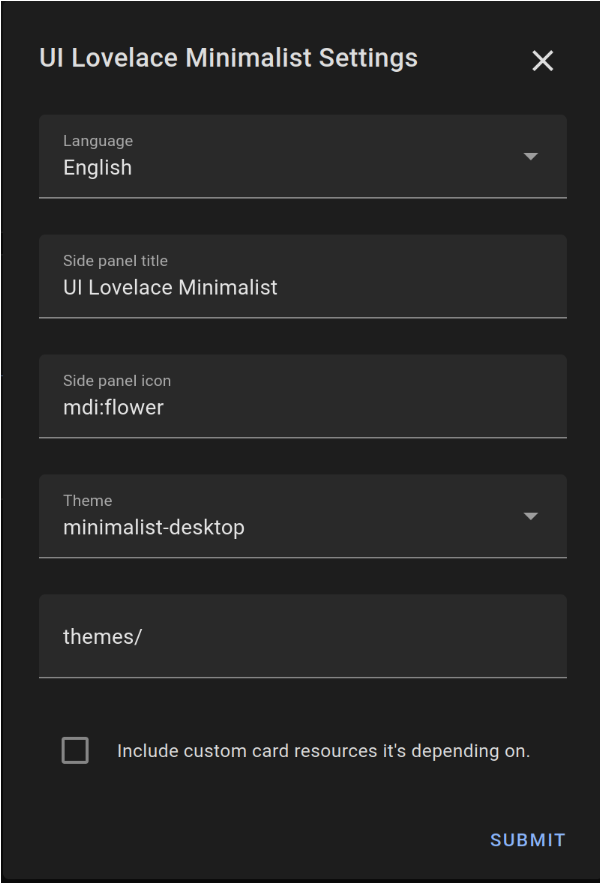

<!-- markdownlint-disable MD046 -->

## Install Integration

Open your Home Assistant instance and start setting up by following these steps:

- Navigate to "Settings" --> "Devices & Services"
- Click "+ Add Integration"
- Search for and select -> "UI Lovelace Minimalist"

Or you can use the My Home Assistant Button below.

!!! danger "Unsaved Settings"

    Currently the settings are not stored between initial setup and the settings after installation. After installation the settings drop back to their default values. This bug is reported and looked at.

[](https://my.home-assistant.io/redirect/config_flow_start/?domain=ui_lovelace_minimalist){ height="250" }

Now you can configure the Integration, you can do this also after it's installed!



- _Language_: Will set the language for the Integration.
- _Enable creation of a Dashboard entry in the Side panel_: If you want to add an Entry in the Side Panel for the auto generated Dashboard. (Still under heavy development!)
- _Side panel title_: Will set the title for the Lovelace Dashboard in the Sidebar.
- _Side panel icon_: Which icon to put in front of the Title.
- _Enable adaptive Dashboard with popup splitview_: Creates an entry for the [adaptive dashboard](adaptive_dash.md)
- _Adaptive panel title_: Will set the title for the adaptive dashboard in the Sidebar.
- _Adaptive panel icon_: Which icon to put in front of the adaptive dashboard sidebar entry.
- _Theme_: Choose a theme of your choice (Note: Both themes will be installed anyway and can be customized later if needed.)

!!! note ""

    Currently, it may happen that themes are not automatically selected correctly for you in all cases automatically. Please make sure that the minimalist theme is correctly selected in your Home Assistant settings (click on your profile picture in Home Assistant, bottom left).

- _Theme path_: Make sure this is set to the same path as is configured in your `configuration.yaml` (default: `themes/`)

!!! note ""

    Please make sure that you have included this themes/ folder in your `configuration.yaml` in the [frontend settings](https://www.home-assistant.io/integrations/frontend/). Unfortunately, this is something that the HACS integration cannot do for you. If you use the themes/ folder, your entry in `configuration.yaml` must look like this for example:

    ```yaml
    frontend:
      themes: !include_dir_merge_named themes
    ```

    You will also need to change your user theme to the chosen theme or else no visual modifications will work.

- _Include Custom Cards_: This will make sure almost all dependency cards are included and configured for you.

!!! danger ""

    Activate **"Include Custom Cards"** only if you have not already installed the required Lovelace resources yourself, or if you dont want to install them by yourself. Otherwise this can currently lead to a freeze of the frontend due to double loaded lovelace resources.

| Included lovelace resources                                                    |
| ------------------------------------------------------------------------------ |
| [`button-card`](https://github.com/custom-cards/button-card)                   |
| [`lovelace-card-mod`](https://github.com/thomasloven/lovelace-card-mod)        |
| [`mini-graph-card`](https://github.com/kalkih/mini-graph-card)                 |
| [`mini-media-player`](https://github.com/kalkih/mini-media-player)             |
| [`my-cards-slider-card`](https://github.com/AnthonMS/my-cards)                 |
| [`light-entity-card`](https://github.com/ljmerza/light-entity-card)            |
| [`auto-entities`](https://github.com/thomasloven/lovelace-auto-entities)       |
| [`simple-weather-card`](https://github.com/kalkih/simple-weather-card)         |
| [`weather-radar-card`](https://github.com/Makin-Things/weather-radar-card)     |
| [`lovelace-layout-card`](https://github.com/thomasloven/lovelace-layout-card)  |
| [`lovelace-state-swtch`](https://github.com/thomasloven/lovelace-state-switch) |

- _Select Community Cards you want to enable_: Selected [custom cards](custom_cards.md) will be downloaded automatically to enable usage. Requires a GitHub account. Restart or reload your configuration after toggling this setting. If needed, a notification will appear, indicating that GitHub needs to be set up. You will be prompted to go to your integrations and to reconfigure this integration. Selecting "reconfigure" on your Lovelace Minimalist UI integration, the GitHub-Login-flow will start. You might need to restart HomeAssistant, when your selected community cards change.

Hit submit and in the Sidebar a new Dashboard entry should appear.
A new file for the dashboard configuration, with a small example, where you can generate your own layout should have been created under that location:

```yaml
config
└── ui_lovelace_minimalist
├── custom_cards
└── dashboard
└── ui-lovelace.yaml
```

In case you want to use your own ui-lovelace files go to [Configuration](../configuration).
