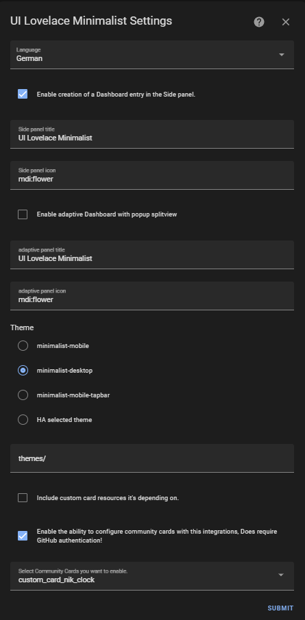

## Install Integration

Open your Home Assistant instance and start setting up "UI Lovelace Minimalist" under "Configuration" --> "Devices & Services". Or you can use the My Home Assistant Button bellow.

[](https://my.home-assistant.io/redirect/config_flow_start/?domain=ui_lovelace_minimalist){ height="250" }

Now you can configure the Integration, you can do this also after it's installed!



- Language: Will set the language for the Integration.
- Side panel title: Will set the title for the Lovelace Dashboard in the Sidebar.
- Side panel icon: Which icon to put in front of the Title.
- Theme: Choose a theme of your choice (Note: Both themes will be installed anyway and can be customized later if needed.)
- Theme path: Make sure this is set to the same path as is configured in your `configuration.yaml` (default: `/themes`)
- Include Custom Cards: This will make sure almost all dependency cards are included and configured for you.

| Included lovelace resources                                             |
|-------------------------------------------------------------------------|
| [`button-card`](https://github.com/custom-cards/button-card)            |
| [`lovelace-card-mod`](https://github.com/thomasloven/lovelace-card-mod) |
| [`mini-graph-card`](https://github.com/kalkih/mini-graph-card)          |
| [`mini-media-player`](https://github.com/kalkih/mini-media-player)      |
| [`my-cards-slider-card`](https://github.com/AnthonMS/my-cards)          |
| [`light-entity-card`](https://github.com/ljmerza/light-entity-card)     |

Hit submit and in the Sidebar a new Dashboard entry should appear.
A new file for the dashboard configuration, with a small example, where you can generate your own layout should have been created under that location:

```yaml
config
└── ui_lovelace_minimalist
    ├── config
    ├── custom_cards
    └── dashboard
        └── ui-lovelace.yaml
```

In case you want to use your own ui-lovelace files go to [Configuration](../configuration).
