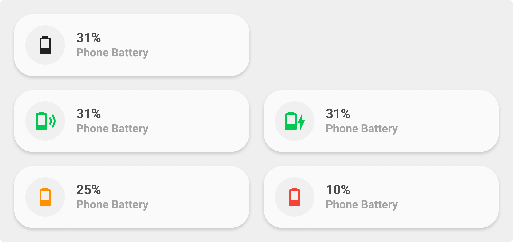

<!-- markdownlint-disable MD046 -->

## Description

{ width="500" }

Charging animation if `ulm_card_battery_charging_animation` is true:


The `battery-card` is a slightly enhanced `generic-card`, that can indicate whether and how a device is being charged and colors the icon based on the battery level.

## Variables

| Variable                                     | Default              | Required         | Notes                                                                                                                                                                                                                                                                                                               |
| -------------------------------------------- | -------------------- | ---------------- | ------------------------------------------------------------------------------------------------------------------------------------------------------------------------------------------------------------------------------------------------------------------------------------------------------------------- |
| entity                                       |                      | :material-check: | This is your battery entity                                                                                                                                                                                                                                                                                         |
| ulm_card_battery_name                        | `friendly_name`      | :material-close: | Customize name                                                                                                                                                                                                                                                                                                      |
| ulm_card_battery_attribute                   |                      | :material-close: | If your entity provides the battery percent in an attribute (= not as an own sensor), fill in the attribute's name here. E.g. if you have `sensor.livingroom_thermometer` and the attribute for your battery power is `sensor.livingroom_thermometer.attributes.battery_percent`, you fill in battery_percent here. |
| ulm_card_battery_battery_state_entity_id     |                      | :material-close: | Entity that holds the battery state (charging/discharging). If provided, the Icon will display the current status.                                                                                                                                                                                                  |
| ulm_card_battery_charger_type_entity_id      |                      | :material-close: | Entity that holds the charger type (ac/wireless/none). This Entity replaces the need for the `ulm_card_battery_battery_state_entity_id` entity. If provided, the Icon will display the current charger type. This is only useful if you charge your devices Wireless and with cable.                                |
| ulm_card_battery_charging_animation          | `false`              | :material-close: | Weather to show charging animation or not. If set to `true`, `ulm_card_battery_battery_state_entity_id` needs to be defined and `ulm_card_battery_charger_type_entity_id` will be ignored.                                                                                                                          |
| ulm_card_battery_battery_level_danger        |                      | :material-check: | Changes the color of the Icon, if the battery level falls below the provided value. Must be higher than `ulm_card_battery_battery_level_waring`                                                                                                                                                                     |
| ulm_card_battery_battery_level_waring        |                      | :material-check: | Changes the color of the Icon, if the battery level falls below the provided value.                                                                                                                                                                                                                                 |
| ulm_card_battery_color_battery_level_danger  | var(--google-red)    | :material-close: | Color of icon if battery level is within the 'danger' zone.                                                                                                                                                                                                                                                         |
| ulm_card_battery_color_battery_level_warning | var(--google-yellow) | :material-close: | Color of icon if battery level is within the 'warning' zone.                                                                                                                                                                                                                                                        |
| ulm_card_battery_color_battery_level_ok      | var(--google-green)  | :material-close: | Color of icon if battery level is not within the 'danger' or 'warning' zone.                                                                                                                                                                                                                                        |

## Usage

```yaml
- type: "custom:button-card"
  template: card_battery
  entity: sensor.battery_level
  variables:
    ulm_card_battery_charger_type_entity_id: sensor.battery_level
    ulm_card_battery_battery_level_danger: 30
    ulm_card_battery_battery_level_warning: 80
    ulm_card_battery_name: Smartphone
```

??? note "Template Code"

    ```yaml title="card_battery.yaml"
    --8<-- "custom_components/ui_lovelace_minimalist/lovelace/ulm_templates/card_templates/cards/card_battery.yaml"
    ```
