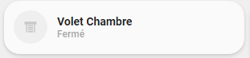
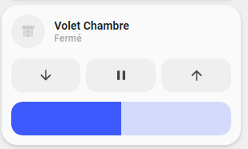
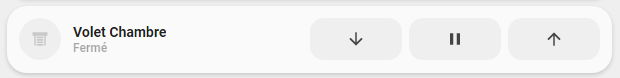

<!-- markdownlint-disable MD046 -->

## Description

{ width="500" }
{ width="500" }
{ width="500" }

With the `cover-card` you have the state of your cover. Optionally, on the second line, OPEN / PAUSE / CLOSE to control it and/or a slider to control position.

!!! warning
This card has backward compatibility with older template except custom name. It means variable `ulm_card_cover_buttons_name` must be replaced by `ulm_card_cover_name`.

## Variables

| Variable/Entity                       | Default         | Required         | Notes                                                            | Requirement                                                                         |
| ------------------------------------- | --------------- | ---------------- | ---------------------------------------------------------------- | ----------------------------------------------------------------------------------- |
| entity                                |                 | :material-check: | Your HA entity                                                   |                                                                                     |
| ulm_card_cover_name                   | `friendly_name` | :material-close: | Customize name                                                   |                                                                                     |
| ulm_card_cover_icon                   |                 | :material-close: | Customize icon                                                   |                                                                                     |
| ulm_card_invert_percent               | `false`         | :material-close: | Invert the Percentage (100% = Closed)                            |                                                                                     |
| ulm_card_cover_display_left_right     | `false`         | :material-close: | Display left right control button                                |                                                                                     |
| ulm_card_cover_garage_large           | `false`         | :material-close: | Display variant garage icon for garage cover                     | Only if `device_class = 'garage`                                                    |
| ulm_card_cover_enable_controls        | `false`         | :material-close: | Enable control buttons                                           |                                                                                     |
| ulm_card_cover_enable_slider          | `false`         | :material-close: | Enable slider                                                    |                                                                                     |
| ulm_card_cover_enable_horizontal      | `false`         | :material-close: | Enable horizontal card                                           | Need `ulm_card_cover_enable_controls: true` or `ulm_card_cover_enable_slider: true` |
| ulm_card_cover_favorite_percentage    | `false`         | :material-close: | Display favorite button to jump to preset position               | enter number                                                                        |
| ulm_card_cover_enable_tilt            | `false`         | :material-close: | Display angled buttons for Venetian blind tilt                   |                                                                                     |
| ulm_card_cover_enable_popup           | `false`         | :material-close: | Enable `popup_cover`                                             |                                                                                     |
| ulm_card_cover_slider_min             | `0`             | :material-close: | Set Minimum Slider Value                                         |                                                                                     |
| ulm_card_cover_slider_max             | `100`           | :material-close: | Set Maximum Slider Value                                         |                                                                                     |
| ulm_card_cover_color                  | `blue`          | :material-close: | Set Custom Color                                                 |                                                                                     |
| ulm_card_cover_force_background_color | `false`         | :material-close: | Set `ulm_card_cover_color` as background color in active state ` |                                                                                     |

## Usage

```yaml
- type: "custom:button-card"
  template: card_cover
  entity: cover.window
  variables:
    ulm_card_cover_enable_controls: true
    ulm_card_cover_enable_slider: true
    ulm_card_cover_favorite_percentage: 45
    ulm_card_cover_color: "green"
```

??? note "Template Code"

    ```yaml title="card_cover_buttons.yaml"
    --8<-- "custom_components/ui_lovelace_minimalist/lovelace/ulm_templates/card_templates/cards/card_cover.yaml"
    ```
