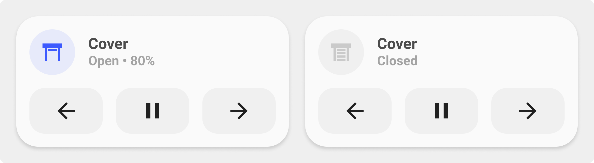

<!-- markdownlint-disable MD046 -->

## Description

{ width="500" }

With the `cover-card` you have the state of your cover and on the second line UP / PAUSE / DOWN to control it.

## Variables

| Variable | Default | Required         | Notes             |
|----------|---------|------------------|-------------------|
| entity     |         | :material-check: | The entity_id of your cover |
| name |         | :material-close: | The name of your cover entity |

## Usage

```yaml
- type: 'custom:button-card'
  template: card_cover_buttons
  entity: cover.livingroom_window
  name: "Cover Livingroom Window"
```

??? note "Template Code"

    ```yaml title="card_cover_buttons.yaml"
    --8<-- "custom_components/ui_lovelace_minimalist/lovelace/ulm_templates/card_templates/2-line_cards/card_cover_buttons.yaml"
    ```
