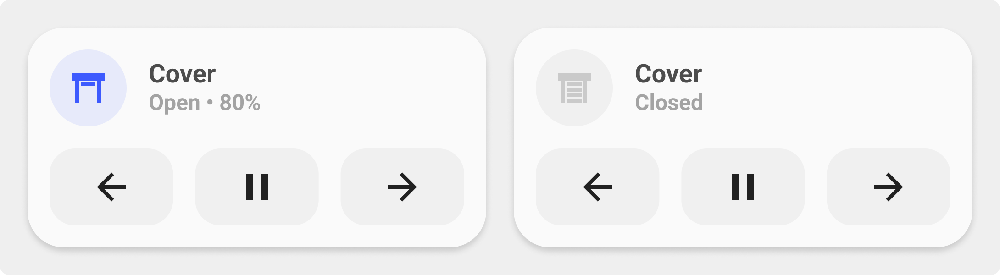

<!-- markdownlint-disable MD046 -->

## Description

{ width="500" }

With the `cover-card` you have the state of your cover and on the second line UP / PAUSE / DOWN to control it.

## Variables

| Variable | Default | Required         | Notes             |
|----------|---------|------------------|-------------------|
| name     |         | :material-check: |                   |
|background| `true`  | :material-close: | Enable background |

## Usage

```yaml
- type: "custom:button-card"
  template: example
```

??? note "Template Code"

    ```yaml title="card_light.yaml"
    --8<-- "custom_components/ui_lovelace_minimalist/lovelace/ulm_templates/card_templates/2-line_cards/card_cover_with_buttons.yaml"
    ```
