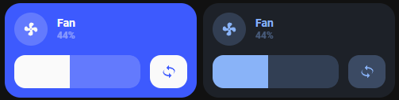

<!-- markdownlint-disable MD046 -->

## Description

This is the `fan-card`, used to toggle a fan entity.
Shows state of the fan and, if available, percentage and humidity in %.

This is a new card based off of the Sexel Fan Custom Card.
Rather than deprecate and many breaking changes on that card for users, this new card can be used as an alternative.

#### Light theme


#### Dark theme



## Variables

<table>
  <tr>
    <th>Variable</th>
    <th>Example</th>
    <th>Required</th>
    <th>Explanation</th>
  </tr>
  <tr>
    <td>entity</td>
    <td>fan.smart_fan</td>
    <td>yes</td>
    <td>Fan entity</td>
  </tr>
  <tr>
    <td>ulm_card_fan_name</td>
    <td>Fan</td>
    <td>no</td>
    <td>Name to show. If not specified the attribute <i>friendly_name</i> is shown instead</td>
  </tr>
  <tr>
    <td>ulm_card_fan_icon</td>
    <td>Fan</td>
    <td>no</td>
    <td>Icon to show. If not specified the attribute <i>icon</i> is shown instead</td>
  </tr>
  <tr>
    <td>ulm_card_fan_enable_horizontal</td>
    <td>true</td>
    <td>no</td>
    <td>true/false if the card should be horizontal. Default: false</td>
  </tr>
  <tr>
    <td>ulm_card_fan_enable_collapse</td>
    <td>true</td>
    <td>no</td>
    <td>true/false if the fan speed row should collapse when the fan is turned off. Default: false</td>
  </tr>
  <tr>
    <td>ulm_card_fan_color</td>
    <td>blue</td>
    <td>no</td>
    <td>Custom Color for the Card. default: "blue"</td>
  </tr>
  <tr>
    <td>ulm_card_fan_force_background_color</td>
    <td>true</td>
    <td>no</td>
    <td>true/false if the card should force the background color, not just in dark mode."</td>
  </tr>
  <tr>
    <td>ulm_card_fan_enable_button</td>
    <td>true</td>
    <td>no</td>
    <td>true/false if the card should show a button next to the slider for turning Oscillation on/off."</td>
  </tr>
</table>

### Others

    ulm_card_fan_enable_slider: false
    ulm_card_fan_slider_min: 0
    ulm_card_fan_slider_max: 100
    ulm_card_fan_enable_button: false
    ulm_card_fan_temp_attribute: "temp"
    ulm_card_fan_hum_attribute: "hum"

## Usage

```yaml
- type: "custom:button-card"
  template: card_fan
  entity: fan.bedroom
  variables:
    ulm_card_fan_enable_slider: true
    ulm_card_fan_color: "blue"
    ulm_card_fan_force_background_color: true
```

??? note "Template Code"

    ```yaml title="card_fan.yaml"
    --8<-- "custom_components/ui_lovelace_minimalist/lovelace/ulm_templates/card_templates/cards/card_fan.yaml"
    ```
