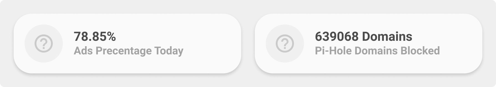

<!-- markdownlint-disable MD046 -->

## Description

{ width="500" }

This is the `generic-card` to display values from a sensor, eg. to show humidity, your next waste collection date or whatever sensor value is provided.

## Variables

| Variable                                | Default | Required         | Notes                                                              |
| --------------------------------------- | ------- | ---------------- | ------------------------------------------------------------------ |
| entity                                  |         | :material-check: |                                                                    |
| ulm_card_generic_name                   |         | :material-close: | Set custom Name                                                    |
| ulm_card_generic_icon                   |         | :material-close: | Set custom Icon                                                    |
| ulm_card_generic_color                  | `blue`  | :material-close: | Set Custom Color                                                   |
| ulm_card_generic_force_background_color | `false` | :material-close: | Set `ulm_card_generic_color` as background color in active state ` |

## Usage

```yaml
- type: "custom:button-card"
  template: card_generic
  entity: sensor.next_waste_collection
```

??? note "Template Code"

    ```yaml title="card_generic.yaml"
    --8<-- "custom_components/ui_lovelace_minimalist/lovelace/ulm_templates/card_templates/cards/card_generic.yaml"
    ```
