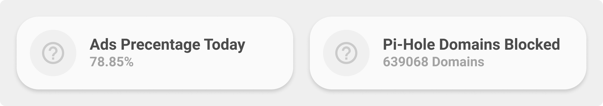

<!-- markdownlint-disable MD046 -->

## Description

{ width="500" }

This is a `generic-card` with swapped label and name.

## Variables

| Variable                                     | Default | Required         | Notes                                                                   |
| -------------------------------------------- | ------- | ---------------- | ----------------------------------------------------------------------- |
| entity                                       |         | :material-check: |                                                                         |
| ulm_card_generic_swap_name                   |         | :material-close: | Set custom Name                                                         |
| ulm_card_generic_swap_icon                   |         | :material-close: | Set custom Icon                                                         |
| ulm_card_generic_swap_color                  | `blue`  | :material-close: | Set Custom Color                                                        |
| ulm_card_generic_swap_force_background_color | `false` | :material-close: | Set `ulm_card_generic_swap_color` as background color in active state ` |

## Usage

```yaml
- type: "custom:button-card"
  template: card_generic_swap
  entity: sensor.next_waste_collection
```

??? note "Template Code"

    ```yaml title="card_generic_swap.yaml"
    --8<-- "custom_components/ui_lovelace_minimalist/lovelace/ulm_templates/card_templates/cards/card_generic_swap.yaml"
    ```
