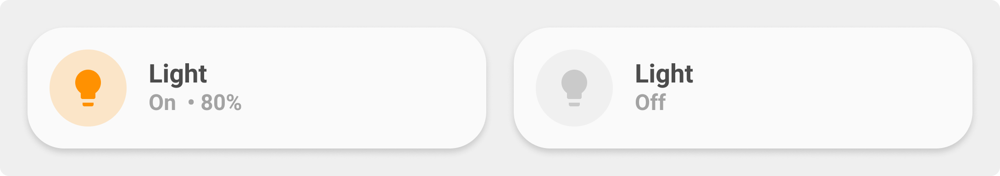
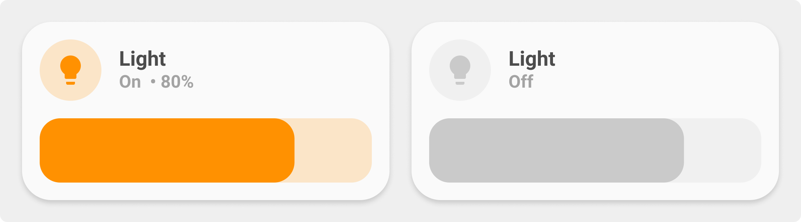
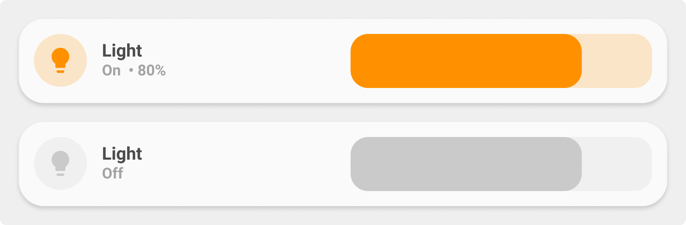
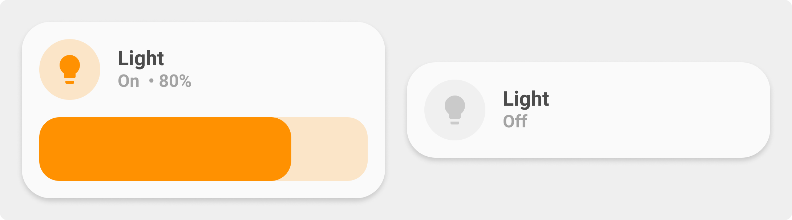

<!-- markdownlint-disable MD046 -->

## Description

{ width="500" }
{ width="500" }
{ width="500" }
{ width="500" }

This is the `light-card`, used to toggle a light or a light group. Shows state of the light and, if available, brightness in %.

This documentation refers to the new "All in one" light card.
This card merges the following one :

- legacy `card_light` (the old one)
- legacy `card_light_slider`
- legacy `card_light_slider_collapse`
- legacy `card_light_slider_horizontal`
- custom `card_light_color` by basbruss
- custom `card_light_horizontal_color` by basbruss
- custom `card_light_slider_color` by basbruss
- custom `card_light_slider_collapse_color` by basbruss

!!! warning
This card has backward compatibility with older template except custom names and icons. It means variables like `ulm_card_XXX_name` and `ulm_card_XXX_icon` must be replaced by `ulm_card_light_name` and `ulm_card_light_icon`.
To use `popup_light` you need to set the variable `ulm_card_light_enable_popup` to `true`. This is a different approach as the other `popup_cards` use.

## Variables

| Variable/Entity                           | Default         | Required         | Notes                                                             | Requirement                                   |
| ----------------------------------------- | --------------- | ---------------- | ----------------------------------------------------------------- | --------------------------------------------- |
| entity                                    |                 | :material-check: | Your HA entity                                                    |                                               |
| ulm_card_light_name                       | `friendly_name` | :material-close: | Customize name                                                    |                                               |
| ulm_card_light_icon                       | `mdi:lightbulb` | :material-close: | Customize icon                                                    |                                               |
| ulm_card_light_enable_slider              | `false`         | :material-close: | Enable slider                                                     |                                               |
| ulm_card_light_enable_slider_minSet       | `0`             | :material-close: | Minimum brightness value user can select in the slider            | Need `ulm_card_light_enable_slider: true`     |
| ulm_card_light_enable_slider_maxSet       | `100`           | :material-close: | Maximum brightness value user can select in the slider            | Need `ulm_card_light_enable_slider: true`     |
| ulm_card_light_enable_collapse            | `false`         | :material-close: | Collapse slider when off                                          | Need `ulm_card_light_enable_slider: true`     |
| ulm_card_light_enable_horizontal          | `false`         | :material-close: | Enable horizontal card                                            |                                               |
| ulm_card_light_enable_horizontal_wide     | `false`         | :material-close: | Wider slider                                                      | Need `ulm_card_light_enable_horizontal: true` |
| ulm_card_light_color                      | `yellow`        | :material-close: | Set a manual color from the theme for icon, slider and background |                                               |
| ulm_card_light_enable_color               | `false`         | :material-close: | Enable icon and label light color from the light itself.          | Overrides `ulm_card_light_color`              |
| ulm_card_light_force_background_color     | `false`         | :material-close: | Force background light color even in light theme                  |                                               |
| ulm_card_light_enable_popup               | `false`         | :material-close: | Enable `popup_light`                                              |                                               |
| ulm_card_light_enable_popup_tap           | `false`         | :material-close: | Enable `popup_light` on simple icon tap                           |                                               |
| ulm_card_light_color_palette              |                 | :material-close: | Add `select` entity to control color palette                      |                                               |
| ulm_card_light_enable_buttons             | `false`         | :material-close: | Enable Preset Brightness Buttons                                  |                                               |
| ulm_card_light_brightness_low/medium/high |                 | :material-close: | Override the Brightness defaults for Buttons - Percentages        |                                               |

## Usage

```yaml
- type: "custom:button-card"
  template: card_light
  entity: light.allee
  variables:
    ulm_card_light_enable_slider: true
    ulm_card_light_enable_color: true
    ulm_card_light_force_background_color: true
```

??? note "Template Code"

    ```yaml title="card_light.yaml"
    --8<-- "custom_components/ui_lovelace_minimalist/lovelace/ulm_templates/card_templates/cards/card_light.yaml"
    ```
