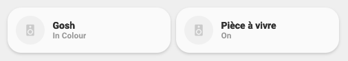
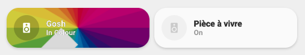

<!-- markdownlint-disable MD046 -->

## Description

{ width="500" }
{ width="500" }
{ width="500" }
{ width="500" }
{ width="500" }
{ width="500" }

  The `card_media_player` shows you the _app_, the _title_ and the _album name_ playing, if the data is available through HA. The _app_ is shown via a different icon.

## Variables

| Variable                                     | Default | Required         | Notes                                           |
| -------------------------------------------- | ------- | ---------------- | ----------------------------------------------- |
| entity                                       |         | :material-check: | The media-player entity                         |
| name                                         |         | :material-check: | Name to display for your media-player           |
| ulm_card_media_player_name                   |         |                  | Name to display for your media-player           |
| ulm_card_media_player_icon                   |         |                  | Change the icon displayed                       |
| ulm_card_media_player_enable_art             | false   |                  | Enable album picture on background              |
| ulm_card_media_player_enable_controls        | false   |                  | Enable controls bellow the title                |
| ulm_card_media_player_enable_volume_slider   | false   |                  | Enable volume slider bellow controls            |
| ulm_card_media_player_collapsible            | false   |                  | Controls are collapsible when state is off      |
| ulm_card_media_player_player_controls_entity | entity  |                  | Change the controlled entity                    |
| ulm_card_media_player_enable_popup           | false   |                  | Enable pop-up                                   |
| ulm_card_media_player_more_info              | false   |                  | Displays artist and album info in the sub-label |

!!! note
  To use `popup_media_player` you need to set the variable `ulm_card_media_player_enable_popup` to `true`. This is a different approach as the other `popup_cards` use.

## Usage

```yaml
- type: "custom:button-card"
  template: card_media_player
  entity: media_player.livingroom_shield
  name: Livingroom Nvidia Shield
```

??? note "Template Code"

    ```yaml title="card_media_player.yaml"
    --8<-- "custom_components/ui_lovelace_minimalist/lovelace/ulm_templates/card_templates/cards/card_media_player.yaml"
    ```
