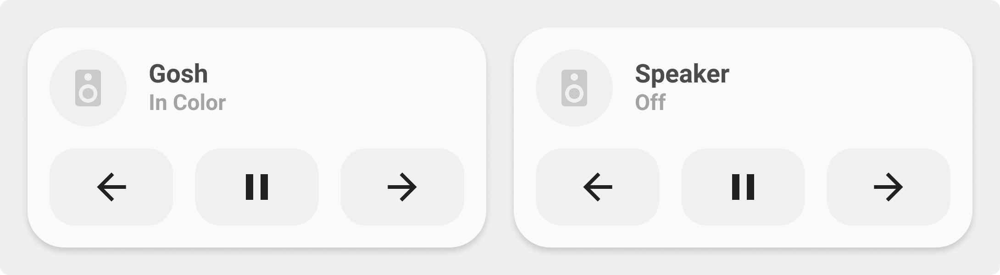

<!-- markdownlint-disable MD046 -->

## Description

{ width="500" }

This is the second `media-player-card`, in contrast to the first one above, it shows the cover art from your media player.

## Variables

| Variable | Default | Required         | Notes             |
|----------|---------|------------------|-------------------|
| name     |         | :material-check: |                   |
|background| `true`  | :material-close: | Enable background |

## Usage

```yaml
- type: "custom:button-card"
  template: example
```

??? note "Template Code"

        Internal Link to Template Code here
