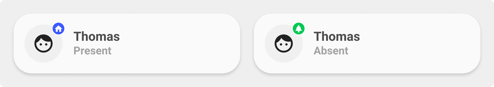

<!-- markdownlint-disable MD046 -->

## Description

{ width="500" }

The `card_person` shows if a person is `home` or `not_home`. If you have setup other zones, it will show these as well.

## Variables

| Variable | Default | Required         | Notes             |
|----------|---------|------------------|-------------------|
| entity     |         | :material-check: | The person entity |
| ulm_card_person_entity     |         | :material-check: | The person entity |
| ulm_card_person_use_entity_picture |       | :material-close: | If you set this to true, the card shows the entity picture from your user, otherwise (set to false) shows the icon. Default is false. |
| ulm_card_person_zone1     |         | :material-close: | Set another zone (beside "home") to use for the card. You can set up two zones besides "home". |
| ulm_card_person_zone2     |         | :material-close: | Set another zone (beside "home") to use for the card. You can set up two zones besides "home". |
| ulm_address     |         | :material-close: | Show an address as label, add an entity with a geo location |

## Usage

```yaml
- type: 'custom:button-card'
  template: card_person
  entity: person.username
  variables:
    ulm_card_person_entity: person.username
    ulm_card_person_use_entity_picture: true
    ulm_card_person_zone1: zone.work
    ulm_card_person_zone2: zone.school
    ulm_address: sensor.s10_mike_gegeocodeerde_locatie
```

??? note "Template Code"

    ```yaml title="card_person.yaml"
    --8<-- "custom_components/ui_lovelace_minimalist/lovelace/ulm_templates/card_templates/cards/card_person.yaml"
    ```
