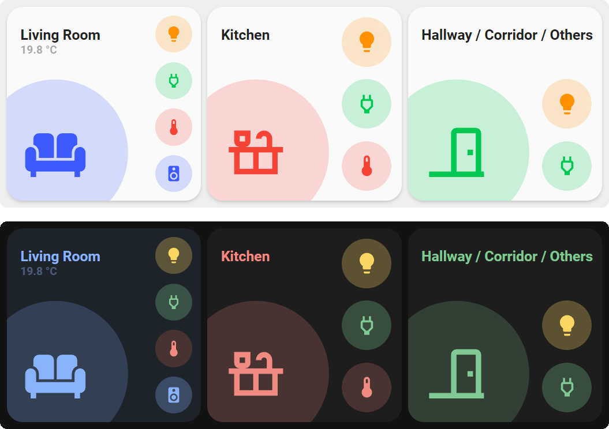

<!-- markdownlint-disable MD046 -->

## Description

{ width="500" }

This is the `room-card`, used to show the state of single room in a quick glance.
The card has support for up to 4 subicons at the right side of the card. These can be configured using custom colors and tap actions.

## Variables

| Variable              | Default | Required         | Notes                                                                                                                                                                                       | Requirement |
| --------------------- | ------- | ---------------- | ------------------------------------------------------------------------------------------------------------------------------------------------------------------------------------------- | ----------- |
| label_use_temperature | `true`  | :material-close: | Define whether the label should show the current room temperature</br>The temperature should be provide by either a `temperature` or `current_temperature` attribute or by the entity state |             |
| label_use_brightness  | `false` | :material-close: | Define whether the label should show the current room brightness of the lights</br>Requires `label_use_temperature` to be false                                                             |             |
| entity_1              |         | :material-close: | a `room_entity` object (see below)                                                                                                                                                          |             |
| entity_2              |         | :material-close: | a `room_entity` object (see below)                                                                                                                                                          |             |
| entity_3              |         | :material-close: | a `room_entity` object (see below)                                                                                                                                                          |             |
| entity_4              |         | :material-close: | a `room_entity` object (see below)                                                                                                                                                          |             |

## Room entity

| Variable    | Default | Required         | Notes                                                               | Requirement |
| ----------- | ------- | ---------------- | ------------------------------------------------------------------- | ----------- |
| entity_id   |         | :material-close: | The entity_id of the status icon                                    |             |
| templates   |         | :material-close: | List of the additional button card templates to apply to this icon  |             |
| tap_action  |         | :material-close: | tap_action for the icon (see button card documentation for options) |             |
| hold_action |         | :material-close: | tap_action for the icon (see button card documentation for options) |             |

## Default card options

All the options from the button card are still available for the large room card.
If you want to tweak this card a little bit more, below are some examples. The full list can be found here: [link](https://github.com/custom-cards/button-card#main-options)

| Options     | Default | Required         | Notes                                                                                                                                       | Requirement |
| ----------- | ------- | ---------------- | ------------------------------------------------------------------------------------------------------------------------------------------- | ----------- |
| entity      |         | :material-close: | The entity_id for the large card                                                                                                            |             |
| icon        |         | :material-close: | Icon to display. Defaults to the entity icon                                                                                                |             |
| tap_action  |         | :material-close: | Define the type of action on click, if undefined, toggle will be used.</br>See [Action](https://github.com/custom-cards/button-card#Action) |             |
| hold_action |         | :material-close: | Define the type of action on hold, if undefined, nothing happens</br> See [Action](https://github.com/custom-cards/button-card#Action)      |             |
| label       |         | :material-close: | Change the label text                                                                                                                       |             |
| title       |         | :material-close: | Change the title text                                                                                                                       |             |

## Usage

```yaml
- type: "custom:button-card"
  template:
    - card_room
    - red_no_state
  name: Bathroom
  entity: light.bathroom
  icon: mdi:shower-head
  tap_action:
    action: navigate
    navigation_path: "/ui-lovelace-minimalist/bathroom"
  variables:
    label_use_temperature: false
    label_use_brightness: true
    entity_1:
      entity_id: light.bathroom
      templates:
        - yellow_on
      tap_action:
        action: toggle
    entity_2:
      entity_id: binary_sensor.badkamer_motion_sensor
      templates:
        - blue_on
      tap_action:
        action: none
    entity_3:
      entity_id: input_boolean.badkamer_motionsensor_enabled
      templates:
        - green_on
        - red_off
      tap_action:
        action: toggle
    entity_4:
      entity_id: input_boolean.bath_mode
      templates:
        - pink_on
      tap_action:
        action: toggle
```

??? note "Template Code"

    ```yaml title="card_room.yaml"
    --8<-- "custom_components/ui_lovelace_minimalist/lovelace/ulm_templates/card_templates/cards/card_room.yaml"
    ```
