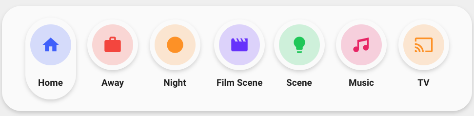

<!-- markdownlint-disable MD046 -->

## Description

{ width="500" }

This card is part of the Welcome Scenes card and can be used separately to only show the scene pills. It has the same features set as the pills in the Welcome Scenes card.

## Variables

| Variable | Default       | Required         | Notes                                                                                     |
| -------- | ------------- | ---------------- | ----------------------------------------------------------------------------------------- |
| entity_1 | auto-entities | :material-close: | Can be any common type of entity <br> if no entity is specified defaults to auto-entities |
| entity_2 | auto-entities | :material-close: | Can be any common type of entity <br> if no entity is specified defaults to auto-entities |
| entity_3 | auto-entities | :material-close: | Can be any common type of entity <br> if no entity is specified defaults to auto-entities |
| entity_4 | auto-entities | :material-close: | Can be any common type of entity <br> if no entity is specified defaults to auto-entities |
| entity_5 | auto-entities | :material-close: | Can be any common type of entity <br> if no entity is specified defaults to auto-entities |
| entity_6 | none          | :material-close: | Can be any common type of entity                                                          |
| entity_7 | none          | :material-close: | Can be any common type of entity                                                          |

## Entity Variables

| Variable    | Default           | Required         | Notes                                                                                                                                            |
| ----------- | ----------------- | ---------------- | ------------------------------------------------------------------------------------------------------------------------------------------------ |
| \_entity_id |                   | :material-close: | Support almost all types of entities <br> Scenes do always show as off                                                                           |
| \_icon      |                   | :material-close: | The icon to show                                                                                                                                 |
| \_name      |                   | :material-close: | The name to show                                                                                                                                 |
| \_color     | Random            | :material-close: | Color of the icon <br> Can choose between: `blue`, `red`, `green`, `yellow`, `pink`, `purple` <br> If not specified, it will take a random color |
| \_state     | `on` or `playing` | :material-close: | Define `input_select` state or give manual state for pill to be full                                                                             |
| \_nav_path  |                   | :material-close: | Navigate to another view <br> _Overrides other types of actions_                                                                                 |

## Usage

!!! note ""
You can set 1 to 7 entities to show 1 to 7 pills dynamically <br>
If set none it uses `auto-entities` with max 5 pills

```yaml
- type: "custom:button-card"
  template: "card_scenes_welcome"
  variables:
    entity_1:
      entity_id: "<YOUR_ENTITY>"
      icon: "mdi:YOUR_ICON" #OPTIONAL
      name: "YOUR_NAME" #OPTIONAL
      color: "blue"
    entity_2:
      entity_id: "<YOUR_ENTITY>"
      icon: "mdi:YOUR_ICON" #OPTIONAL
      name: "YOUR_NAME" #OPTIONAL
      color: "red"
    entity_3:
      entity_id: "<YOUR_ENTITY>"
      icon: "mdi:YOUR_ICON" #OPTIONAL
      name: "YOUR_NAME" #OPTIONAL
      color: "green"
    entity_4:
      entity_id: "<YOUR_ENTITY>"
      icon: "mdi:YOUR_ICON" #OPTIONAL
      name: "YOUR_NAME" #OPTIONAL
      color: "purple"
    entity_5:
      entity_id: "<YOUR_ENTITY>"
      icon: "mdi:YOUR_ICON" #OPTIONAL
      name: "YOUR_NAME" #OPTIONAL
      color: "yellow"
    entity_6:
      entity_id: "<YOUR_ENTITY>"
      icon: "mdi:YOUR_ICON" #OPTIONAL
      name: "YOUR_NAME" #OPTIONAL
      color: "pink"
    entity_7:
      entity_id: "<YOUR_ENTITY>"
      icon: "mdi:YOUR_ICON" #OPTIONAL
      name: "YOUR_NAME" #OPTIONAL
      color: "yellow"
```

??? note "Auto-entities"

    ```yaml
    - type: "custom:button-card"
      template: "card_scenes_welcome"
    ```

??? note "Template Code"

    ```yaml title="card_welcome_scenes.yaml"
    --8<-- "custom_components/ui_lovelace_minimalist/lovelace/ulm_templates/card_templates/cards/card_scenes_welcome.yaml"
    ```
