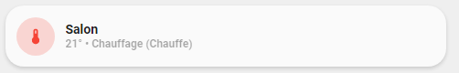

<!-- markdownlint-disable MD046 -->

## Description

{ width="500" }
{ width="500" }
{ width="500" }
{ width="500" }

This is the `thermostat-card`, used to toggle a climate entity. Shows state of the thermostat and, if available, current temperature.

This documentation refers to the new "All in one" thermostat card.
This card merges the following one :

- legacy `card_thermostat` (the old one)
- custom `custom_card_heat_pump` by Kam
- custom `custom_card_mpse_thermostat` by mpse
- custom `custom_card_httpedo13_thermostat` by httpedo13
- custom `custom_card_httpedo13_thermostat_with_buttons` by httpedo13
- custom `custom_card_httpedo13_thermostat_with_buttons_collapse` by httpedo13

!!! warning
    This card has backward compatibility with older template except custom names and icons. It means variables like `ulm_card_XXX_name` and `ulm_card_XXX_icon` must be replaced by `ulm_card_thermostat_name` and `ulm_card_thermostat_icon`.
    To use `popup_thermostat` you need to set the variable `ulm_card_thermostat_enable_popup` to `true`. This is a different approach as the other `popup_cards` use.

## Variables

| Variable/Entity                                 | Default           | Required         | Notes          | Requirement |
|-------------------------------------------------|-------------------|------------------|----------------|-------------|
| entity                                          |                   | :material-check: | Your HA entity |             |
| ulm_card_thermostat_name                        | `friendly_name`   | :material-close: | Customize name |             |
| ulm_card_thermostat_icon                        | `mdi:thermometer` | :material-close: | Customize icon |             |
| ulm_card_thermostat_enable_collapse             | `false`           | :material-close: | Collapse controls when off | Need `ulm_card_thermostat_enable_controls: true` |
| ulm_card_thermostat_enable_controls             | `false`           | :material-close: | Enable temperature control | |
| ulm_card_thermostat_enable_hvac_modes           | `false`           | :material-close: | Enable HVAC modes control | |
| ulm_card_thermostat_enable_background_color     | `false`           | :material-close: | Enable background color when cooling or heating | |
| ulm_card_thermostat_enable_display_temperature  | `false`           | :material-close: | Display  current temperature on top right | |
| ulm_card_thermostat_enable_horizontal           | `false`           | :material-close: | Enable horizontal card| Need `ulm_card_thermostat_enable_controls: true` |
| ulm_card_thermostat_enable_popup                | `false`           | :material-close: | Enable `popup_thermostat` | |
| ulm_card_thermostat_fan_entity                  | `null`            | :material-close: | `fan` entity for climate if separate entity | |
| ulm_card_thermostat_minimum_temp_spread         | `1`               | :material-close: | Minimum temperature spread between low and high temperature when in `heat_cool` mode | |

## Usage

```yaml
- type: "custom:button-card"
  template: card_thermostat
  entity: climate.hvac
  variables:
    ulm_card_thermostat_enable_collapse: true
    ulm_card_thermostat_enable_controls: true
    ulm_card_thermostat_enable_hvac_modes: true
    ulm_card_thermostat_enable_popup: true
```

??? note "Template Code"

    ```yaml title="card_thermostat.yaml"
    --8<-- "custom_components/ui_lovelace_minimalist/lovelace/ulm_templates/card_templates/cards/card_thermostat.yaml"
    ```
