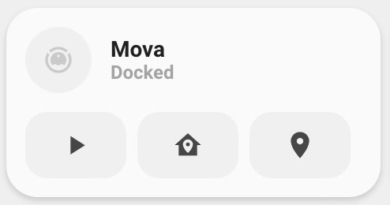
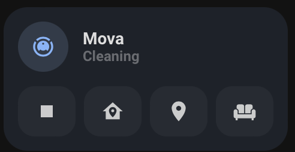
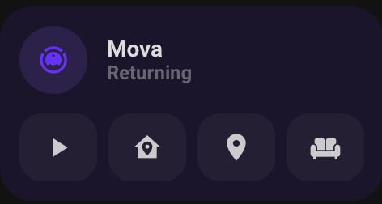

<!-- markdownlint-disable MD046 -->

## Description

{ width="250" }
{ width="250" }
{ width="250" }

This is a card to control your Robot-vacuum. It has support for all vacuums which use the services `vacuum.start`, `vacuum.stop`, `vacuum.return_to_base` and `vacuum.locate`

## Variables

| Variable                               | Default     | Required         | Notes                                                             |
| -------------------------------------- | ----------- | ---------------- | ----------------------------------------------------------------- |
| entity                                 | `vacuum.*`  | :material-check: |                                                                   |
| `ulm_card_vacuum_name`                 |             | :material-close: | Add a custom name                                                 |
| `ulm_card_vacuum_icon`                 |             | :material-close: | Add a custom MDI icon                                             |
| `ulm_card_vacuum_label`                |             | :material-close: | Add a custom label                                                |
| `ulm_card_vacuum_room`                 |             | :material-close: | Add a script to clean a specific room                             |
| `ulm_card_vacuum_room_icon`            |             | :material-close: | Add custom icon to the room script                                |
| `ulm_card_vacuum_camera`               |             | :material-close: | Add a camera entity to the card to show the vacuum map            |
| `ulm_card_vacuum_camera_toggle`        |             | :material-close: | Only show the camera entity while cleaning                        |
| ulm_card_vacuum_color                  | state based | :material-close: | Set Custom Color                                                  |
| ulm_card_vacuum_force_background_color | `false`     | :material-close: | Set `ulm_card_vacuum_color` as background color in active state ` |

## Usage

```yaml
- type: "custom:button-card"
  template: "card_vacuum"
  entity: "vacuum.<Your_Vacuum>"

- type: "custom:button-card"
  template: "card_vacuum"
  entity: "vacuum.<Your_Vacuum>"
  variables:
    ulm_card_vacuum_room: "script.clean_kitchen"
    ulm_card_vacuum_room_icon: "mdi:table-chair"
    ulm_card_vacuum_camera: "camera.vacuum_map"
    ulm_card_vacuum_camera_toggle: true
```

??? note "Template Code"

    ```yaml title="card_vacuum.yaml"
    --8<-- "custom_components/ui_lovelace_minimalist/lovelace/ulm_templates/card_templates/cards/card_vacuum.yaml"
    ```
