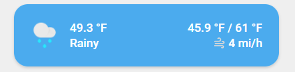

<!-- markdownlint-disable MD046 -->

## Description

{ width="500" }

This is a card based on simple-weather-card to show your weather.
[simple-weather-card](https://github.com/kalkih/simple-weather-card) lovelace ressources must be installed for this one!

## Variables

| Variable                  | Default         | Required         | Notes                                                                                                       |
| ------------------------- | --------------- | ---------------- | ----------------------------------------------------------------------------------------------------------- |
| entity                    |                 | :material-check: | your weather entity                                                                                         |
| ulm_card_weather_name     | `friendly_name` |                  | customize display name                                                                                      |
| ulm_card_weather_primary_info | `extrema`   |                  | customize primary info. Set to `false` to disable. See [simple-weather-card](https://github.com/kalkih/simple-weather-card) for more information |
| ulm_card_weather_secondary_info | `precipitation`   |          | customize secondary info. Set to `false` to disable. See [simple-weather-card](https://github.com/kalkih/simple-weather-card) for more information |
| ulm_card_weather_backdrop | `false`         |                  | add backdrop. See [simple-weather-card](https://github.com/kalkih/simple-weather-card) for more information |

## Usage

```yaml
- type: "custom:button-card"
  template: card_weather
  entity: weather.my_local_weather
  variables:
    ulm_card_weather_name: " "
    ulm_card_weather_primary_info:
      - wind_speed
      - precipitation_probability
    ulm_card_weather_backdrop:
      fade: true
```

??? note "Template Code"

    ```yaml title="card_weather.yaml"
    --8<-- "custom_components/ui_lovelace_minimalist/lovelace/ulm_templates/card_templates/cards/card_weather.yaml"
    ```
