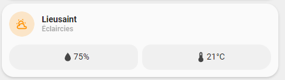

<!-- markdownlint-disable MD046 -->

## Description

{ width="500" }

This is a card to show your weather without usage of custom resources.

## Variables

| Variable                            | Default  | Required         | Notes                                 |
| ----------------------------------- | -------- | ---------------- | ------------------------------------- |
| entity                              |          | :material-check: | your weather entity                   |
| ulm_card_weather_ulm_enable_popup   | `false`  | :material-close: |                                       |

## Usage

```yaml
- type: "custom:button-card"
  template: "card_weather_ulm"
  entity: "weather.lieusaint"
  variables:
    ulm_card_weather_ulm_enable_popup: true
```

??? note "Template Code"

    ```yaml title="card_weather.yaml"
    --8<-- "custom_components/ui_lovelace_minimalist/lovelace/ulm_templates/card_templates/cards/card_weather_ulm.yaml"
    ```
