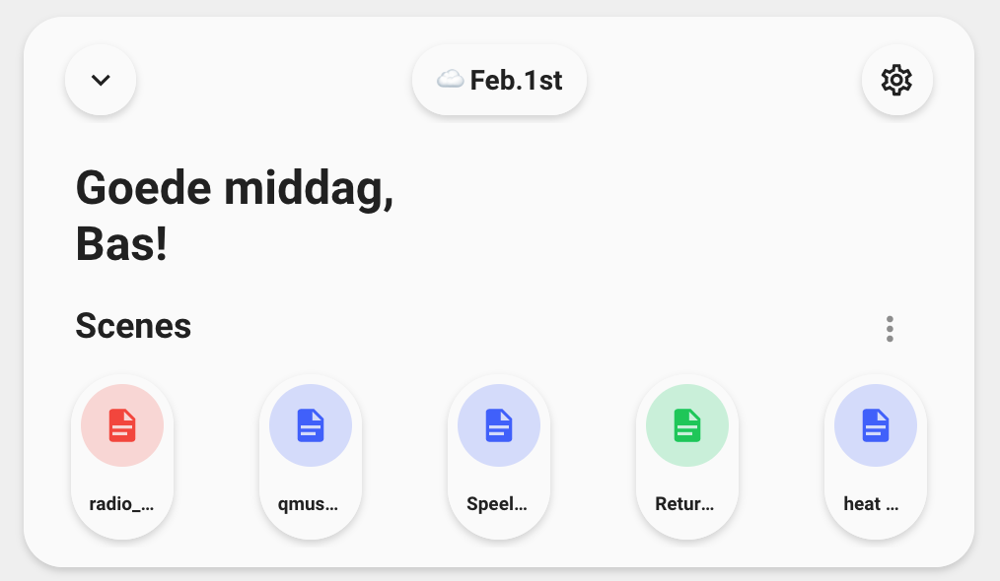

<!-- markdownlint-disable MD046 -->

## Description

{ width="500" }

This is a card which shows the basic needs for your dashboard. This card can generate itself automatically. It is also included in the preview-dashboard which comes with a fresh installation of UI-Minimalist.

## Variables

| Variable | Default | Required         | Notes             |
|----------|---------|------------------|-------------------|
| ulm_card_welcome_scenes_collapse  |         | :material-close: | Enables the collapse function. <br> requires an `input_boolean` to track the state|
| ulm_weather   |         | :material-check: | This is your weather provider. <br> Example: `weather.your_provider`|
| ulm_language   |  Language of your system  | :material-close: | You can set a different format with the [BCP-47 language tags](https://www.techonthenet.com/js/language_tags.php) <br> Example:
`"en-US"` or just `"en"`|
| entity_  |     | :material-check: | Support almost all types of entities <br> Scenes do always show as off |
| icon_  |    | :material-close: | The icon to show |
| name_  |      | :material-close: | The name to show|
| color_  |  Random    | :material-close: | Color of the icon <br> Can choose between: `blue`, `red`, `green`, `yellow`, `pink`, `purple` <br> If not specified, it will take a random color  |

## Collapse

!!! note
    This feature is fully optional. It requires some more manual configuration!
You need to create a `input_boolean` in HA to track the state. See [Docs](https://www.home-assistant.io/integrations/input_boolean/).
Furthermore, you need to add the `input_boolean` to the variable `ulm_card_welcome_scenes_collapse` **and** to either the `entity` or `triggers_update` to make sure it directly refreshes the state.
!!! warning
    Do not use `triggers_update: "all"`! This will lead to unwanted behavior with the random colors generator.

## Usage

```yaml
- type: "custom:button-card"
  template: "card_welcome_scenes"
  #triggers_update: input_boolean.<Your_boolean>
  #entity: input_boolean.<Your_boolean>
  variables:
    ulm_card_welcome_scenes_collapse: input_boolean.<Your_boolean> #OPTIONAl --> uncomment also entity or triggers_update
    ulm_weather: "weather.YOUR_WEATHERPROVIDER"
    entity_1:
      entity_id: "<YOUR_ENTITY>"
      icon: "mdi:YOUR_ICON" #OPTIONAL
      name: "YOUR_NAME" #OPTIONAL
      color: "blue"
    entity_2:
      entity_id: "<YOUR_ENTITY>"
      icon: "mdi:YOUR_ICON" #OPTIONAL
      name: "YOUR_NAME" #OPTIONAL
      color: "red"
    entity_3:
      entity_id: "<YOUR_ENTITY>"
      icon: "mdi:YOUR_ICON" #OPTIONAL
      name: "YOUR_NAME" #OPTIONAL
      color: "green"
    entity_4:
      entity_id: "<YOUR_ENTITY>"
      icon: "mdi:YOUR_ICON" #OPTIONAL
      name: "YOUR_NAME" #OPTIONAL
      color: "purple"
    entity_5:
      entity_id: "<YOUR_ENTITY>"
      icon: "mdi:YOUR_ICON" #OPTIONAL
      name: "YOUR_NAME" #OPTIONAL
      color: "yellow"
```

??? note "Auto-entities"

    ```yaml
    - type: "custom:button-card"
      template: "card_welcome_scenes"
      #triggers_update: input_boolean.<Your_boolean>
      #entity: input_boolean.<Your_boolean>
      variables:
        ulm_card_welcome_scenes_collapse: input_boolean.<Your_boolean> #OPTIONAl --> uncomment also entity or triggers_update
        ulm_weather: "weather.YOUR_WEATHERPROVIDER"
        entity_1:
          entity_id:
          icon:
          name:
          color: "blue" #OPTIONAL
        entity_2:
          entity_id:
          icon:
          name:
          color: "red"  #OPTIONAL
        entity_3:
          entity_id:
          icon:
          name:
          color: "green" #OPTIONAL
        entity_4:
          entity_id:
          icon:
          name:
          color: "purple" #OPTIONAL
        entity_5:
          entity_id:
          icon:
          name:
          color: "yellow" #OPTIONAL
    ```

??? note "Random Colors"

    ```yaml
    - type: "custom:button-card"
      template: "card_welcome_scenes"
      #triggers_update: input_boolean.<Your_boolean>
      #entity: input_boolean.<Your_boolean>
      variables:
        ulm_card_welcome_scenes_collapse: input_boolean.<Your_boolean> #OPTIONAl --> uncomment also entity or triggers_update
        ulm_weather: "weather.YOUR_WEATHERPROVIDER"
        entity_1:
          entity_id: "<YOUR_ENTITY>"
          icon: "mdi:YOUR_ICON" #OPTIONAL
          name: "YOUR_NAME" #OPTIONAL
          color:
        entity_2:
          entity_id: "<YOUR_ENTITY>"
          icon: "mdi:YOUR_ICON" #OPTIONAL
          name: "YOUR_NAME" #OPTIONAL
          color:
        entity_3:
          entity_id: "<YOUR_ENTITY>"
          icon: "mdi:YOUR_ICON" #OPTIONAL
          name: "YOUR_NAME" #OPTIONAL
          color:
        entity_4:
          entity_id: "<YOUR_ENTITY>"
          icon: "mdi:YOUR_ICON" #OPTIONAL
          name: "YOUR_NAME" #OPTIONAL
          color:
        entity_5:
          entity_id: "<YOUR_ENTITY>"
          icon: "mdi:YOUR_ICON" #OPTIONAL
          name: "YOUR_NAME" #OPTIONAL
          color:
    ```

??? note "Template Code"

    ```yaml title="card_welcome_scenes.yaml"
    --8<-- "custom_components/ui_lovelace_minimalist/lovelace/ulm_templates/card_templates/cards/card_welcome_scenes.yaml"
    ```
