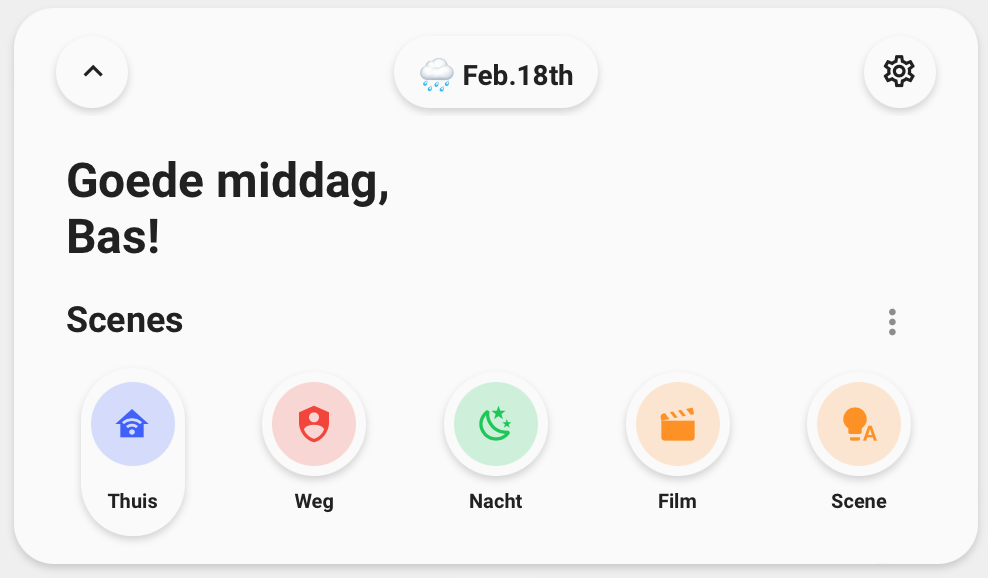

<!-- markdownlint-disable MD046 -->

## Description

{ width="500" }

This is a card which shows the basic needs for your dashboard. This card can generate itself automatically. It is also included in the preview-dashboard which comes with a fresh installation of UI-Minimalist.

## Variables

| Variable                         | Default                 | Required         | Notes                                                                                                                                                    |
| -------------------------------- | ----------------------- | ---------------- | -------------------------------------------------------------------------------------------------------------------------------------------------------- |
| ulm_card_welcome_scenes_collapse |                         | :material-close: | Enables the collapse function. <br> requires an `input_boolean` to track the state                                                                       |
| ulm_weather                      |                         | :material-check: | This is your weather provider. <br> Example: `weather.your_provider`                                                                                     |
| ulm_language                     | Language of your system | :material-close: | You can set a different format with the [BCP-47 language tags](https://www.techonthenet.com/js/language_tags.php) <br> Example: `"en-US"` or just `"en"` |
| entity_1                         | auto-entities           | :material-close: | Can be any common type of entity <br> if no entity is specified defaults to auto-entities                                                                |
| entity_2                         | auto-entities           | :material-close: | Can be any common type of entity <br> if no entity is specified defaults to auto-entities                                                                |
| entity_3                         | auto-entities           | :material-close: | Can be any common type of entity <br> if no entity is specified defaults to auto-entities                                                                |
| entity_4                         | auto-entities           | :material-close: | Can be any common type of entity <br> if no entity is specified defaults to auto-entities                                                                |
| entity_5                         | auto-entities           | :material-close: | Can be any common type of entity <br> if no entity is specified defaults to auto-entities                                                                |
| entity_6                         | none                    | :material-close: | Can be any common type of entity                                                                                                                         |
| entity_7                         | none                    | :material-close: | Can be any common type of entity                                                                                                                         |

## Entity Variables

| Variable       | Default           | Required         | Notes                                                                                                                                            |
| -------------- | ----------------- | ---------------- | ------------------------------------------------------------------------------------------------------------------------------------------------ |
| \_entity_id    |                   | :material-close: | Support almost all types of entities <br> Scenes do always show as off                                                                           |
| \_icon         |                   | :material-close: | The icon to show                                                                                                                                 |
| \_name         |                   | :material-close: | The name to show                                                                                                                                 |
| \_color        | Random            | :material-close: | Color of the icon <br> Can choose between: `blue`, `red`, `green`, `yellow`, `pink`, `purple` <br> If not specified, it will take a random color |
| \_state        | `on` or `playing` | :material-close: | Define `input_select` state or give manual state for pill to be full                                                                             |
| \_nav_path     |                   | :material-close: | Navigate to another view <br> _Overrides other types of actions_                                                                                 |
| \_service_data |                   | :material-close: | Data to be passed through to data_service. Useful for running scripts with custom fields/parameters                                              |

## Requirement Collapse Function

!!! note ""
This feature is fully optional. It requires some more manual configuration!
You need to create a `input_boolean` in HA to track the state. See [Docs](https://www.home-assistant.io/integrations/input_boolean/).
Furthermore, you need to add the `input_boolean` to the variable `ulm_card_welcome_scenes_collapse` **and** to either the `entity` or `triggers_update` to make sure it directly refreshes the state.
!!! warning
Do not use `triggers_update: "all"`! This will lead to unwanted behavior with the random colors generator.

## Usage

!!! note ""
You can set 1 to 7 entities to show 1 to 7 pills dynamically <br>
If set none it uses `auto-entities` with max 5 pills

```yaml
- type: "custom:button-card"
  template: "card_welcome_scenes"
  #triggers_update: input_boolean.<Your_boolean>
  #entity: input_boolean.<Your_boolean>
  variables:
    ulm_card_welcome_scenes_collapse: input_boolean.<Your_boolean> #OPTIONAl --> uncomment also entity or triggers_update
    ulm_weather: "weather.YOUR_WEATHERPROVIDER"
    entity_1:
      entity_id: "<YOUR_ENTITY>"
      icon: "mdi:YOUR_ICON" #OPTIONAL
      name: "YOUR_NAME" #OPTIONAL
      color: "blue"
    entity_2:
      entity_id: "<YOUR_ENTITY>"
      icon: "mdi:YOUR_ICON" #OPTIONAL
      name: "YOUR_NAME" #OPTIONAL
      color: "red"
    entity_3:
      entity_id: "<YOUR_ENTITY>"
      icon: "mdi:YOUR_ICON" #OPTIONAL
      name: "YOUR_NAME" #OPTIONAL
      color: "green"
    entity_4:
      entity_id: "<YOUR_ENTITY>"
      icon: "mdi:YOUR_ICON" #OPTIONAL
      name: "YOUR_NAME" #OPTIONAL
      color: "purple"
    entity_5:
      entity_id: "<YOUR_ENTITY>"
      icon: "mdi:YOUR_ICON" #OPTIONAL
      name: "YOUR_NAME" #OPTIONAL
      color: "yellow"
    entity_6:
      entity_id: "<YOUR_ENTITY>"
      icon: "mdi:YOUR_ICON" #OPTIONAL
      name: "YOUR_NAME" #OPTIONAL
      color: "pink"
    entity_7:
      entity_id: "<YOUR_ENTITY>"
      icon: "mdi:YOUR_ICON" #OPTIONAL
      name: "YOUR_NAME" #OPTIONAL
      color: "yellow"
```

??? note "Auto-entities"

    ```yaml
    - type: "custom:button-card"
      template: "card_welcome_scenes"
      #triggers_update: input_boolean.<Your_boolean>
      #entity: input_boolean.<Your_boolean>
      variables:
        ulm_card_welcome_scenes_collapse: input_boolean.<Your_boolean> #OPTIONAl --> uncomment also entity or triggers_update
        ulm_weather: "weather.YOUR_WEATHERPROVIDER"
    ```

??? note "Random Colors"

    ```yaml
    - type: "custom:button-card"
      template: "card_welcome_scenes"
      #triggers_update: input_boolean.<Your_boolean>
      #entity: input_boolean.<Your_boolean>
      variables:
        ulm_card_welcome_scenes_collapse: input_boolean.<Your_boolean> #OPTIONAl --> uncomment also entity or triggers_update
        ulm_weather: "weather.YOUR_WEATHERPROVIDER"
        entity_1:
          entity_id: "<YOUR_ENTITY>"
          icon: "mdi:YOUR_ICON" #OPTIONAL
          name: "YOUR_NAME" #OPTIONAL
        entity_2:
          entity_id: "<YOUR_ENTITY>"
          icon: "mdi:YOUR_ICON" #OPTIONAL
          name: "YOUR_NAME" #OPTIONAL
        entity_3:
          entity_id: "<YOUR_ENTITY>"
          icon: "mdi:YOUR_ICON" #OPTIONAL
          name: "YOUR_NAME" #OPTIONAL
        entity_4:
          entity_id: "<YOUR_ENTITY>"
          icon: "mdi:YOUR_ICON" #OPTIONAL
          name: "YOUR_NAME" #OPTIONAL
        entity_5:
          entity_id: "<YOUR_ENTITY>"
          icon: "mdi:YOUR_ICON" #OPTIONAL
          name: "YOUR_NAME" #OPTIONAL
        entity_6:
          entity_id: "<YOUR_ENTITY>"
          icon: "mdi:YOUR_ICON" #OPTIONAL
          name: "YOUR_NAME" #OPTIONAL
        entity_7:
          entity_id: "<YOUR_ENTITY>"
          icon: "mdi:YOUR_ICON" #OPTIONAL
          name: "YOUR_NAME" #OPTIONAL

    ```

??? note "Template Code"

    ```yaml title="card_welcome_scenes.yaml"
    --8<-- "custom_components/ui_lovelace_minimalist/lovelace/ulm_templates/card_templates/cards/card_welcome_scenes.yaml"
    ```
