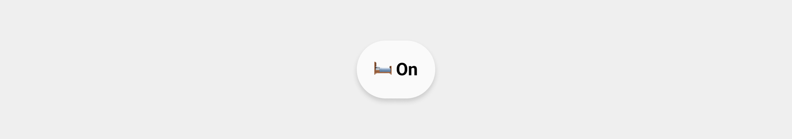

<!-- markdownlint-disable MD046 -->

## Description

{ width="500" }

This `chip` displays an icon and a label, where the label can be any `state` of a `sensor` you configure.

## Variables

| Variable | Default | Required         | Notes             |
|----------|---------|------------------|-------------------|
| ulm_chip_icon_state_icon     |         | :material-check: | This is the icon to show. See See icons to read more about the used unicode `emojis`.  |
|ulm_chip_icon_state_entity|  | :material-check: | Enable background |

## Usage

```yaml
- type: 'custom:button-card'
  template: chip_icon_state
  variables:
    ulm_chip_icon_state_icon: '🛏️'
    ulm_chip_icon_state_entity: sensor.bed_occupancy
```

??? note "Template Code"

    ```yaml title="chip_icon_state.yaml"
    --8<-- "custom_components/ui_lovelace_minimalist/lovelace/ulm_templates/card_templates/chips/chip_icon_state.yaml"
    ```
