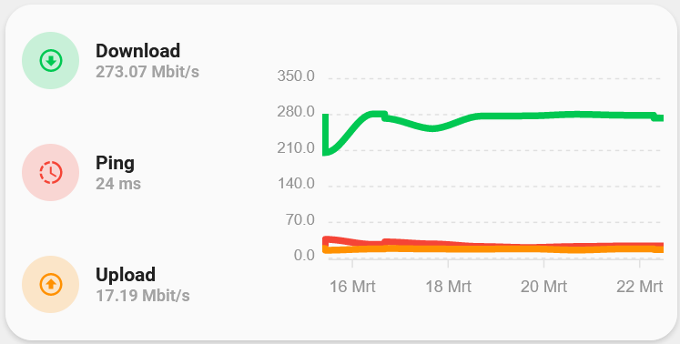
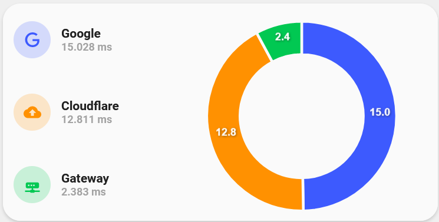

<!-- markdownlint-disable MD046 -->

# Custom-card "Apexcharts"





## Credits

- Author: AndyVRD - 2022
- Credits to benm7
- Version: 1.0.0

## Changelog

<details>
<summary>1.0.0</summary>
Initial release
</details>

## Usage

```yaml
    - type: "custom:button-card"
      template: "custom_card_apexcharts"
      variables:
        chart_type: "donut"
        graph_span: "1d"
        entity_1:
          entity_id: "sensor.google"
          icon: ''
          name: "Google"
          color: "blue"
          max_value: 300
        entity_2:
          entity_id: "sensor.cloudflare"
          icon: ''
          name: "Cloudflare"
          color: "yellow"
          max_value: 50
        entity_3:
          entity_id: "sensor.gateway"
          icon: ''
          name: "Gateway"
          color: "green"
          max_value: 30
```

## Requirements

Integration from HACS: "custom:apexcharts-card" from RomRider

## Variables

<table>
<tr>
<th>Variable</th>
<th>Example</th>
<th>Required</th>
<th>Explanation</th>
</tr>
<tr>
<td>chart_type</td>
<td>line, scatter, pie, donut or radialBar</td>
<td>yes</td>
<td>The chart type you want to display</td>
</tr>
<tr>
<td>graph_span</td>
<td>1h, 12min, 1d, 1h25, 10sec, ...</td>
<td>no</td>
<td>The span of the graph as a time interval</td>
</tr>
<tr>
<td>entity_id</td>
<td>sensor.speedtest_download</td>
<td>yes</td>
<td>Entity sensor of choice</td>
</tr>
<tr>
<td>icon</td>
<td>mdi:cpu-64-bit</td>
<td>no</td>
<td>mdi icon you want to be exposed in the img_cell, '' will return entity.attributes.icon </td>
</tr>
<tr>
<td>name</td>
<td>name for the used sensor</td>
<td>no</td>
<td>'' will return entity.attributes.friendly_name</td>
</tr>
<tr>
<td>color</td>
<td>green, blue, yellow, red or grey</td>
<td>no</td>
<td>if you don't use the color variable it will choice a random color</td>
</tr>
<tr>
<td>max_value</td>
<td>10, 300, ...</td>
<td>no</td>
<td>Maximum value of the sensor. Default will be 100</td>
</tr>
</table>

## Template code

```yaml
---
custom_card_apexcharts:
  variables:
    entity_1:
      entity_id:
      icon: "[[[ return entity.attributes.icon ]]]"
      name: "[[[ return entity.attributes.friendly_name ]]]"
      color: >
        [[[
          var colors = ['yellow', 'blue', 'red', 'green'];
          var color = colors[Math.floor(Math.random() * colors.length)];
          return color;
        ]]]
    entity_2:
      entity_id:
      icon: "[[[ return entity.attributes.icon  ]]]"
      name: "[[[ return entity.attributes.friendly_name ]]]"
      color: >
        [[[
          var colors = ['yellow', 'blue', 'red', 'green'];
          var color = colors[Math.floor(Math.random() * colors.length)];
          return color;
        ]]]
    entity_3:
      entity_id:
      icon: "[[[ return entity.attributes.icon  ]]]"
      name: "[[[ return entity.attributes.friendly_name ]]]"
      color: >
        [[[
          var colors = ['yellow', 'blue', 'red','green'];
          var color = colors[Math.floor(Math.random() * colors.length)];
          return color;
        ]]]
  color: "auto"
  variable: "spin"
  spin: false
  show_name: false
  show_state: false
  show_label: false
  show_icon: false
  show_last_changed: false
  show_entity_picture: false
  tap_action:
    action: "none"
  aspect_ratio: "2/1"
  styles:
    grid:
      - grid-template-areas: "'item1 radial' 'item2 radial' 'item3 radial'"
      - grid-template-columns: "35% 65%"
      - grid-template-rows: "1fr 1fr 1fr"
    card:
      - border-radius: "var(--border-radius)"
      - box-shadow: "var(--box-shadow)"
      - padding: "0px"
  custom_fields:
    item1:
      card:
        type: "custom:button-card"
        entity: "[[[ return variables.entity_1.entity_id ]]]"
        icon: "[[[ return variables.entity_1.icon ]]]"
        name: "[[[ return variables.entity_1.name ]]]"
        template:
          - "card_generic_swap"
        styles:
          icon:
            - color: "[[[ return `rgba(var(--color-${variables.entity_1.color}), 1)`;]]]"
          img_cell:
            - background-color: "[[[ return `rgba(var(--color-${variables.entity_1.color}), 0.20)`;]]]"
          card:
            - box-shadow: "none"
            - border-radius: "none"
            - padding-top: "1px"
            - padding-bottom: "1px"
    item2:
      card:
        type: "custom:button-card"
        entity: "[[[ return variables.entity_2.entity_id ]]]"
        icon: "[[[ return variables.entity_2.icon ]]]"
        name: "[[[ return variables.entity_2.name ]]]"
        template:
          - "card_generic_swap"
        styles:
          icon:
            - color: "[[[ return `rgba(var(--color-${variables.entity_2.color}), 1)`;]]]"
          img_cell:
            - background-color: "[[[ return `rgba(var(--color-${variables.entity_2.color}), 0.20)`;]]]"
          card:
            - box-shadow: "none"
            - border-radius: "none"
            - padding-top: "1px"
            - padding-bottom: "1px"
    item3:
      card:
        type: "custom:button-card"
        entity: "[[[ return variables.entity_3.entity_id ]]]"
        icon: "[[[ return variables.entity_3.icon ]]]"
        name: "[[[ return variables.entity_3.name ]]]"
        template:
          - "card_generic_swap"
        styles:
          icon:
            - color: "[[[ return `rgba(var(--color-${variables.entity_3.color}), 1)`;]]]"
          img_cell:
            - background-color: "[[[ return `rgba(var(--color-${variables.entity_3.color}), 0.20)`;]]]"
          card:
            - box-shadow: "none"
            - border-radius: "none"
            - padding-top: "1px"
            - padding-bottom: "1px"
    radial:
      card:
        type: "custom:apexcharts-card"
        graph_span: "[[[ return variables.graph_span ]]]"
        chart_type: "[[[ return variables.chart_type ]]]"
        style: |
          ha-card {
            border-radius: "var(--border-radius)";
            box-shadow: none;
            padding-left: 10px;
            padding-bottom: 0px;
          }
        header:
          show: false
        apex_config:
          title:
            floating: false
            align: "top"
            style:
              fontSize: "2px"
              fontWeight: "bold"
          chart:
            foreColor: "rgb(148,148,148)"
            offsetY: 5
          legend:
            show: false
        series:
          - entity: "[[[ return variables.entity_1.entity_id ]]]"
            name: "[[[ return variables.entity_1_name ]]]"
            color: "[[[ return `var(--google-${variables.entity_1.color})`;]]]"
            max: "[[[ return variables.entity_1.max_value ]]]"
          - entity: "[[[ return variables.entity_2.entity_id ]]]"
            name: "[[[ return variables.entity_2_name ]]]"
            color: "[[[ return `var(--google-${variables.entity_2.color})`;]]]"
            max: "[[[ return variables.entity_2.max_value ]]]"
          - entity: "[[[ return variables.entity_3.entity_id ]]]"
            name: "[[[ return variables.entity_3_name ]]]"
            color: "[[[ return `var(--google-${variables.entity_3.color})`;]]]"
            max: "[[[ return variables.entity_3.max_value ]]]"
```
