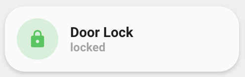
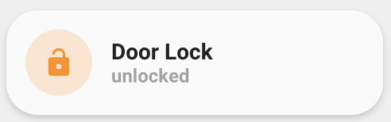

<!-- markdownlint-disable MD046 -->

# Custom-card "Lock"

This is a `custom-card` that works in switch logic with a `lock` entity. Card structure uses `lock`, `unlock` actions and `lock`,`unlock`,`locking`,`unlocking` states.




## Credits

Author: eraycetinay - 2022
Version: 0.0.1

## Changelog

<details>
  <summary>0.0.1</summary>
  Initial release
</details>

## Usage

```yaml
- type: "custom:button-card"
  entity: lock.door_lock
  template: "custom_card_eraycetinay_lock"
  name: "Door Lock"
  variables:
    ulm_custom_card_eraycetinay_lock_tap_control: true
```

## Variables

<table>
<tr>
<th>Variable</th>
<th>Example</th>
<th>Required</th>
<th>Explanation</th>
</tr>
<tr>
<td>ulm_custom_card_eraycetinay_lock_tap_control</td>
<td>true</td>
<td>no</td>
<td>Lock/Unlock on tap action</td>
</tr>
</table>

## Template code

```yaml
---
custom_card_eraycetinay_lock:
  template:
    - "ulm_custom_card_eraycetinay_lock_language_variables"
    - "icon_info_bg"
    - "ulm_language_variables"
  tap_action:
    action: |
      [[[
        if(variables.ulm_custom_card_eraycetinay_lock_tap_control == true){
          return "call-service";
        } else {
          return "more-info";
        }
      ]]]
    # only related with call-service action
    service: |
      [[[
        if(variables.ulm_custom_card_eraycetinay_lock_tap_control == true){
          if (entity.state == "locked"){
            return "lock.unlock"
          } else if (entity.state == "unlocked"){
            return "lock.lock"
          }
        } else {
          return;
        }
      ]]]
    # only related with call-service action
    service_data:
      entity_id: |
        [[[ return entity.entity_id ]]]
  show_label: true
  show_name: true
  triggers_update:
    - "[[[ return entity.entity_id ]]]"
  label: |
    [[[
      if (entity.state != "unavailable"){
        if (entity.state == "locked"){
          return variables.custom_card_eraycetinay_lock_locked;
        } else if (entity.state == "unlocked"){
          return variables.custom_card_eraycetinay_lock_unlocked;
        } else if (entity.state == "unlocking"){
          return variables.custom_card_eraycetinay_lock_unlocking;
        } else if (entity.state == "locking"){
          return variables.custom_card_eraycetinay_lock_locking;
        }  else {
          return entity.state;
        }
      } else {
        return custom_card_eraycetinay_lock_unavailable;
      }
    ]]]
  state:
    - operator: "template"
      value: |
        [[[
          return entity.state == "unlocked";
        ]]]
      styles:
        icon:
          - color: "[[[ return `rgba(var(--color-yellow), 1)`; ]]]"
        img_cell:
          - background-color: "[[[ return `rgba(var(--color-yellow), 0.2)`; ]]]"
    - operator: "template"
      value: |
        [[[
          return entity.state == "locked";
        ]]]
      styles:
        icon:
          - color: "[[[ return `rgba(var(--color-green), 1)`; ]]]"
        img_cell:
          - background-color: "[[[ return `rgba(var(--color-green), 0.2)`; ]]]"
  styles:
    icon:
      - color: "rgba(var(--color-theme),0.2)"
    img_cell:
          - background-color: "rgba(var(--color-theme),0.05)"
          - border-radius: "50%"
          - place-self: "center"
          - width: "42px"
          - height: "42px"
```
