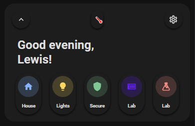

<!-- markdownlint-disable MD046 -->

# Custom Card "Welcome Navigation"




## Credits

- Author: Everything Smart Home - 2022
- Credits to the [welcome scenes card](https://ui-lovelace-minimalist.github.io/UI/usage/cards/card_welcome_scenes/) as the basis
- Version: 1.0.0

## Changelog

<details>
<summary>1.0.0</summary>
Initial release
</details>

## Description

This is a welcome card based on the [welcome scenes card](https://ui-lovelace-minimalist.github.io/UI/usage/cards/card_welcome_scenes/) but replaces the scenes for page navigation instead.

## Variables

| Variable | Default | Required         | Notes             |
|----------|---------|------------------|-------------------|
| ulm_card_esh_welcome_collapse  |         | No | Enables the collapse function. <br> requires an `input_boolean` to track the state|
| ulm_weather   |         | Yes | This is your weather provider. <br> Example: `weather.your_provider`|
| entity_  |     | Yes | Support almost all types of entities <br> Scenes do always show as off |
| icon_  |    | Yes | The icon to show |
| name_  |      | Yes | The name to show|
| color_  |     | Yes | Color of the icon <br> Can choose between: `blue`, `red`, `green`, `yellow`, `pink`, `purple` <br> |
| nav_  |      | Yes | The page/view to navigate to |

## Collapse

!!! note
    This feature is fully optional. It requires some more manual configuration!
You need to create a `input_boolean` in HA to track the state. See [Docs](https://www.home-assistant.io/integrations/input_boolean/).
Furthermore, you need to add the `input_boolean` to the variable `ulm_card_esh_welcome_collapse` **and** to either the `entity` or `triggers_update` to make sure it directly refreshes the state.
!!! warning
    Do not use `triggers_update: "all"`! This will lead to unwanted behavior with the random colors generator.

## Usage

```yaml
  - type: "custom:button-card"
    template: "card_esh_welcome"
    triggers_update: "input_boolean.welcome_toggle"
    variables:
      ulm_card_esh_welcome_collapse: input_boolean.welcome_toggle
      ulm_weather: "weather.your_weather"
      entity_1:
        nav: "house"
        icon: "mdi:home"
        name: "House"
        color: "blue"
      entity_2:
        nav: "lights"
        icon: "mdi:lightbulb"
        name: "Lights"
        color: "yellow"
      entity_3:
        nav: "security"
        icon: "mdi:shield"
        name: Secure
        color: "green"
      entity_4:
        nav: "network"
        icon: "mdi:nas"
        name: Lab
        color: "purple"
      entity_5:
        nav: "network"
        icon: "mdi:flask"
        name: Lab
        color: "red"
```

## Template code

```yaml
---
card_esh_welcome:
  variables:
    ulm_weather: "[[[ return variables.ulm_weather]]]"
    entity_1:
      entity_id:
      icon: "[[[ return entity.attributes.icon ]]]"
      name: "[[[ return entity.attributes.friendly_name ]]]"
      color: >
        [[[
          var colors = ['yellow', 'blue', 'red', 'purple','green', 'pink'];
          var color = colors[Math.floor(Math.random() * colors.length)];
          return color;
        ]]]
    entity_2:
      entity_id:
      icon: "[[[ return entity.attributes.icon  ]]]"
      name: "[[[ return entity.attributes.friendly_name ]]]"
      color: >
        [[[
          var colors = ['yellow', 'blue', 'red', 'purple','green', 'pink'];
          var color = colors[Math.floor(Math.random() * colors.length)];
          return color;
        ]]]
    entity_3:
      entity_id:
      icon: "[[[ return entity.attributes.icon  ]]]"
      name: "[[[ return entity.attributes.friendly_name ]]]"
      color: >
        [[[
          var colors = ['yellow', 'blue', 'red', 'purple','green', 'pink'];
          var color = colors[Math.floor(Math.random() * colors.length)];
          return color;
        ]]]
    entity_4:
      entity_id:
      icon: "[[[ return entity.attributes.icon  ]]]"
      name: "[[[ return entity.attributes.friendly_name ]]]"
      color: >
        [[[
          var colors = ['yellow', 'blue', 'red', 'purple','green', 'pink'];
          var color = colors[Math.floor(Math.random() * colors.length)];
          return color;
        ]]]
    entity_5:
      entity_id:
      icon: "[[[ return entity.attributes.icon  ]]]"
      name: "[[[ return entity.attributes.friendly_name ]]]"
      color: >
        [[[
          var colors = ['yellow', 'blue', 'red', 'purple','green', 'pink'];
          var color = colors[Math.floor(Math.random() * colors.length)];
          return color;
        ]]]
  template:
    - "ulm_language_variables"
  show_icon: false
  show_name: false
  show_label: true
  styles:
    grid:
      - grid-template-areas: >
          [[[
            if(variables.ulm_card_esh_welcome_collapse && states[variables.ulm_card_esh_welcome_collapse].state == 'on'){
              return "\'item1\' \'item2\' ";
            } else {
              return "\'item1\' \'item2\' \'item3\'";
            }
          ]]]
      - grid-template-columns: "1fr"
      - grid-template-rows: "min-content min-content"
      - row-gap: "0px"
    card:
      - border-radius: "var(--border-radius)"
      - box-shadow: "var(--box-shadow)"
      - padding: "10px"
    custom_fields:
      item3:
        - display: >
            [[[
              if(variables.ulm_card_esh_welcome_collapse && states[variables.ulm_card_esh_welcome_collapse].state == 'on'){
                return "none";
              } else {
                return "block";
              }
            ]]]
      item4:
        - display: >
            [[[
              if(variables.ulm_card_esh_welcome_collapse && states[variables.ulm_card_esh_welcome_collapse].state == 'on'){
                return "none";
              } else {
                return "block";
              }
            ]]]
  custom_fields:
    item1:
      card:
        type: "custom:button-card"
        template: "card_esh_welcome_topbar"
        variables:
          ulm_card_esh_welcome_collapse: "[[[ return variables.ulm_card_esh_welcome_collapse ]]]"
          ulm_weather: "[[[ return variables.ulm_weather]]]"
        styles:
          card:
            - border-radius: "none"
            - box-shadow: "none"
            - padding: "4px"
            - margin-left: "relative"
    item2:
      card:
        type: "custom:button-card"
        show_icon: false
        show_label: false
        show_name: true
        show_entity_picture: false
        name: |
          [[[
            var today = new Date();
            var time = today.getHours()
            let welcome = '';
            if (time >= '18'){
              welcome = variables.ulm_evening;
            } else if (time >= '12'){
              welcome = variables.ulm_afternoon;
            } else if (time >= '5'){
              welcome = variables.ulm_morning;
            } else {
              welcome = variables.ulm_hello;
            }
            return welcome + ', ' + '   <br>' + user.name + '!';
          ]]]
        styles:
          name:
            - align-self: "start"
            - justify-self: "start"
            - font-weight: "bold"
            - font-size: "24px"
            - margin-left: "16px"
          grid:
            - grid-template-areas: "'i n' 'i l'"
            - grid-template-columns: "min-content auto"
            - grid-template-rows: "min-content min-content"
            - text-align: "start"
          card:
            - box-shadow: "none"
            - padding-bottom: "8px"
    item3:
      card:
        type: "custom:button-card"
        template: >
          [[[
            if(variables.entity_1.nav && variables.entity_2.nav && variables.entity_3.nav && variables.entity_4.nav && variables.entity_5.nav){
              return 'card_esh_welcome_nav'
            }
          ]]]
        styles:
          card:
            - border-radius: "none"
            - box-shadow: "none"
            - padding: "4px"
        variables:
          entity_1: "[[[ return variables.entity_1]]]"
          entity_2: "[[[ return variables.entity_2]]]"
          entity_3: "[[[ return variables.entity_3]]]"
          entity_4: "[[[ return variables.entity_4]]]"
          entity_5: "[[[ return variables.entity_5]]]"

card_esh_welcome_title:
  tap_action:
    action: "none"
  show_icon: false
  show_label: true
  show_name: true
  styles:
    card:
      - background-color: "rgba(0,0,0,0)"
      - box-shadow: "none"
      - height: "auto"
      - width: "auto"
      - margin-top: "-10px"
      - margin-left: "16px"
      - margin-bottom: "-15px"
    grid:
      - grid-template-areas: "'n' 'l'"
      - grid-template-columns: "1fr"
      - grid-template-rows: "min-content min-content"
    name:
      - justify-self: "start"
      - font-weight: "bold"
      - font-size: "20px"
    label:
      - justify-self: "start"
      - font-weight: "bold"
      - font-size: "1rem"
      - opacity: "0.4"

card_esh_welcome_nav:
  show_icon: false
  show_name: true
  show_label: false
  styles:
    grid:
      - grid-template-areas: "'item1 item2 item3 item4 item5'"
      - grid-template-columns: "1fr 1fr 1fr 1fr 1fr"
      - grid-template-rows: "min-content"
      - justify-items: "center"
    card:
      - border-radius: "var(--border-radius)"
      - box-shadow: "var(--box-shadow)"
      - padding: "12px"
      - overflow: "visible"
  custom_fields:
    item1:
      card:
        type: "custom:button-card"
        template: "card_esh_welcome_pill_nav"
        custom_fields:
          item1:
            card:
              type: "custom:button-card"
              tap_action:
                action: "navigate"
                navigation_path: "[[[ return variables.entity_1.nav; ]]]"
              icon: "[[[ return variables.entity_1.icon ]]]"
              styles:
                icon:
                  - color: "[[[ return `rgba(var(--color-${variables.entity_1.color}), 1)`;]]]"
                img_cell:
                  - background-color: "[[[ return `rgba(var(--color-${variables.entity_1.color}), 0.20)`;]]]"
          item2:
            card:
              type: "custom:button-card"
              tap_action:
                action: "navigate"
                navigation_path: "[[[ return variables.entity_1.nav; ]]]"
              name: "[[[ return variables.entity_1.name ]]]"
    item2:
      card:
        type: "custom:button-card"
        template: "card_esh_welcome_pill_nav"
        entity: "[[[ return variables.entity_2.entity_id ]]]"
        custom_fields:
          item1:
            card:
              type: "custom:button-card"
              tap_action:
                action: "navigate"
                navigation_path: "[[[ return variables.entity_2.nav; ]]]"
              icon: "[[[ return variables.entity_2.icon ]]]"
              styles:
                icon:
                  - color: "[[[ return `rgba(var(--color-${variables.entity_2.color}), 1)`;]]]"
                img_cell:
                  - background-color: "[[[ return `rgba(var(--color-${variables.entity_2.color}), 0.20)`;]]]"
          item2:
            card:
              type: "custom:button-card"
              tap_action:
                action: "navigate"
                navigation_path: "[[[ return variables.entity_2.nav; ]]]"
              name: "[[[ return variables.entity_2.name ]]]"
    item3:
      card:
        type: "custom:button-card"
        template: "card_esh_welcome_pill_nav"
        entity: "[[[ return variables.entity_3.entity_id ]]]"
        custom_fields:
          item1:
            card:
              type: "custom:button-card"
              tap_action:
                action: "navigate"
                navigation_path: "[[[ return variables.entity_3.nav; ]]]"
              icon: "[[[ return variables.entity_3.icon ]]]"
              styles:
                icon:
                  - color: "[[[ return `rgba(var(--color-${variables.entity_3.color}), 1)`;]]]"
                img_cell:
                  - background-color: "[[[ return `rgba(var(--color-${variables.entity_3.color}), 0.20)`;]]]"
          item2:
            card:
              type: "custom:button-card"
              tap_action:
                action: "navigate"
                navigation_path: "[[[ return variables.entity_3.nav; ]]]"
              name: "[[[ return variables.entity_3.name ]]]"
    item4:
      card:
        type: "custom:button-card"
        template: "card_esh_welcome_pill_nav"
        entity: "[[[ return variables.entity_4.entity_id ]]]"
        custom_fields:
          item1:
            card:
              type: "custom:button-card"
              tap_action:
                action: "navigate"
                navigation_path: "[[[ return variables.entity_4.nav; ]]]"
              icon: "[[[ return variables.entity_4.icon ]]]"
              styles:
                icon:
                  - color: "[[[ return `rgba(var(--color-${variables.entity_4.color}), 1)`;]]]"
                img_cell:
                  - background-color: "[[[ return `rgba(var(--color-${variables.entity_4.color}), 0.20)`;]]]"
          item2:
            card:
              type: "custom:button-card"
              tap_action:
                action: "navigate"
                navigation_path: "[[[ return variables.entity_4.nav; ]]]"
              name: "[[[ return variables.entity_4.name ]]]"
    item5:
      card:
        type: "custom:button-card"
        template: "card_esh_welcome_pill_nav"
        custom_fields:
          item1:
            card:
              type: "custom:button-card"
              tap_action:
                action: "navigate"
                navigation_path: "[[[ return variables.entity_5.nav; ]]]"
              icon: "[[[ return variables.entity_5.icon ]]]"
              styles:
                icon:
                  - color: "[[[ return `rgba(var(--color-${variables.entity_5.color}), 1)`;]]]"
                img_cell:
                  - background-color: "[[[ return `rgba(var(--color-${variables.entity_5.color}), 0.20)`;]]]"
          item2:
            card:
              type: "custom:button-card"
              tap_action:
                action: "navigate"
                navigation_path: "[[[ return variables.entity_1.nav; ]]]"
              name: "[[[ return variables.entity_5.name ]]]"

card_esh_welcome_pill_nav:
  show_icon: false
  show_label: false
  show_name: false
  state:
    - value: "on"
      styles:
        card:
          - overflow: "visible"
          - box-shadow: "none"
  styles:
    grid:
      - grid-template-areas: "'item1' 'item2'"
      - grid-template-columns: "min-content"
      - grid-template-rows: "1fr 1fr"
      - row-gap: "12px"
      - justify-items: "center"
      - column-gap: "auto"
    card:
      - border-radius: "50px"
      - place-self: "center"
      - width: "52px"
      - height: "84px"
      - box-shadow: >
          [[[
            if (hass.themes.darkMode){
              return "0px 2px 4px 0px rgba(0,0,0,0.80)";
            } else {
              return "var(--box-shadow)";
            }
          ]]]
  color: "var(--google-grey)"
  custom_fields:
    item1:
      card:
        type: "custom:button-card"
        show_icon: true
        show_label: false
        show_name: false
        styles:
          grid:
            - grid-template-areas: "i"
          icon:
            - color: "[[[ return `rgba(var(--color-theme), 0.20)`;]]]"
            - width: "20px"
          img_cell:
            - background-color: "[[[ return `rgba(var(--color-theme), 0.05)`;]]] "
            - border-radius: "50%"
            - width: "42px"
            - height: "42px"
          card:
            - box-shadow: "none"
            - border-radius: "50px"
            - padding: "5px"
        state:
          - value: "on"
            styles:
              card:
                - overflow: "visible"
                - box-shadow: >
                    [[[
                      if (hass.themes.darkMode){
                        return "0px 2px 4px 0px rgba(0,0,0,0.80)";
                      } else {
                        return "var(--box-shadow)";
                      }
                    ]]]
    item2:
      card:
        type: "custom:button-card"
        show_icon: false
        show_label: false
        styles:
          grid:
            - grid-template-areas: "n"
          name:
            - font-weight: "bold"
            - font-size: "9.5px"
            - width: "33px"
            - padding-bottom: "7px"
          card:
            - box-shadow: "none"
            - padding: "0px 5px 5px 5px"
            - margin-top: "-5px"
            - border-radius: "50px"

card_esh_welcome_topbar:
  show_icon: false
  show_name: true
  show_label: false
  styles:
    grid:
      - grid-template-areas: "'item1 item2 item3'"
      - grid-template-columns: "1fr 7fr 1fr"
      - grid-template-rows: "min-content"
      - justify-items: "center"
    card:
      - border-radius: "var(--border-radius)"
      - box-shadow: "var(--box-shadow)"
      - padding: "12px"
  custom_fields:
    item1:
      card:
        type: "custom:button-card"
        template: "chips"
        entity: "[[[ return variables.ulm_card_esh_welcome_collapse ]]]"
        icon: "mdi:chevron-up"
        show_icon: true
        styles:
          grid:
            - grid-template-areas: "'i'"
          card:
            - box-shadow: >
                [[[
                  if (hass.themes.darkMode){
                    return "0px 2px 4px 0px rgba(0,0,0,0.80)";
                  } else {
                    return "var(--box-shadow)";
                  }
                ]]]
        state:
          - value: "on"
            icon: "mdi:chevron-down"
            styles:
              icon:
                - color: "rgb(var(--color-theme))"
        tap_action:
          action: "call-service"
          service: "input_boolean.toggle"
          service_data:
            entity_id: "[[[ return variables.ulm_card_esh_welcome_collapse ]]]"
    item2:
      card:
        type: "custom:button-card"
        template: "chip_weather_date"
        variables:
          ulm_weather: "[[[ return variables.ulm_weather]]]"
        tap_action:
          action: "more-info"
        styles:
          card:
            - width: "100px"
            - box-shadow: >
                [[[
                  if (hass.themes.darkMode){
                    return "0px 2px 4px 0px rgba(0,0,0,0.80)";
                  } else {
                    return "var(--box-shadow)";
                  }
                ]]]
    item3:
      card:
        type: "custom:button-card"
        tap_action:
          action: "navigate"
          navigation_path: "/config/dashboard"
        template: "chip_mdi_icon_only"
        variables:
          ulm_chip_mdi_icon_only_icon: "mdi:cog-outline"
        styles:
          card:
            - align-self: "end"
            - box-shadow: >
                [[[
                  if (hass.themes.darkMode){
                    return "0px 2px 4px 0px rgba(0,0,0,0.80)";
                  } else {
                    return "var(--box-shadow)";
                  }
                ]]]
```
