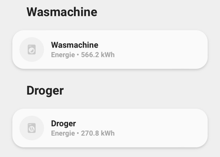
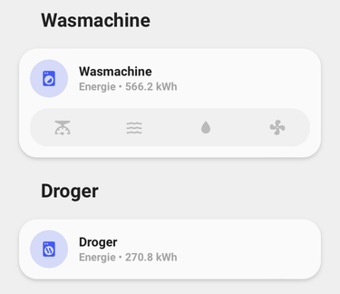
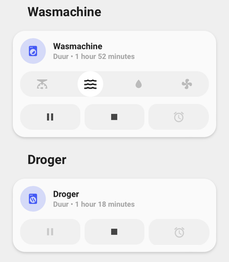

<!-- markdownlint-disable MD046 -->

# Custom-card "Washer"



Small layout when the washer, dryer or dishwasher is turned off (ulm_custom_card_washer_power === "off"). It shows the content of the idle label variable (ulm_custom_card_washer_label_idle)



When the washer, dryer or dishwasher is turned on the possible (job) stages of machine become visible (In this example the dryer has no different (job) stages so the stages remain closed)


When the washer, dryer or dishwasher is set to smart control (ulm_custom_card_washer_remote_control === "true"), you can start the machine from you app, or you can start it using automation. The buttons will reflect this stage change.


When you want to start the washer, dryer or dishwasher at a specific time (through automation) you can turn on the timer (press the icon and the ulm_custom_card_washer_delayed_start === "on") and set the time to start (use the up and down buttons of click on the time to set ulm_custom_card_washer_delayed_starttime (Time only)). It shows the content of the configuration label variable (ulm_custom_card_washer_label_configuring)



When the washer, dryer or dishwasher is running you can use the running label variable (ulm_custom_card_washer_label_running) to show the remaining time. The dryer can't be paused so the button is disabled.

!! Attention !!

This custom card is build based on a Samsung Washer and Dryer and based on the SmartThings Custom integration (installable using HACS: https://github.com/veista/smartthings). Other washer, dryers or dishwasher could work with this custom card, but might require some work. This card is highly configurable, but for the machine state you might need a template sensors to support the same terminology (run, pause, stop).

## Credits

- Author: Cruguah - 2023
- Version: 1.0.1

- Thanks to rphlwnk for sharing his code of his washing machine card

## Changelog

<details>
  <summary>1.0.1</summary>
  Small bug fix resolving issue #1230
</details>
<details>
  <summary>1.0.0</summary>
  Initial release
</details>

## Usage

```yaml
- type: "custom:button-card"
  template: "custom_card_haven_washer"
  variables:
    ulm_custom_card_washer_power: switch.washingmachine_switch
    ulm_custom_card_washer_remote_control: sensor.washingmachine_remote_control
    ulm_custom_card_washer_machine_state: sensor.washingmachine_machine_state
    ulm_custom_card_washer_job_state: sensor.washingmachine_job_state
    ulm_custom_card_washer_job_states:
      state1:
        name: "weightSensing"
        icon: "mdi:scale"
      state2:
        name: "wash"
        icon: "mdi:waves"
      state3:
        name: "rinse"
        icon: "mdi:water"
      state4:
        name: "spin"
        icon: "mdi:fan"
    ulm_custom_card_washer_delayed_start: input_boolean.washingmachine_latest_start
    ulm_custom_card_washer_delayed_starttime: input_datetime.washingmachine_latest_starttime
    ulm_custom_card_washer_label_idle: >
      [[[
        var name = states["sensor.washingmachine_energy"].attributes.friendly_name;
        var value = states["sensor.washingmachine_energy"].state;
        var measurement = states["sensor.washingmachine_energy"].attributes.unit_of_measurement;
        return name + " • " + value + " " + measurement;
      ]]]
    ulm_custom_card_washer_label_running: "[[[ return states["sensor.washer_remaining_time"].state; ]]]"
    ulm_custom_card_washer_label_configuring: >
      [[[
          var name = states["sensor.washer_actual_starttime"].attributes.friendly_name;
          var time = states["sensor.washer_actual_starttime"].attributes.display_time;
          return name + " • " + time;
      ]]]
    ulm_custom_card_washer_start_action:
      action: "call-service"
      service: switch.turn_on
      service_data:
        entity_id: switch.washer_run_action
    ulm_custom_card_washer_pause_action:
      action: "call-service"
      service: switch.turn_on
      service_data:
        entity_id: switch.washer_pause_action
    ulm_custom_card_washer_stop_action:
      action: "call-service"
      service: switch.turn_on
      service_data:
        entity_id: switch.washer_stop_action
```

## Requirements

An integration that will support your washer, dryer, dishwasher or any other machine with job stages that you want to monitor.

When using a Samsung Washing machine or Dryer that integrates with SmartThings, a default integration is available in Home Assistant and this custom card works with this integration. One thing missing in the default SmartThings integration is the ability to see is remote control is enabled. A custom integration is available which extends the sensors with a remote control sensor. Integration from HACS: "SmartThings Custom" (https://github.com/veista/smartthings) from veista

## Additional: Show the remaining time

If you want to show the remaining time of your wash you can use the following template sensor to calculate duration

```yaml
template:
  - sensor:
      - unique_id: washer_remaining_time
        name: "Remaining Time"
        state: >-
          {% set rem_h = (as_timestamp(states.sensor.washer_completion_time.state) - as_timestamp(now())) | timestamp_custom("%-H", false) %}
          {% set rem_m = (as_timestamp(states.sensor.washer_completion_time.state) - as_timestamp(now())) | timestamp_custom("%-M", false) %}
           {{ rem_h }} hour(s) and {{ rem_m }} minute(s)   {{ rem_m }} minute(s) 
```

## Additional: Control the washing machine of dryer remotely

Starting, pausing or stopping the washer or dryer is currently not supported by the Samsung SmartThings integration.
To use the start, pause, and stop buttons, you can create command line switches, which can initiate the corresponding action.
When creating a command-line switch, you need to replace the following items:

| Variable  | Explanation                                                                              |
| --------- | ---------------------------------------------------------------------------------------- |
| action    | this should be run, pause or stop                                                        |
| deviceId  | The id of your device (guid)                                                             |
| PAT Token | The same PAT Token you"ve created during the installation of the SmartThings integration |

For every action you need to create an other command-line switch

Please ensure the capabilities of you machine before creating command-line switches

```yaml
switch:
  - platform: command_line
    switches:
      washer_run_action:
        unique_id: switch.washer_<action>_action
        value_template: >
          
            false
          
        command_on: >
          curl --location --request POST "https://api.smartthings.com/v1/devices/<deviceId>/commands" --header "authorization: Bearer <PAT Token>" --header  "Content-Type: text/plain" --data-raw "[{"capability":"washerOperatingState","command":"setMachineState","arguments":["<action>"]}]"
```

## Variables

### Main parameters

| Variable                                 | Example                                                         | Required | Explanation                                             |
| ---------------------------------------- | --------------------------------------------------------------- | -------- | ---------------------------------------------------------------------------------------------- |
| ulm_custom_card_washer_power             | switch.washingmachine_switch                                    | yes      | Is the washing machine or dryer turned on?                                                        |
| ulm_custom_card_washer_remote_control    | sensor.washingmachine_remote_control                            | no       | Can we control the washing machine or dryer remotely                                             |
| ulm_custom_card_washer_machine_state     | sensor.washingmachine_machine_state                             | no       | What is the current state of washing machine or dryer: none, run or pause                       |
| ulm_custom_card_washer_job_state         | sensor.washingmachine_job_state                                 | no       | What is the current step in the program, weightSensing, wash, rinse, spin or drying                 |
| ulm_custom_card_washer_job_states        | List of maximum 5 states (name and icon) to show as job states  | no       | Define the job states of the washing machine of dryer (or any other machine that you wanna use) |
| ulm_custom_card_washer_delayed_start     | input_boolean.washingmachine_latest_start                       | no       | Turn on the ability to start the washing machine of dryer at a specific time                        |
| ulm_custom_card_washer_delayed_starttime | input_datetime.washingmachine_latest_starttime                  | no       | What time should the washing machine or dryer start                                                |
| ulm_custom_card_washer_label_idle        | Any text, for example the number of runs                        | no       | What label to show when the washing machine or dryer is idle                                   |
| ulm_custom_card_washer_label_running     | Any text, for example the remaining time of the current program | no       | What label to show when the washing machine or dryer is running                                |
| ulm_custom_card_washer_label_configuring | Any text, for example, the end result of all the settings       | no       | What label to show when the washing machine or dryer is being configured                       |
| ulm_custom_card_washer_start_action      | A collection of setting to change a value or start an action    | no       | This contains all the parameters to start the washing machine or dryer (See the next table)    |
| ulm_custom_card_washer_pause_action      | A collection of setting to change a value or start an action    | no       | This contains all the parameters to pause the washing machine or dryer (See the next table)    |
| ulm_custom_card_washer_stop_action       | A collection of setting to change a value or start an action    | no       | This contains all the parameters to stop the washing machine or dryer (See the next table)          |

### Parameters specific for the start, pause and stop of the washing machine of dryer

| Variable        | Example                                | Required | Explanation                                                                                         |
| --------------- | -------------------------------------- | -------- | --------------------------------------------------------------------------------------------------- |
| action          | none                                   | no       | Action to perform (more-info, toggle, call-service, navigate, url, none) Default: none              |
| entity          | entity_id                              | no       | Entity id to call the action on                                                                     |
| navigation_path | The navigation path for the call       | no       | Path to navigate to (e.g., /lovelace/0/) when action defined as navigate                            |
| url_path        | The url path for the call              | no       | Path to navigate to (e.g., https://www.home-assistant.io) when action defined as url                |
| service         | The service to call the action on      | no       | Service to call (e.g., media_player.media_play_pause) when action defined as call-service           |
| service_data    | The service_data to call the action on | no       | Service data to include (e.g., entity_id: media_player.bedroom) when action defined as call-service |

??? note "Template Code"

    ```yaml title="custom_card_haven_washer.yaml"
    --8<-- "custom_cards/custom_card_haven_washer/custom_card_haven_washer.yaml"
    ```
