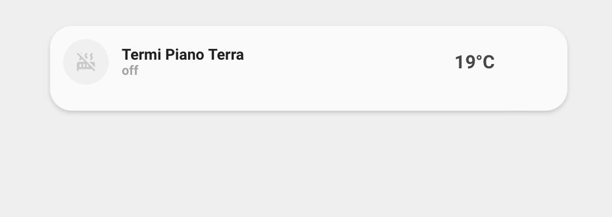
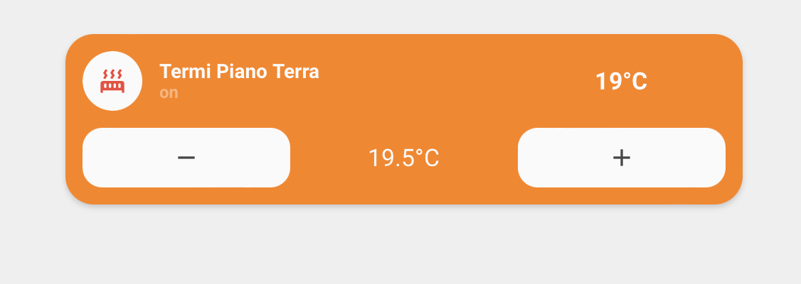
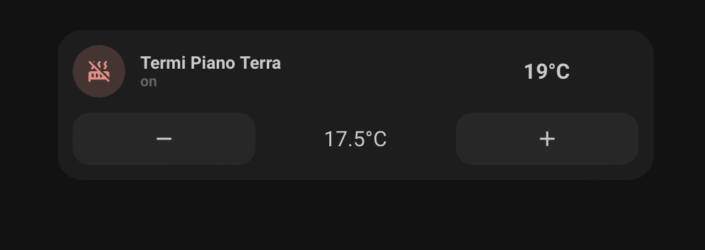
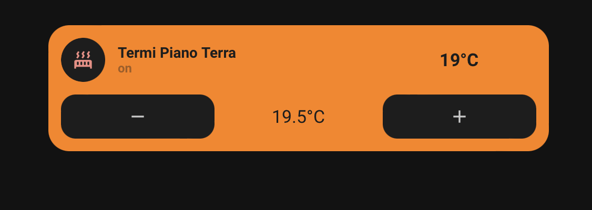

<!-- markdownlint-disable MD046 -->

# Custom-card "Thermostat"

The `custom_card_httpedo13_thermostat` shows data from your thermostat and gives you the possibility to control it. Thanks to [tpx01's](https://github.com/httpedo13/UI/tree/main/custom_cards/custom_card_tpx01_aircondition) air-condition custom card!

## Credits

Author: httpedo13 - 2021
Version: 1.0.0

This design was made by [tpx01's](https://github.com/httpedo13/UI/tree/main/custom_cards/custom_card_tpx01_aircondition)

## Changelog

<details>
<summary>1.0.0</summary>
Initial release
</details>

## Images










## Usage

With buttons:

```yaml
- type: custom:button-card
  template: custom_card_httpedo13_thermostat_with_buttons
  variables:
   entity: climate.ground_floor
   name: Heater Ground Floor
```

With collapse button:

```yaml
- type: custom:button-card
  template: custom_card_httpedo13_thermostat_with_buttons_collapse
  variables:
   entity: climate.ground_floor
   name: Heater Ground Floor
```

## Requirements

Entity climate with only heat mode

## Variables

<table>
<tr>
<th>Variable</th>
<th>Example</th>
<th>Required</th>
<th>Explanation</th>
</tr>
<tr>
<td>entity</td>
<td>climate.ground_floor</td>
<td>yes</td>
<td>Your climate with only heat mode entity</td>
</tr>
<tr>
<td>name</td>
<td>Heater Ground Floor</td>
<td>yes</td>
<td>The name to show</td>
</tr>
</table>

## Template code

```yaml
---
custom_card_httpedo13_thermostat:
  template:
    - "ulm_language_variables"
    - "custom_card_httpedo13_thermostat_language_variables"
  tap_action:
    action: "toggle"
  icon: |
    [[[
        if (entity.attributes.hvac_action == 'heating') {
          return "mdi:radiator";
        }
        return "mdi:radiator-off";
    ]]]
  label: >-
    [[[
        if (entity.state =='off') {
          return variables.custom_card_httpedo13_thermostat_off;
        } else if (entity.state =='heat') {
          return variables.custom_card_httpedo13_thermostat_on;
        } else if (entity.attributes.hvac_action == 'heating') {
          return variables.custom_card_httpedo13_thermostat_heating;
        }
        return entity.state;
    ]]]
  state:
    - operator: "template"
      value: >
        [[[
          return entity.state != 'off';
        ]]]
      styles:
        label:
          - color: |
              [[[
                if (entity.attributes.hvac_action == 'heating'){
                  return "var(--card-background-color)";
                }
                return "rgba(var(--color-theme),0.9)";
              ]]]
        name:
          - font-weight: "bold"
          - color: |
              [[[
                if (entity.attributes.hvac_action == 'heating'){
                  return "var(--card-background-color)";
                }
                return "rgba(var(--color-theme),0.9)";
              ]]]
        icon:
          - color: "rgba(var(--color-red),1)"
        img_cell:
          - background-color: |
              [[[
                if (entity.attributes.hvac_action == 'heating'){
                  return 'var(--card-background-color)';
                }
                return 'rgba(var(--color-red),0.2)';
              ]]]
        card:
          - background-color: |
              [[[
                if (entity.attributes.hvac_action == 'heating'){
                  return '#ff8100';
                }
                return 'var(--card-background-color)';
              ]]]

custom_card_httpedo13_thermostat_with_buttons:
  triggers_update: "all"
  styles:
    grid:
      - grid-template-areas: "'item1' 'item2'"
      - grid-template-columns: "1fr"
      - grid-template-rows: "min-content  min-content"
      - row-gap: "12px"
    card:
      - border-radius: "var(--border-radius)"
      - box-shadow: "var(--box-shadow)"
      - padding: "12px"
      - background-color: |
          [[[
            if (states[variables.entity].attributes.hvac_action == 'heating'){
              return '#ff8100';
            }
            return 'var(--card-background-color)';
          ]]]
  tap_action:
    action: "call-service"
    service: "climate.set_hvac_mode"
    service_data:
      entity_id: "[[[ return variables.entity ]]]"
      hvac_mode: |
        [[[
          if (states[variables.entity].state == "off"){
            return 'heat';
          } else if (states[variables.entity].state == "heat"){
            return 'off';
          }
        ]]]
  custom_fields:
    item1:
      card:
        type: "custom:button-card"
        template: "list_items_favorite"
        styles:
          card:
            - background-color: |
                [[[
                  if (states[variables.entity].attributes.hvac_action == 'heating'){
                    return '#ff8100';
                  }
                  return 'var(--card-background-color)';
                ]]]
        custom_fields:
          item1:
            card:
              type: "custom:button-card"
              template:
                - "icon_info"
                - "custom_card_httpedo13_thermostat"
              tap_action:
                action: "call-service"
                service: "climate.set_hvac_mode"
                service_data:
                  entity_id: "[[[ return variables.entity ]]]"
                  hvac_mode: |
                    [[[
                      if (states[variables.entity].state == "off"){
                        return 'heat';
                      } else if (states[variables.entity].state == "heat"){
                        return 'off';
                      }
                    ]]]
              name: >
                [[[
                    if (variables.name == null) {
                      return variables.entity;
                    }
                    return variables.name;
                ]]]
              entity: "[[[ return variables.entity ]]]"
          item2:
            card:
              type: "custom:button-card"
              template: "widget_current_temperature"
              tap_action:
                action: "toggle"
              entity: "[[[ return variables.entity ]]]"
              icon: "mdi:temperature-celsius"
    item2:
      card:
        type: "custom:button-card"
        template: "list_3_items"
        styles:
          card:
            - background-color: |
                [[[
                  if (states[variables.entity].attributes.hvac_action == 'heating'){
                    return '#ff8100';
                  }
                  return 'var(--card-background-color)';
                ]]]
        custom_fields:
          item1:
            card:
              type: "custom:button-card"
              template: "widget_icon_for_thermostat"
              entity: "[[[ return variables.entity ]]]"
              tap_action:
                action: "call-service"
                service: "climate.set_temperature"
                service_data:
                  temperature: "[[[ return (parseFloat(states[variables.entity].attributes.temperature) - 0.5)  ]]]"
                  entity_id: "[[[ return variables.entity ]]]"
              icon: "mdi:minus"
          item2:
            card:
              type: "custom:button-card"
              template: "widget_temperature"
              tap_action:
                action: "toggle"
              entity: "[[[ return variables.entity ]]]"
              icon: "mdi:temperature-celsius"
          item3:
            card:
              type: "custom:button-card"
              template: "widget_icon_for_thermostat"
              entity: "[[[ return variables.entity ]]]"
              tap_action:
                action: "call-service"
                service: "climate.set_temperature"
                service_data:
                  temperature: "[[[ return (parseFloat(states[variables.entity].attributes.temperature) + 0.5)  ]]]"
                  entity_id: "[[[ return variables.entity ]]]"
              icon: "mdi:plus"


custom_card_httpedo13_thermostat_with_buttons_collapse:
  triggers_update: "all"
  styles:
    grid:
      - grid-template-areas: "'item1' 'item2'"
      - grid-template-columns: "1fr"
      - grid-template-rows: "min-content  min-content"
      - row-gap: "12px"
    card:
      - border-radius: "var(--border-radius)"
      - box-shadow: "var(--box-shadow)"
      - padding: "12px"
      - background-color: |
          [[[
            if (states[variables.entity].attributes.hvac_action == 'heating'){
              return '#ff8100';
            }
            return 'var(--card-background-color)';
          ]]]
  tap_action:
    action: "call-service"
    service: "climate.set_hvac_mode"
    service_data:
      entity_id: "[[[ return variables.entity ]]]"
      hvac_mode: |
        [[[
          if (states[variables.entity].state == "off"){
            return 'heat';
          } else if (states[variables.entity].state == "heat"){
            return 'off';
          }
        ]]]
  custom_fields:
    item1:
      card:
        type: "custom:button-card"
        template: "list_items_favorite"
        styles:
          card:
            - background-color: |
                [[[
                  if (states[variables.entity].attributes.hvac_action == 'heating'){
                    return '#ff8100';
                  }
                  return 'var(--card-background-color)';
                ]]]
        custom_fields:
          item1:
            card:
              type: "custom:button-card"
              template:
                - "icon_info"
                - "custom_card_httpedo13_thermostat"
              tap_action:
                action: "call-service"
                service: "climate.set_hvac_mode"
                service_data:
                  entity_id: "[[[ return variables.entity ]]]"
                  hvac_mode: |
                    [[[
                      if (states[variables.entity].state == "off"){
                        return 'heat';
                      } else if (states[variables.entity].state == "heat"){
                        return 'off';
                      }
                    ]]]
              name: >
                [[[
                    if (variables.name == null) {
                      return variables.entity;
                    }
                    return variables.name;
                ]]]
              entity: "[[[ return variables.entity ]]]"
          item2:
            card:
              type: "custom:button-card"
              template: "widget_current_temperature"
              tap_action:
                action: "toggle"
              entity: "[[[ return variables.entity ]]]"
              icon: "mdi:temperature-celsius"
    item2:
      card:
        type: "conditional"
        conditions:
          - entity: "[[[ return states[variables.entity].entity_id ]]]"
            state: "heat"
        card:
          type: "custom:button-card"
          template: "list_3_items"
          styles:
            card:
              - background-color: |
                  [[[
                    if (states[variables.entity].attributes.hvac_action == 'heating'){
                      return '#ff8100';
                    }
                    return 'var(--card-background-color)';
                  ]]]
          custom_fields:
            item1:
              card:
                type: "custom:button-card"
                template: "widget_icon_for_thermostat"
                entity: "[[[ return variables.entity ]]]"
                tap_action:
                  action: "call-service"
                  service: "climate.set_temperature"
                  service_data:
                    temperature: "[[[ return (parseFloat(states[variables.entity].attributes.temperature) - 0.5)  ]]]"
                    entity_id: "[[[ return variables.entity ]]]"
                icon: "mdi:minus"
            item2:
              card:
                type: "custom:button-card"
                template: "widget_temperature"
                tap_action:
                  action: "toggle"
                entity: "[[[ return variables.entity ]]]"
                icon: "mdi:temperature-celsius"
            item3:
              card:
                type: "custom:button-card"
                template: "widget_icon_for_thermostat"
                entity: "[[[ return variables.entity ]]]"
                tap_action:
                  action: "call-service"
                  service: "climate.set_temperature"
                  service_data:
                    temperature: "[[[ return (parseFloat(states[variables.entity].attributes.temperature) + 0.5)  ]]]"
                    entity_id: "[[[ return variables.entity ]]]"
                icon: "mdi:plus"


widget_current_temperature:
  color: "var(--google-grey-500)"
  show_icon: false
  show_name: false
  show_label: true
  size: "20px"
  label: |-
    [[[
        var temperature = entity.attributes.current_temperature;
        if (temperature == null) {
          var temperature = '-';
        }
        return temperature + '°C'
    ]]]
  styles:
    label:
      - font-weight: "bold"
      - color: |
          [[[
            if (entity.attributes.hvac_action == 'heating'){
              return 'var(--card-background-color)';
            }
            return 'rgb(var(--color-theme),0.9)';
          ]]]
    grid:
      - grid-template-areas: "'l'"
    card:
      - box-shadow: "none"
      - padding: "0px"
      - border-radius: "14px"
      - place-self: "center"
      - height: "42px"
      - background-color: |
          [[[
            if (entity.attributes.hvac_action == 'heating'){
              return '#ff8100';
            }
            return 'var(--card-background-color)';
          ]]]

widget_temperature:
  color: "var(--google-grey-500)"
  show_icon: false
  show_name: false
  show_label: true
  size: "20px"
  label: |-
    [[[
        var temperature = entity.attributes.temperature;
        if (temperature == null) {
          var temperature = '-';
        }
        return temperature + '°C'
    ]]]
  styles:
    label:
      - color: |
          [[[
            if (entity.attributes.hvac_action == 'heating'){
              return 'var(--card-background-color)';
            }
            return 'rgb(var(--color-theme),0.9)';
          ]]]
    grid:
      - grid-template-areas: "'l'"
    card:
      - box-shadow: "none"
      - padding: "0px"
      - border-radius: "14px"
      - place-self: "center"
      - height: "42px"
      - background-color: |
          [[[
            if (entity.attributes.hvac_action == 'heating'){
              return '#ff8100';
            }
            return 'var(--card-background-color)';
          ]]]

widget_icon_for_thermostat:
  tap_action:
    action: "toggle"
  show_icon: true
  show_name: false
  styles:
    grid:
      - grid-template-areas: "'i'"
    card:
      - box-shadow: "none"
      - padding: "0px"
      - background-color: |
          [[[
            if (entity.attributes.hvac_action == 'heating'){
              return 'var(--card-background-color)';
            }
            return 'rgba(var(--color-theme),0.05)';
          ]]]
      - border-radius: "14px"
      - place-self: "center"
      - height: "42px"
    icon:
      - color: "rgba(var(--color-theme),0.9)"
  size: "20px"
  color: "var(--google-grey)"

list_items_favorite:
  styles:
    grid:
      - grid-template-areas: "'item1 item1 item2'"
      - grid-template-columns: "1fr 1fr 1fr"
      - grid-template-rows: "min-content"
      - column-gap: "7px"
    card:
      - box-shadow: "none"
      - padding: "0px"
```
