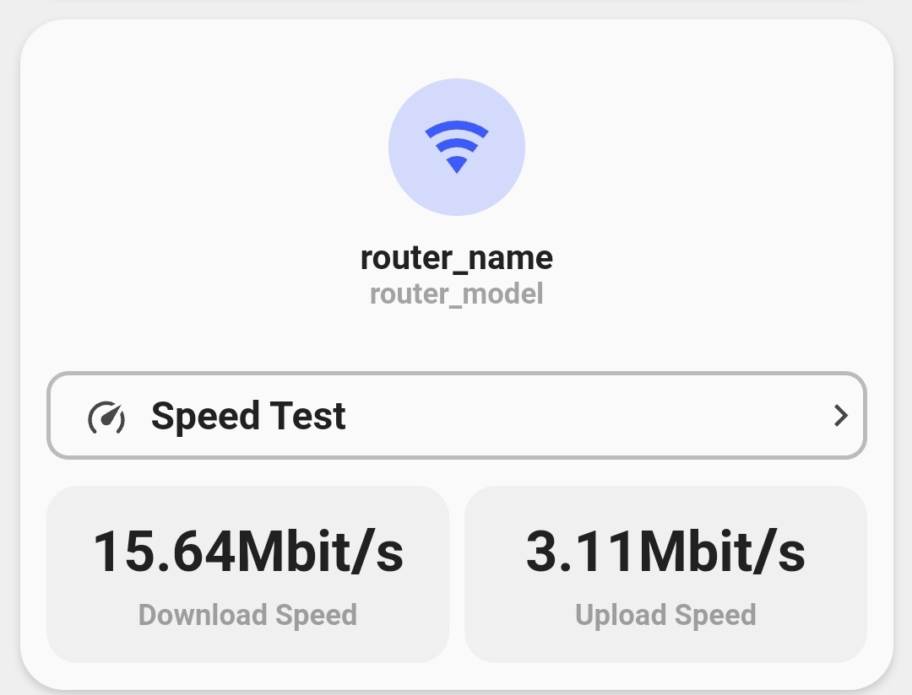

<!-- markdownlint-disable MD046 -->

# Custom-card "Speedtest"

This is a `custom-card` to display the results from the `Speedtest.net` integration. The integration uses the Speedtest.net web service to measure network bandwidth performance.



## Credits

Author: irmajavi - 2022
Version: 1.0.0

## Changelog

<details>
<summary>1.0.0</summary>
Initial release
</details>

## Requirements

 Home Assistant Speedtest.net integration

## Usage

```yaml
type: custom:button-card
template: custom_card_irmajavi_speedtest
variables:
  ulm_custom_card_irmajavi_speedtest_download_speed_entity: sensor.speedtest_download
  ulm_custom_card_irmajavi_speedtest_upload_speed_entity: sensor.speedtest_upload
  ulm_custom_card_irmajavi_speedtest_color: blue
  ulm_custom_card_irmajavi_speedtest_router_name: router_name
  ulm_custom_card_irmajavi_speedtest_router_model: router_model
```

## Variables

<table>
<thead>
  <tr>
    <th>Variable</th>
    <th>Example</th>
    <th>Required</th>
    <th>Explanation</th>
  </tr>
</thead>
<tbody>
  <tr>
    <td>ulm_custom_card_irmajavi_speedtest_router_name</td>
    <td>Linksys</td>
    <td>Yes</td>
    <td>Your router name</td>
  </tr>
  <tr>
    <td>ulm_custom_card_irmajavi_speedtest_router_model</td>
    <td>EA8549</td>
    <td>Yes</td>
    <td>Your router model</td>
  </tr>
  <tr>
    <td>ulm_custom_card_irmajavi_speedtest_color</td>
    <td>blue</td>
    <td>Yes</td>
    <td>The color of the icon</td>
  </tr>
  <tr>
    <td>ulm_custom_card_irmajavi_speedtest_upload_speed_entity</td>
    <td>sensor.test2</td>
    <td>Yes</td>
    <td>The upload sensor created by the integration</td>
  </tr>
  <tr>
    <td>ulm_custom_card_irmajavi_speedtest_download_speed_entity</td>
    <td>sensor.test3</td>
    <td>Yes</td>
    <td>The download sensor created by the integration</td>
  </tr>
</tbody>
</table>

## Template Code

```yaml
---
custom_card_irmajavi_speedtest:
  triggers_update: "all"
  show_name: false
  show_label: false
  variables:
    ulm_custom_card_irmajavi_speedtest_color: "blue"
    ulm_custom_card_irmajavi_speedtest_router_name: "router_name"
    ulm_custom_card_irmajavi_speedtest_router_model: "router_model"
  styles:
    grid:
      - grid-template-areas: "'item1' 'item2' 'item3'"
      - grid-template-columns: "1fr"
      - grid-template-rows: "min-content  min-content"
      - row-gap: "12px"
    card:
      - border-radius: "var(--border-radius)"
      - box-shadow: "var(--box-shadow)"
      - padding: "12px"
  custom_fields:
    item1:
      card:
        type: "custom:button-card"
        tap_action:
          action: "none"
        show_last_changed: false
        show_label: true
        show_name: true
        show_icon: true
        label: >-
          [[[ return variables.ulm_custom_card_irmajavi_speedtest_router_model
          ]]]
        name: >-
          [[[ return variables.ulm_custom_card_irmajavi_speedtest_router_name
          ]]]
        icon: "mdi:wifi"
        styles:
          icon:
            - color: >-
                [[[ return
                `rgba(var(--color-${variables.ulm_custom_card_irmajavi_speedtest_color}),
                1)`; ]]]
            - width: "32px"
          label:
            - justify-self: "center"
            - align-self: "start"
            - font-weight: "bolder"
            - font-size: "12px"
            - filter: "opacity(40%)"
          name:
            - margin-top: "10px"
            - justify-self: "center"
            - font-weight: "bold"
            - font-size: "14px"
          img_cell:
            - background-color: >-
                [[[ return
                `rgba(var(--color-${variables.ulm_custom_card_irmajavi_speedtest_color}),
                0.2)`; ]]]
            - border-radius: "50%"
            - place-self: "center"
            - width: "62px"
            - height: "62px"
          grid:
            - grid-template-areas: "'i' 'n' 'l'"
          card:
            - box-shadow: "none"
        size: "20px"
    item2:
      card:
        type: "custom:button-card"
        tap_action:
          action: "call-service"
          service: "speedtestdotnet.speedtest"
        color: "var(--google-grey)"
        show_icon: true
        show_label: false
        show_name: true
        styles:
          custom_fields:
            item1:
              - justify-self: "end"
          icon:
            - color: "rgba(var(--color-theme),0.9)"
            - width: "20px"
          img_cell:
            - background-color: "none"
            - place-self: "center"
            - justify-self: "start"
            - width: "40px"
            - height: "20px"
          name:
            - align-self: "end"
            - justify-self: "start"
            - font-weight: "bold"
            - font-size: "16px"
          grid:
            - grid-template-areas: "i n item1"
            - grid-template-columns: "min-content"
            - grid-template-rows: "auto"
          card:
            - box-shadow: "none"
            - border-radius: "10px"
            - border: "2px solid var(--google-grey)"
            - padding_bottom: "-8px"
            - height: "40px"
            - padding-top: "5px"
            - padding-left: "5px"
        name: "Speedtest"
        icon: "mdi:speedometer"
        custom_fields:
          item1:
            card:
              type: "custom:button-card"
              show_icon: true
              show_name: false
              show_label: false
              styles:
                icon:
                  - color: "rgba(var(--color-theme),0.9)"
                  - width: "20px"
                  - justify-self: "end"
                grid:
                  - grid-template-areas: "i"
                  - grid-template-columns: "auto"
                  - grid-template-rows: "auto"
                card:
                  - box-shadow: "none"
              icon: "mdi:chevron-right"
    item3:
      card:
        type: "custom:button-card"
        template: "list_2_items"
        custom_fields:
          item1:
            card:
              type: "custom:button-card"
              tap_action:
                action: "more-info"
              color: "var(--google-blue)"
              show_label: true
              show_icon: false
              name: "Download Speed"
              entity: >-
                [[[ return
                    variables.ulm_custom_card_irmajavi_speedtest_download_speed_entity;
                ]]]
              label: |
                [[[
                    var state1 = "";
                    if (states[variables.ulm_custom_card_irmajavi_speedtest_download_speed_entity].state){
                      var state1 = states[variables.ulm_custom_card_irmajavi_speedtest_download_speed_entity].state;
                      if (states[variables.ulm_custom_card_irmajavi_speedtest_download_speed_entity].attributes.unit_of_measurement){
                        state1 += states[variables.ulm_custom_card_irmajavi_speedtest_download_speed_entity].attributes.unit_of_measurement;
                      }
                    }
                    return state1;
                ]]]
              styles:
                icon:
                  - width: "30px"
                  - height: "30px"
                label:
                  - align-self: "center"
                  - justify-self: "center"
                  - font-weight: "bold"
                  - font-size: "23px"
                name:
                  - align-self: "center"
                  - justify-self: "center"
                  - font-weight: "bold"
                  - font-size: "12px"
                  - filter: "opacity(40%)"
                grid:
                  - grid-template-areas: "'l' 'n'"
                  - grid-template-columns: "auto"
                  - grid-template-rows: "min-content"
                card:
                  - box-shadow: "none"
                  - padding-top: "15px"
                  - padding-botton: "10px"
                  - background-color: "rgba(var(--color-theme),0.05)"
                  - border-radius: "14px"
                  - place-self: "center"
                  - height: "80px"
          item2:
            card:
              type: "custom:button-card"
              color: "var(--google-blue)"
              show_label: true
              show_icon: false
              name: "Upload Speed"
              entity: >-
                [[[ return
                variables.ulm_custom_card_irmajavi_speedtest_upload_speed_entity;
                ]]]
              label: |
                [[[
                    var state1 = "";
                    if (states[variables.ulm_custom_card_irmajavi_speedtest_upload_speed_entity].state){
                        var state1 = states[variables.ulm_custom_card_irmajavi_speedtest_upload_speed_entity].state;
                        if (states[variables.ulm_custom_card_irmajavi_speedtest_upload_speed_entity].attributes.unit_of_measurement){
                          state1 += states[variables.ulm_custom_card_irmajavi_speedtest_upload_speed_entity].attributes.unit_of_measurement;
                        }
                    }
                    return state1;
                ]]]
              styles:
                icon:
                  - width: "30px"
                  - height: "30px"
                label:
                  - align-self: "center"
                  - justify-self: "center"
                  - font-weight: "bold"
                  - font-size: "23px"
                name:
                  - align-self: "center"
                  - justify-self: "center"
                  - font-weight: "bold"
                  - font-size: "12px"
                  - filter: "opacity(40%)"
                grid:
                  - grid-template-areas: "'l' 'n'"
                  - grid-template-columns: "auto"
                  - grid-template-rows: "min-content"
                card:
                  - box-shadow: "none"
                  - padding-top: "15px"
                  - padding-botton: "10px"
                  - background-color: "rgba(var(--color-theme),0.05)"
                  - border-radius: "14px"
                  - place-self: "center"
                  - height: "80px"
```
