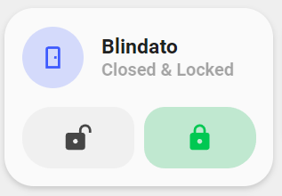

<!-- markdownlint-disable MD046 -->

# Custom-card "Minimal Door Lock"

This is a `custom-card` that shows the currenct state of your Lock and allows you to open and close it showing the state with a Minimal Design.



## Credits

Author: Nik - 2022 Version: 1.0.0

## Changelog

<details>
<summary>1.0.0</summary>
Initial release
</details>

## Requirements

To have the Minimalist cards and custom cards installed

## Usage

```yaml

- type: "custom:button-card"
  template: custom_card_nik_door
  entity: sensor.nuki_blindato_door_security_state
  variables:
    ulm_custom_card_entity_1_name: Blindato
    ulm_custom_card_entity_1_lock: lock.nuki_blindato_lock
```

## Variables

<table>
<thead>
  <tr>
    <th>Variable</th>
    <th>Example</th>
    <th>Required</th>
    <th>Explanation</th>
  </tr>
</thead>
<tbody>
  <tr>
    <td>ulm_custom_card_entity_1_name</td>
    <td>sensor.nuki_blindato_door_security_state</td>
    <td>Yes</td>
    <td>Your Door Name</td>
  </tr>
  <tr>
    <td>ulm_custom_card_entity_1_lock</td>
    <td>lock.nuki_blindato_lock</td>
    <td>Yes</td>
    <td>Your Door Lock entity</td>
  </tr>
  <tr>
    <td>entity</td>
    <td>sensor.nuki_blindato_door_security_state</td>
    <td>Yes</td>
    <td>Your door sensor to track "Open" and "Close" state.</td>
  </tr>
</tbody>
</table>

## Template Code

??? note "Template Code"

    ```yaml title="custom_card_nik_door.yaml"
    --8<-- "custom_cards/custom_card_nik_door/custom_card_nik_door.yaml"
    ```
