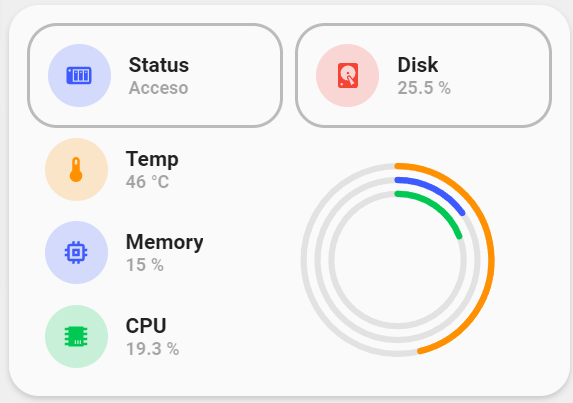

<!-- markdownlint-disable MD046 -->

# Custom-card "Nas Summary Card"

This is a `custom-card` that shows you a summary for your NAS with sensors, Wake on Lan and collapsed info. Once the NAS is off or unavailable it collapses the info.




## Credits

Author: Nik - 2022
Version: 1.0.0

## Changelog

<details>
<summary>1.0.0</summary>
Initial release
</details>

## Requirements

To have the Minimalist cards and custom cards installed

## Usage

```yaml
- type: "custom:button-card"
    template: "custom_card_nik_nas"
    entity: switch.qnap_wol
    variables:
      graph_span: "1d"
      chart_type: "radialBar"
      entity_1:
        entity_id: "sensor.nas_cpu_temperature"
        icon: ''
        name: "Temp"
        color: "yellow"
        max_value: 100
      entity_2:
        entity_id: "sensor.nas_memory_usage"
        icon: ''
        name: "Memory"
        color: "blue"
        max_value: 100
      entity_3:
        entity_id: "sensor.nas_cpu_usage"
        icon: ''
        name: "CPU"
        color: "green"
        max_value: 100
      entity_4:
        entity_id: "sensor.disk_use_percent"
        icon: "mdi:harddisk"
        name: "Disk"
        color: "red"
```

## Variables

<table>
<thead>
  <tr>
    <th>Variable</th>
    <th>Example</th>
    <th>Required</th>
    <th>Explanation</th>
  </tr>
</thead>
<tbody>
  <tr>
    <td>entity</td>
    <td>switch.qnap_wol</td>
    <td>yes</td>
    <td>The Switch to turn On or Off the NAS</td>
  </tr>
  <tr>
    <td>chart_type</td>
    <td>line, scatter, pie, donut or radialBar</td>
    <td>yes</td>
    <td>The chart type you want to display</td>
  </tr>
  <tr>
    <td>graph_span</td>
    <td>1h, 12min, 1d, 1h25, 10sec, ...</td>
    <td>yes</td>
    <td>The span of the graph as a time interval</td>
  </tr>
  <tr>
    <td>entity_id</td>
    <td>sensor.disk_use_percent</td>
    <td>yes</td>
    <td>Entity sensor of choice. 4 entities must be added</td>
  </tr>
  <tr>
    <td>icon</td>
    <td>mdi:cpu-64-bit</td>
    <td>no</td>
    <td>mdi icon you want to be exposed in the img_cell, '' will return entity.attributes.icon </td>
  </tr>
  <tr>
    <td>name</td>
    <td>name for the used sensor</td>
    <td>no</td>
    <td>'' will return entity.attributes.friendly_name</td>
  </tr>
  <tr>
    <td>color</td>
    <td>green, blue, yellow, red or grey</td>
    <td>no</td>
    <td>if you don't use the color variable it will choice a random color</td>
  </tr>
  <tr>
    <td>max_value</td>
    <td>10, 300, ...</td>
    <td>no</td>
    <td>Maximum value of the sensor. Default will be 100</td>
  </tr>
</tbody>
</table>

## Template Code

```yaml
---
custom_card_nik_nas:
  variables:
    entity_1:
      entity_id:
      icon: "[[[ return entity.attributes.icon ]]]"
      name: "[[[ return entity.attributes.friendly_name ]]]"
      color: >
        [[[
          var colors = ["yellow", "blue", "red", "green"];
          var color = colors[Math.floor(Math.random() * colors.length)];
          return color;
        ]]]
    entity_2:
      entity_id:
      icon: "[[[ return entity.attributes.icon  ]]]"
      name: "[[[ return entity.attributes.friendly_name ]]]"
      color: >
        [[[
          var colors = ["yellow", "blue", "red", "green"];
          var color = colors[Math.floor(Math.random() * colors.length)];
          return color;
        ]]]
    entity_3:
      entity_id:
      icon: "[[[ return entity.attributes.icon  ]]]"
      name: "[[[ return entity.attributes.friendly_name ]]]"
      color: >
        [[[
          var colors = ["yellow", "blue", "red","green"];
          var color = colors[Math.floor(Math.random() * colors.length)];
          return color;
        ]]]
    entity_4:
      entity_id:
      icon: "[[[ return entity.attributes.icon  ]]]"
      name: "[[[ return entity.attributes.friendly_name ]]]"
      color: >
        [[[
          var colors = ["yellow", "blue", "red","green"];
          var color = colors[Math.floor(Math.random() * colors.length)];
          return color;
        ]]]
  show_name: false
  show_state: false
  show_label: false
  show_icon: false
  show_last_changed: false
  show_entity_picture: false
  styles:
    grid:
      - grid-template-areas: >
          [[[
            var areas = [];
            if (entity.state == "off" || entity.state == "unavailable") {
                areas.push("item5");
                return "\"" + areas.join("\" \"") + "\"";
            } else {
                areas.push("item4 item4");
                areas.push("item1 radial");
                areas.push("item2 radial");
                areas.push("item3 radial");
                return "\"" + areas.join("\" \"") + "\"";
            }
          ]]]
      - grid-template-columns: >
          [[[
            if (entity.state == "off" || entity.state == "unavailable") {
                return "1fr";
            } else {
                return "35% 65%";
            }
          ]]]
      - grid-template-rows: >
          [[[
            if (entity.state == "off" || entity.state == "unavailable") {
                return "min-content";
            } else {
                return "1fr";
            }
          ]]]
    card:
      - border-radius: "var(--border-radius)"
      - box-shadow: "var(--box-shadow)"
      - padding: "12px"
    custom_fields:
      item1:
        - display: >
            [[[
              if (entity.state == "off" || entity.state == "unavailable") {
                  return "none";
              } else {
                  return "block";
              }
            ]]]
      item2:
        - display: >
            [[[
              if (entity.state == "off" || entity.state == "unavailable") {
                  return "none";
              } else {
                  return "block";
              }
            ]]]
      item3:
        - display: >
            [[[
              if (entity.state == "off" || entity.state == "unavailable") {
                  return "none";
              } else {
                  return "block";
              }
            ]]]
      item4:
        - display: >
            [[[
              if (entity.state == "off" || entity.state == "unavailable") {
                  return "none";
              } else {
                  return "block";
              }
            ]]]
      item5:
        - display: >
            [[[
              if (entity.state == "off" || entity.state == "unavailable") {
                  return "block";
              } else {
                  return "none";
              }
            ]]]
      radial:
        - display: >
            [[[
              if (entity.state == "off" || entity.state == "unavailable") {
                  return "none";
              } else {
                  return "block";
              }
            ]]]
  custom_fields:
    item1:
      card:
        type: "custom:button-card"
        entity: "[[[ return variables.entity_1.entity_id ]]]"
        icon: "[[[ return variables.entity_1.icon ]]]"
        name: "[[[ return variables.entity_1.name ]]]"
        template: "card_generic_swap"
        styles:
          icon:
            - color: "[[[ return `rgba(var(--color-${variables.entity_1.color}), 1)`;]]]"
          img_cell:
            - background-color: "[[[ return `rgba(var(--color-${variables.entity_1.color}), 0.20)`;]]]"
          card:
            - box-shadow: "none"
            - border-radius: "none"
            - padding-top: "1px"
            - padding-bottom: "1px"
    item2:
      card:
        type: "custom:button-card"
        entity: "[[[ return variables.entity_2.entity_id ]]]"
        icon: "[[[ return variables.entity_2.icon ]]]"
        name: "[[[ return variables.entity_2.name ]]]"
        template: "card_generic_swap"
        styles:
          icon:
            - color: "[[[ return `rgba(var(--color-${variables.entity_2.color}), 1)`;]]]"
          img_cell:
            - background-color: "[[[ return `rgba(var(--color-${variables.entity_2.color}), 0.20)`;]]]"
          card:
            - box-shadow: "none"
            - border-radius: "none"
            - padding-top: "1px"
            - padding-bottom: "1px"
    item3:
      card:
        type: "custom:button-card"
        entity: "[[[ return variables.entity_3.entity_id ]]]"
        icon: "[[[ return variables.entity_3.icon ]]]"
        name: "[[[ return variables.entity_3.name ]]]"
        template: "card_generic_swap"
        styles:
          icon:
            - color: "[[[ return `rgba(var(--color-${variables.entity_3.color}), 1)`;]]]"
          img_cell:
            - background-color: "[[[ return `rgba(var(--color-${variables.entity_3.color}), 0.20)`;]]]"
          card:
            - box-shadow: "none"
            - border-radius: "none"
            - padding-top: "1px"
            - padding-bottom: "1px"
    item4:
      card:
        type: "horizontal-stack"
        cards:
          - type: "custom:button-card"
            template: "card_input_boolean"
            entity: "[[[ return entity.entity_id]]]"
            icon: "mdi:nas"
            name: "Status"
            styles:
              card:
                - background-color: "transparent"
                - box-shadow: "none"
                - border: "2px solid var(--google-grey)"
            tap_action:
              action: "more-info"

          - type: "custom:button-card"
            template: "card_generic_swap"
            entity: "[[[ return variables.entity_4.entity_id ]]]"
            icon: "[[[ return variables.entity_4.icon ]]]"
            name: "[[[ return variables.entity_4.name ]]]"
            styles:
              card:
                - background-color: "transparent"
                - box-shadow: "none"
                - border: "2px solid var(--google-grey)"
              icon:
                - color: "[[[ return `rgba(var(--color-${variables.entity_4.color}), 1)`;]]]"
              img_cell:
                - background-color: "[[[ return `rgba(var(--color-${variables.entity_4.color}), 0.20)`;]]]"
            tap_action:
              action: "none"
    item5:
      card:
        type: "custom:button-card"
        template: "card_input_boolean"
        entity: "[[[ return entity.entity_id]]]"
        icon: "mdi:nas"
        name: "Status"
        styles:
          card:
            - background-color: "transparent"
            - box-shadow: "none"
            - border: "2px solid var(--google-grey)"
        tap_action:
          action: "more-info"
    radial:
      card:
        type: "custom:apexcharts-card"
        graph_span: "[[[ return variables.graph_span ]]]"
        chart_type: "[[[ return variables.chart_type ]]]"
        style: |
          ha-card {
            border-radius: "var(--border-radius)";
            box-shadow: none;
            padding-left: 10px;
            padding-bottom: 0px;
          }
        header:
          show: false
        apex_config:
          title:
            floating: false
            align: "top"
            style:
              fontSize: "2px"
              fontWeight: "bold"
          chart:
            foreColor: "rgb(148,148,148)"
            offsetY: 5
          legend:
            show: false
        series:
          - entity: "[[[ return variables.entity_1.entity_id ]]]"
            name: "[[[ return variables.entity_1_name ]]]"
            color: "[[[ return `var(--google-${variables.entity_1.color})`;]]]"
            max: "[[[ return variables.entity_1.max_value ]]]"
          - entity: "[[[ return variables.entity_2.entity_id ]]]"
            name: "[[[ return variables.entity_2_name ]]]"
            color: "[[[ return `var(--google-${variables.entity_2.color})`;]]]"
            max: "[[[ return variables.entity_2.max_value ]]]"
          - entity: "[[[ return variables.entity_3.entity_id ]]]"
            name: "[[[ return variables.entity_3_name ]]]"
            color: "[[[ return `var(--google-${variables.entity_3.color})`;]]]"
            max: "[[[ return variables.entity_3.max_value ]]]"
```
