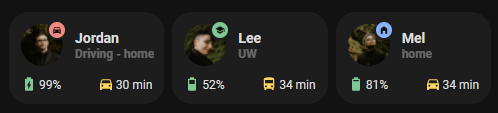

<!-- markdownlint-disable MD046 -->

## Description




The `custom_card_person_info` is an extension of `card_person`. It can also show if the user is driving, a related battery level, and a related commute time.

## Credits

- Author: Jordan Janzen <@jordandrako>
- Version: 1.0.0

## Variables

| Variable                             | Default   | Required         | Notes                                                                                                                                           |
| ------------------------------------ | --------- | ---------------- | ----------------------------------------------------------------------------------------------------------------------------------------------- |
| ulm_card_person_entity               |           | :material-check: | The person entity                                                                                                                               |
| ulm_card_person_use_entity_picture   |           | :material-close: | If you set this to true, the card shows the entity picture from your user, otherwise (set to false) shows the icon. Default is false.           |
| ulm_card_person_zone1                |           | :material-close: | Set another zone (beside "home") to use for the card. You can set up two zones besides "home".                                                  |
| ulm_card_person_zone2                |           | :material-close: | Set another zone (beside "home") to use for the card. You can set up two zones besides "home".                                                  |
| ulm_address                          |           | :material-close: | Show an address as label, add an entity with a geo location                                                                                     |
| ulm_multiline                        | false     | :material-close: | Show battery and commute sensors below state                                                                                                    |
| ulm_card_person_driving_entity       |           | :material-close: | Set a binary sensor that depicts when this person is driving                                                                                    |
| ulm_card_person_battery_entity       |           | :material-close: | Set a battery level sensor                                                                                                                      |
| ulm_card_person_battery_state_entity |           | :material-close: | Set a battery state sensor (eg the battery state sensor from the home assistant companion app will have the states "charging" or "discharging") |
| ulm_card_person_commute_entity       |           | :material-close: | Set a travel time sensor                                                                                                                        |
| ulm_card_person_cummute_icon         | "mdi:car" | :material-close: | Set an icon for the commute sensor to use                                                                                                       |

## Usage

```yaml
- type: "custom:button-card"
  template: card_person_info
  variables:
    ulm_card_person_entity: person.lee
    ulm_card_person_use_entity_picture: true
    ulm_card_person_zone1: zone.uw
    ulm_card_person_zone2: zone.store
    ulm_multiline: true
    ulm_card_person_driving_entity: binary_sensor.lee_in_car
    ulm_card_person_commute_entity: sensor.uw_commute
    ulm_card_person_commute_icon: mdi:bus
    ulm_card_person_battery_entity: sensor.lees_phone_battery_level
    ulm_card_person_battery_state_entity: sensor.lees_phone_battery_state
```

## Template Code

```yaml
---
card_person_info:
  template:
    - "icon_info_bg"
    - "ulm_language_variables"
  variables:
    ulm_card_person_use_entity_picture: false
    ulm_card_person_zone1: ""
    ulm_card_person_zone2: ""
    ulm_address: ""
    ulm_card_person_driving_entity: ""
    ulm_card_person_battery_entity: ""
    ulm_card_person_battery_state_entity: ""
    ulm_card_person_commute_entity: ""
    ulm_card_person_cummute_icon: "mdi:car"
    ulm_multiline: false
  triggers_update: "all"
  tap_action:
    action: "more-info"
    entity: "[[[ return variables.ulm_card_person_entity; ]]]"
  show_label: true
  show_name: true
  label: >
    [[[
      if (variables.ulm_address !== ''){
        return states[variables.ulm_address].state;
      } else if (states[variables.ulm_card_person_driving_entity].state === "on") {
        let state = states[variables.ulm_card_person_entity].state;
        return `Driving - ${variables["ulm_person_state_" + state] ? variables["ulm_person_state_" + state] : state}`;
      } else {
        let state = states[variables.ulm_card_person_entity].state;
        return variables["ulm_person_state_" + state] ? variables["ulm_person_state_" + state] : state;
      }
    ]]]
  name: "[[[ return states[variables.ulm_card_person_entity].attributes.friendly_name ]]]"
  entity: "[[[ return variables.ulm_card_person_entity; ]]]"
  icon: "mdi:face-man"
  show_entity_picture: "[[[ return variables.ulm_card_person_use_entity_picture ]]]"
  entity_picture:
    "[[[ return variables.ulm_card_person_use_entity_picture != false ? states[variables.ulm_card_person_entity].attributes.entity_picture\
    \ : null ]]]"
  styles:
    grid:
      - grid-template-areas: >
          [[[
            return variables.ulm_multiline
              ? "'i n' 'i l' 'battery commute'"
              : "'i n battery' 'i l commute'"
          ]]]
      - grid-template-columns: >
          [[[
            return variables.ulm_multiline
              ? "min-content auto"
              : "min-content auto min-content"
          ]]]
      - grid-template-rows: "min-content min-content"
    icon:
      - color: "rgba(var(--color-theme),0.9)"
      - width: >
          [[[
            if (variables.ulm_card_person_use_entity_picture !== true){
              return "20px";
            } else {
              return "42px";
            }
          ]]]
      - place-self: >
          [[[
            if (variables.ulm_card_person_use_entity_picture !== true){
              return "center";
            } else {
              return "stretch stretch";
            }
          ]]]
    custom_fields:
      notification:
        - border-radius: "50%"
        - position: "absolute"
        - left: "38px"
        - top: "8px"
        - height: "16px"
        - width: "16px"
        - border: "2px solid var(--card-background-color)"
        - font-size: "12px"
        - line-height: "14px"
        - background-color: >
            [[[
              if (states[variables.ulm_card_person_driving_entity].state === "on") {
                return "rgba(var(--color-red),1)";
              } else if (states[variables.ulm_card_person_entity].state !== 'home') {
                return "rgba(var(--color-green),1)";
              } else {
                return "rgba(var(--color-blue),1)";
              }
            ]]]
      battery:
        - align-self: "middle"
        - justify-self: "start"
        - display: "flex"
        - align-items: "center"
        - margin-top: >
            [[[
              return variables.ulm_multiline ? "6px" : "0"
        - font-size: "12px"
      commute:
        - align-self: "middle"
        - justify-self: "end"
        - display: "flex"
        - align-items: "center"
        - margin-top: "6px"
        - font-size: "12px"

  custom_fields:
    notification: >
      [[[
        if (states[variables.ulm_card_person_driving_entity].state === "on") {
          var icon = 'mdi:car'
          return '<ha-icon icon="' + icon + '" style="width: 10px; height: 10px; color: var(--primary-background-color);"></ha-icon>';
        } else if (states[variables.ulm_card_person_entity].state !== 'home') {
          if (states[variables.ulm_card_person_entity].state === states[variables.ulm_card_person_zone1]?.attributes?.friendly_name) {
            var icon = states[variables.ulm_card_person_zone1].attributes.icon !== null ? states[variables.ulm_card_person_zone1].attributes.icon : 'mdi:help-circle'
            return '<ha-icon icon="' + icon + '" style="width: 10px; height: 10px; color: var(--primary-background-color);"></ha-icon>';
          } else if (states[variables.ulm_card_person_entity].state === states[variables.ulm_card_person_zone2]?.attributes?.friendly_name) {
            var icon = states[variables.ulm_card_person_zone2].attributes.icon !== null ? states[variables.ulm_card_person_zone2].attributes.icon : 'mdi:help-circle'
            return '<ha-icon icon="' + icon + '" style="width: 10px; height: 10px; color: var(--primary-background-color);"></ha-icon>';
          } else {
            return '<ha-icon icon="mdi:home-minus" style="width: 10px; height: 10px; color: var(--primary-background-color);"></ha-icon>';
          }
        } else {
          return '<ha-icon icon="mdi:home-variant" style="width: 10px; height: 10px; color: var(--primary-background-color);"></ha-icon>';
        }
      ]]]

    battery: >
      [[[
        if (states[variables.ulm_card_person_battery_entity]?.state) {
          var battery = states[variables.ulm_card_person_battery_entity]?.state;
          var charging = states[variables.ulm_card_person_battery_state_entity]?.state === "charging";
          var iconBase = charging ? "mdi:battery-charging" : "mdi:battery"
          var roundedBattery = Math.ceil(battery / 10) * 10;
          var icon = roundedBattery === 100 ? iconBase : `${iconBase}-${roundedBattery}`;
          var foo = "mdi:battery"
          var color = "rgba(var(--color-green),1)";
          if (battery <= 50) {
            color = "rgba(var(--color-yellow),1)"
          } else if (battery <= 25) {
            color = "rgba(var(--color-red),1)"
          }
          return `
            <ha-icon icon="${icon}" style="width: 16px; height: 16px; font-size: 14px; color: ${color}; margin: 0 2px 0 0"></ha-icon>
            <span style="padding-top: 6px;">${battery}%</span>
          `;
        }
      ]]]
    commute: >
      [[[
        if (states[variables.ulm_card_person_commute_entity]?.state) {
          var icon = variables.ulm_card_person_commute_icon || "mdi:car";
          var commute = states[variables.ulm_card_person_commute_entity]?.state;
          var color = "rgba(var(--color-green),1)";
          if (commute >= 30) {
            color = "rgba(var(--color-yellow),1)"
          }
          if (commute >= 60) {
            color = "rgba(var(--color-red),1)"
          }
          return `
            <ha-icon icon="${icon}" style="width: 16px; height: 16px; font-size: 14px; color: ${color}; margin: 0 2px 0 0"></ha-icon>
            <span style="padding-top: 6px;">${commute} min</span>
          `;
        }
      ]]]
```
