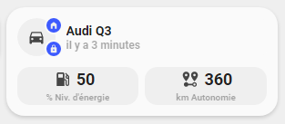

<!-- markdownlint-disable MD046 -->

# Custom-card "Car"

This is a `custom-card` to informations about your car.



_NB : This card has only been tested with Audi Connect integration but should work with some others._

## Credits

Author: schumijo - 2021
Version: 1.0.0

## Changelog

<details>
<summary>1.0.0</summary>
Initial release
</details>

## Usage

```yaml
- type: "custom:button-card"
  template: custom_card_schumijo_car
  variables:
    ulm_card_schumijo_car_name: "Audi Q3"
    ulm_card_schumijo_car_tracker: device_tracker.audi_q3_position
    ulm_card_schumijo_car_lock: lock.audi_q3_door_lock
    ulm_card_schumijo_car_energy_level: sensor.audi_q3_tank_level
    ulm_card_schumijo_car_range: sensor.audi_q3_range
```

#### Variables

<table>
<tr>
<th>Variable</th>
<th>Example</th>
<th>Required</th>
<th>Explanation</th>
</tr>
<tr>
<td>ulm_card_schumijo_car_name</td>
<td>Audi Q3</td>
<td>yes</td>
<td>The name of your car</td>
</tr>
<tr>
<td>ulm_card_schumijo_car_tracker</td>
<td>device_tracker.audi_q3_position</td>
<td>yes</td>
<td>A device_tracker entity of your car</td>
</tr>
<tr>
<td>ulm_card_schumijo_car_lock</td>
<td>lock.audi_q3_door_lock</td>
<td>yes</td>
<td>A lock entity of your car</td>
</tr>
<tr>
<td>ulm_card_schumijo_car_energy_level</td>
<td>sensor.audi_q3_tank_level</td>
<td>yes</td>
<td>A sensor entity that represents energy level of your car (can be fuel or electric)</td>
</tr>
<tr>
<td>ulm_card_schumijo_car_range</td>
<td>sensor.audi_q3_range</td>
<td>yes</td>
<td>A sensor entity that represents range of your car</td>
</tr>
</table>

## Template code

```yaml
---
widget_icon_state:
  tap_action:
    action: "none"
  layout: "icon_state"
  show_state: true
  show_units: false
  styles:
    grid:
      - grid-template-areas: "'i s' 'n n'"
      - grid-template-columns: "45% 55%"
    card:
      - box-shadow: "none"
      - padding: "0px"
      - background-color: "rgba(var(--color-theme),0.05)"
      - border-radius: "14px"
      - place-self: "center"
      - height: "42px"
    name:
      - font-weight: "bold"
      - font-size: "10px"
      - filter: "opacity(40%)"
      - margin-bottom: "2px"
    state:
      - justify-self: "start"
      - margin-left: "5px"
      - font-size: "18px"
      - font-weight: 600
    icon:
      - color: "rgba(var(--color-theme),0.9)"
    img_cell:
      - justify-content: "right"
  size: "20px"
  color: "var(--google-grey)"

car:
  template:
    - "icon_info"
  tap_action:
    action: "more-info"
  show_name: true
  show_last_changed: true
  name: "[[[ return variables.ulm_card_schumijo_car_name ]]]"
  entity: "[[[ return entity.entity_id ]]]"
  icon: "mdi:car"
  styles:
    icon:
      - color: "rgba(var(--color-theme),0.9)"
      - width: "20px"
      - place-self: "center"
    custom_fields:
      tracker:
        - border-radius: "50%"
        - position: "absolute"
        - left: "30px"
        - top: "-2px"
        - height: "16px"
        - width: "16px"
        - border: "2px solid var(--card-background-color)"
        - font-size: "12px"
        - line-height: "14px"
        - background-color: >
            [[[
              if (states[variables.ulm_card_schumijo_car_tracker].state != 'home'){
                return "rgba(var(--color-green),1)";
              } else {
                return "rgba(var(--color-blue),1)";
              }
            ]]]
      lock:
        - border-radius: "50%"
        - position: "absolute"
        - left: "30px"
        - top: "24px"
        - height: "16px"
        - width: "16px"
        - border: "2px solid var(--card-background-color)"
        - font-size: "12px"
        - line-height: "14px"
        - background-color: >
            [[[
              if (states[variables.ulm_card_schumijo_car_lock].state != 'locked'){
                return "rgba(var(--color-red),1)";
              } else {
                return "rgba(var(--color-blue),1)";
              }
            ]]]
  custom_fields:
    tracker: >
      [[[
        if (states[variables.ulm_card_schumijo_car_tracker].state != 'home'){
          return '<ha-icon icon="mdi:road-variant" style="width: 10px; height: 10px; color: var(--primary-background-color);"></ha-icon>';
        } else {
          return '<ha-icon icon="mdi:home-variant" style="width: 10px; height: 10px; color: var(--primary-background-color);"></ha-icon>';
        }
      ]]]
    lock: >
      [[[
        if (states[variables.ulm_card_schumijo_car_lock].state != 'locked'){
          return '<ha-icon icon="mdi:lock-open" style="width: 10px; height: 10px; color: var(--primary-background-color);"></ha-icon>';
        } else {
          return '<ha-icon icon="mdi:lock" style="width: 10px; height: 10px; color: var(--primary-background-color);"></ha-icon>';
        }
      ]]]

custom_card_schumijo_car:
  template:
    - "ulm_custom_card_schumijo_car_language_variables"
  variables:
    ulm_card_schumijo_car_name: "n/a"
  show_icon: false
  show_name: false
  show_label: false
  styles:
    grid:
      - grid-template-areas: "'item1' 'item2'"
      - grid-template-columns: "1fr"
      - grid-template-rows: "min-content min-content"
      - row-gap: "12px"
    card:
      - border-radius: "var(--border-radius)"
      - box-shadow: "var(--box-shadow)"
      - padding: "12px"
  custom_fields:
    item1:
      card:
        type: "custom:button-card"
        template: "car"
        entity: "[[[ return variables.ulm_card_schumijo_car_tracker ]]]"
        variables:
          ulm_card_schumijo_car_tracker: "[[[ return variables.ulm_card_schumijo_car_tracker ]]]"
          ulm_card_schumijo_car_name: "[[[ return variables.ulm_card_schumijo_car_name ]]]"
          ulm_card_schumijo_car_lock: "[[[ return variables.ulm_card_schumijo_car_lock ]]]"
    item2:
      card:
        template: "list_2_items"
        type: "custom:button-card"
        custom_fields:
          item1:
            card:
              type: "custom:button-card"
              template: "widget_icon_state"
              entity: "[[[ return variables.ulm_card_schumijo_car_energy_level ]]]"
              state_display: >
                [[[
                  return parseFloat(states[variables.ulm_card_schumijo_car_energy_level].state).toFixed(0);
                ]]]
              name: "[[[ return states[variables.ulm_card_schumijo_car_energy_level].attributes.unit_of_measurement + ' ' + variables.ulm_custom_card_schumijo_car_energy_level\
                \ ]]]"
          item2:
            card:
              type: "custom:button-card"
              template: "widget_icon_state"
              entity: "[[[ return variables.ulm_card_schumijo_car_range ]]]"
              state_display: >
                [[[
                  return parseFloat(states[variables.ulm_card_schumijo_car_range].state).toFixed(0);
                ]]]
              name: "[[[ return states[variables.ulm_card_schumijo_car_range].attributes.unit_of_measurement + ' ' + variables.ulm_custom_card_schumijo_car_range\
                \ ]]]"


```
