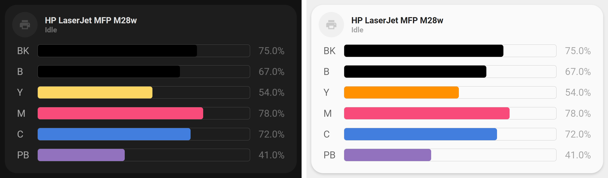

<!-- markdownlint-disable MD046 -->

# Custom-card "Printer"

{ width="650" }

This is the `custom_card_sisimomo_printer`, used to show the state of a printer including, if wanted, ink sensors.
The card has support any number of ink sensors under the state of the printer. These can be configured using custom colors and labels.

## Credits

Author: [Sisimomo](https://github.com/sisimomo) (based on [hiddevanbrussel pictures](https://community.home-assistant.io/t/lovelace-ui-minimalist/322687/203))
Version: 0.1.0

## Changelog

<details>
  <summary>0.1.0</summary>
  Initial release.
</details>

## Card options

| Options      | Required         | Notes          |
|--------------|------------------|----------------|
| entity       | :material-check: | The entity_id for the large card |

## Variables

| Variable                               | Required         | Notes          |
|----------------------------------------|------------------|----------------|
| printer_name                           | :material-close: | If not provide, will use the friendly name of the provided entity |
| cartridges                             | :material-close: | A list of  `Cartridge entity` object (see below) |

## Cartridge entity

|  Variable  | Required         | Notes          | Requirement |
|------------|------------------|----------------|-------------|
| label      | :material-check: | The label for the ink sensor. For better aesthetic, keep this string short eg: "BK", "Y", "M", "C", "PB" |  |
| entity_id  | :material-check: | The entity_id of the ink sensor | Must be a value between 0-100 (percentage) |
| color      | :material-close: | The color of the ink bar | Must be a [CSS Legal Color Value](https://www.w3schools.com/cssref/css_colors_legal.asp).  |

## Usage

```yaml
- type: "custom:button-card"
  template: "custom_card_sisimomo_printer"
  entity: sensor.hp_printer_status
  variables:
    printer_name: HP LaserJet MFP M28w
    cartridges:
      - label: "BK"
        entity: sensor.printer_black_ink
        color: "black"
      - label: "B"
        entity: sensor.printer_photo_black_ink
        color: "black"
      - label: "Y"
        entity: sensor.printer_yellow_ink
        color: "rgba(var(--color-yellow), 1)"
      - label: "M"
        entity: sensor.printer_magenta_ink
        color: "#F84B7A"
      - label: "C"
        entity: sensor.printer_cyan_ink
        color: "#427EDE"
      - label: "PB"
        entity: sensor.printer_photo_blue_ink
        color: "#9272BE"
```

## Template code

??? note "Template Code"

    ```yaml title="custom_card_sisimomo_printer.yaml"
    --8<-- "custom_cards/custom_card_sisimomo_printer/custom_card_sisimomo_printer.yaml"
    ```
