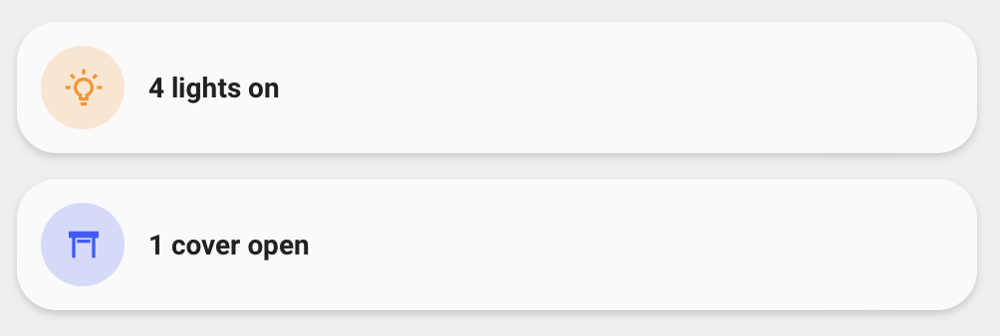
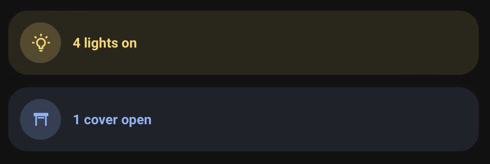

<!-- markdownlint-disable MD046 -->

# Custom-card "Counter Lights/Cover Card"

This is a `custom-card` to display number of lights on or covers open.




## Credits

Author: yagrasdemonde - 04/2022

Version: 1.0.0

## Changelog

<details>
<summary>1.0.0</summary>
Initial release.
</details>

## Requirements

This card needs sensor counting lights/covers you want:

```yaml
template:
  - sensor:
    - name: "lights on"
      unique_id: lights_on
      icon: mdi:lightbulb-on-outline
      state: >
        
        {{ lights | selectattr('state','eq','on') | list | count }}
    - name: "covers open"
      unique_id: covers_open
      icon: mdi:window-shutter-open
      state: >
        
        {{ covers | selectattr('state','eq','open') | list | count }}
```

## Usage

For lights

```yaml
- type: "custom:button-card"
  template: custom_card_yagrasdemonde_lights_count
  entity: sensor.lights_on
```

For covers

```yaml
- type: "custom:button-card"
  template: custom_card_yagrasdemonde_lights_count
  entity: sensor.covers_open
  variables:
    ulm_custom_card_yagrasdemonde_lights_count_type: "cover"
    ulm_custom_card_yagrasdemonde_lights_count_icon_off: "mdi:window-shutter"
    ulm_custom_card_yagrasdemonde_lights_count_color: "blue"
```

## Variables

<table>
<tr>
<th>Variable</th>
<th>Example</th>
<th>Required</th>
<th>Default</th>
<th>Explanation</th>
</tr>
<tr>
<td>ulm_custom_card_yagrasdemonde_lights_count_type</td>
<td>"cover"</td>
<td>No</td>
<td>"light"</td>
<td>The entity type used for translations<br>Values available : cover, light</td>
</tr>
<tr>
<td>ulm_custom_card_yagrasdemonde_lights_count_icon_on</td>
<td>"mdi:lightbulb-on-outline"</td>
<td>No</td>
<td>Sensor Icon</td>
<td>Overwrites the sensor icon used for on/open state</td>
</tr>
<tr>
<td>ulm_custom_card_yagrasdemonde_lights_count_icon_off</td>
<td>"mdi:lightbulb-outline"</td>
<td>No</td>
<td>"mdi:lightbulb-outline"</td>
<td>Icon for state off/closed</td>
</tr>
<tr>
<td>ulm_custom_card_yagrasdemonde_lights_count_color</td>
<td>"red"</td>
<td>No</td>
<td>"yellow"</td>
<td>Style the color of icon, name and card (if applicable)<br>Values available : blue, green, grey, pink, purple, red, yellow</td>
</tr>
<tr>
<td>ulm_custom_card_yagrasdemonde_lights_count_force_background_color</td>
<td>true</td>
<td>No</td>
<td>false</td>
<td>Force background card color even in light mode</td>
</tr>
</table>

<details>
<summary>Template code</summary>

```yaml
custom_card_yagrasdemonde_lights_count:
  show_name: true
  template:
    - "ulm_custom_card_yagrasdemonde_lights_count_language_variables"
    - "icon_only"
    - "ulm_language_variables"
  variables:
    ulm_custom_card_yagrasdemonde_lights_count_icon_on: "[[[ return entity.attributes.icon ]]]"
    ulm_custom_card_yagrasdemonde_lights_count_icon_off: "mdi:lightbulb-outline"
    ulm_custom_card_yagrasdemonde_lights_count_color: "yellow"
    ulm_custom_card_yagrasdemonde_lights_count_force_background_color: false
  tap_action:
    action: "none"
  name: >-
    [[[
      var entity_count_O = '';
      var entity_count_1 = '';
      var entity_count_many = '';
      if(variables.ulm_custom_card_yagrasdemonde_lights_count_type == "cover") {
        entity_count_O = variables.ulm_custom_card_yagrasdemonde_lights_count_cover_0;
        entity_count_1 = variables.ulm_custom_card_yagrasdemonde_lights_count_cover_1;
        entity_count_many = variables.ulm_custom_card_yagrasdemonde_lights_count_cover_many;
      }
      else {
        entity_count_O = variables.ulm_custom_card_yagrasdemonde_lights_count_light_0;
        entity_count_1 = variables.ulm_custom_card_yagrasdemonde_lights_count_light_1;
        entity_count_many = variables.ulm_custom_card_yagrasdemonde_lights_count_light_many;
      }
      if (entity.state != "unavailable") {
        if (entity.state == 0) {
          return entity_count_O;
        } else if (entity.state == 1) {
          return entity_count_1;
        } else {
          return entity.state + " " + entity_count_many;
        }
      } else {
        return variables.ulm_unavailable;
      }
    ]]]
  icon: >
    [[[
        if (entity.state == 0) {
          return variables.ulm_custom_card_yagrasdemonde_lights_count_icon_off;
        }
        else {
          return variables.ulm_custom_card_yagrasdemonde_lights_count_icon_on;
        }
    ]]]
  styles:
    icon:
      - color: >
          [[[
              if (entity.state == 0) {
                return 'rgba(var(--color-theme),0.2)';
              }
              else {
                return 'rgba(var(--color-' + variables.ulm_custom_card_yagrasdemonde_lights_count_color + '),1)';
              }
          ]]]
    name:
      - align-self: "center"
      - justify-self: "start"
      - font-weight: "bold"
      - font-size: "14px"
      - margin-left: "12px"
      - filter: "opacity(100%)"
    img_cell:
      - background-color: >
          [[[
              if (entity.state == 0) {
                return 'rgba(var(--color-theme),0.05)';
              }
              else {
                return 'rgba(var(--color-' + variables.ulm_custom_card_yagrasdemonde_lights_count_color + '),0.2)';
              }
          ]]]
    grid:
      - grid-template-areas: "'i n'"
      - grid-template-columns: "min-content min-content"
      - grid-template-rows: "min-content"
  state:
    - value: 1
      operator: '>='
      styles:
        card:
          - background-color: >-
              [[[
                  if (variables.ulm_custom_card_yagrasdemonde_lights_count_force_background_color == true || hass.themes.darkMode){
                    return 'rgba(var(--color-' + variables.ulm_custom_card_yagrasdemonde_lights_count_color + '-text),0.1)';
                  }
                  else {
                    return 'rgba(var(--color-background-' + variables.ulm_custom_card_yagrasdemonde_lights_count_color + '),var(--opacity-bg))';
                  }
              ]]]
        name:
          - color: "[[[ return 'rgba(var(--color-' + variables.ulm_custom_card_yagrasdemonde_lights_count_color + '-text),1)' ]]]"
```

</details>
