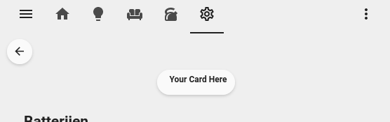
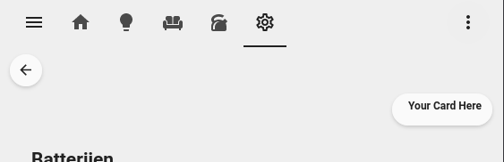
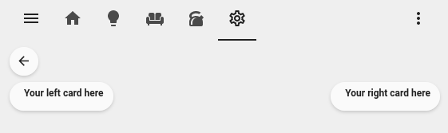

## Aligning cards

If you want to alight cards to the center, right. Or only 1 card on the right it can be done using a `blank-card`.

<!-- markdownlint-disable -->
??? note "Center"

    { align=right width=40% }

    ```yaml
    # Card in the Center
    horizontal_stack:
      cards:
        - type: "custom:button-card"
          color_type: blank-card

        - type: custom:button-card
          template: chip_icon_label
          label: Your Card Here

        - type: "custom:button-card"
          color_type: blank-card
    ```

??? note "Right"

    { align=right width=40% }

    ```yaml
    # Card in the Center
    horizontal_stack:
      cards:
        - type: "custom:button-card"
          color_type: blank-card

        - type: custom:button-card
          template: chip_icon_label
          label: Your Card Here
    ```

??? note "Left & Right"

    { align=right width=40% }

    ```yaml
    # Card in the Center
    horizontal_stack:
      cards:
        - type: custom:button-card
          template: chip_icon_label
          label: Your left card here

        - type: "custom:button-card"
          color_type: blank-card

        - type: custom:button-card
          template: chip_icon_label
          label: Your right card here
    ```
<!-- markdownlint-enable -->
