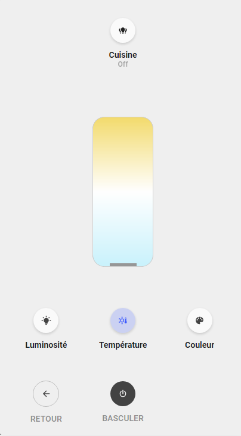
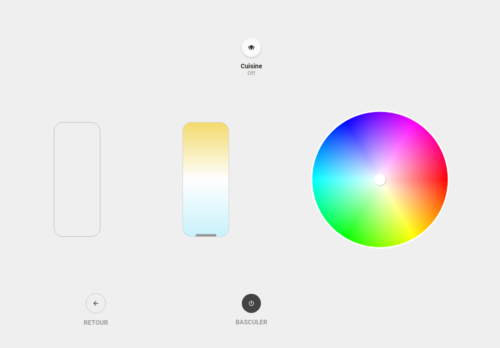

<!-- markdownlint-disable MD046 -->

### Light popup

{ width="500" }
{ width="500" }

#### Requirements

- My Cards Bundle aka slider-card (download for HACS)
- Light Entity Card (download for HACS)

##### Card compatibility

This popup is displayed using ``hold_action`` and it is compatible with the following cards/chips :

- card_light

##### How to use

To enable this popup, add the variable ``ulm_card_light_enable_popup`` and set to ``true``.

!!! warning
    This is a different approach as the other `popup_cards` use.

For example :

```yaml
- type: "custom:button-card"
  template:
    - card_light
  entity: light.cuisine
  variables:
    ulm_card_light_enable_popup: true
```

## Credits

- Designed by schumijo and bavo (special thanks to him for his help on this development)).
