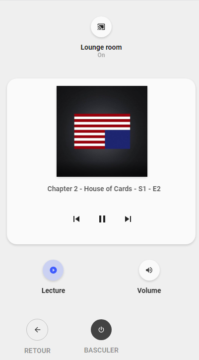
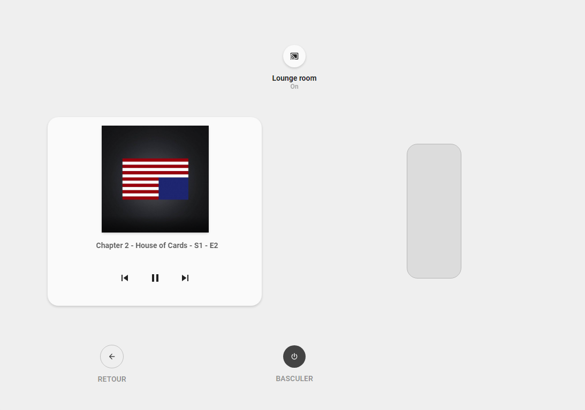

<!-- markdownlint-disable MD046 -->

### Media Player popup

{ width="500" }
{ width="500" }

#### Card compatibility

This popup is displayed using ``hold_action`` and it is compatible with the following cards/chips :

- card_media_player

#### How to use

To enable this popup, you need to add the ``popup_media_player`` template on your card.

For example :

```yaml
- type: "custom:button-card"
  template:
    - card_media_player
    - popup_media_player
  entity: media_player.lounge_room
```

## Credits

- Designed by schumijo and bavo (special thanks to him for his help on this development)).
