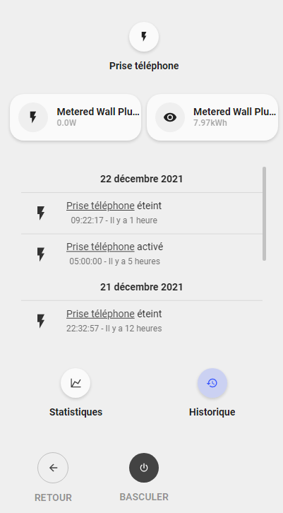
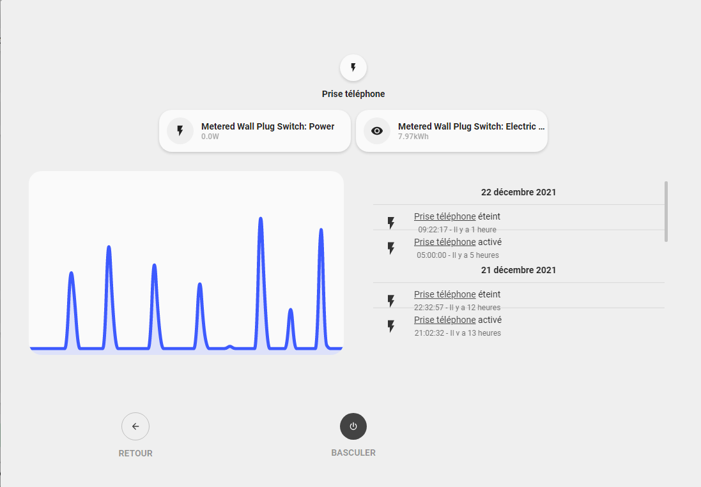

<!-- markdownlint-disable MD046 -->

### Power outlet popup

{ width="500" }
{ width="500" }

#### Requirements

- mini-graph-card (download for HACS)

##### Card compatibility

This popup is displayed using ``hold_action`` and it is compatible with the following cards/chips :

- card_generic
- card_generic_swap
- card_binary_sensor
- card_binary_sensor_alert
- card_power_outlet
- card_input_boolean
- card_battery

##### Variables

<table>
  <tr>
    <th>Variable</th>
    <th>Example</th>
    <th>Required</th>
    <th>Explanation</th>
  </tr>
  <tr>
    <td>ulm_popup_power_outlet_sensor1</td>
    <td>sensor.metered_power</td>
    <td>yes</td>
    <td>Sensor entity displayed on top left button</td>
  </tr>
  <tr>
    <td>ulm_popup_power_outlet_sensor2</td>
    <td>sensor.metered_electric_consumed</td>
    <td>yes</td>
    <td>Sensor entity displayed on top right button</td>
  </tr>
  <tr>
    <td>ulm_popup_power_outlet_graph_sensor</td>
    <td>sensor.metered_power</td>
    <td>yes</td>
    <td>Sensor entity displayed on graph</td>
  </tr>
</table>

##### How to use

To enable this popup, you need to add the ``popup_power_outlet`` template on your card. And also the previously explained variables.

For example :

```yaml
- type: "custom:button-card"
  template:
    - card_power_outlet
    - popup_power_outlet
  variables:
    ulm_card_power_outlet_consumption_sensor: sensor.metered_wall_plug_switch_power_3
    ulm_popup_power_outlet_sensor1: sensor.metered_wall_plug_switch_power_3
    ulm_popup_power_outlet_sensor2: sensor.metered_wall_plug_switch_electric_consumed_kwh_2
    ulm_popup_power_outlet_graph_sensor: sensor.metered_wall_plug_switch_power_3
  entity: switch.metered_wall_plug_switch_2
  name: Prise téléphone
```

## Credits

- Designed by schumijo and bavo (special thanks to him for his help on this development)).
