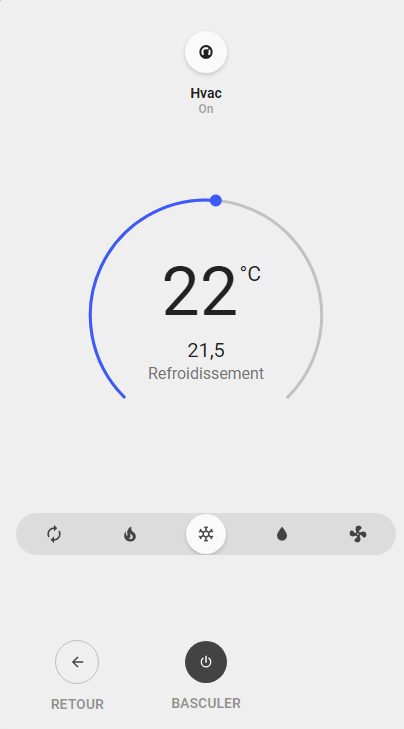

<!-- markdownlint-disable MD046 -->

### Thermostat popup

{ width="500" }

##### Card compatibility

This popup is displayed using ``hold_action`` and it is compatible with the following cards/chips :

- card_thermostat

##### How to use

To enable this popup, add the variable ``ulm_card_thermostat_enable_popup`` and set to ``true``.

!!! warning
    This is a different approach as the other `popup_cards` use.

For example :

```yaml
- type: "custom:button-card"
  template: card_thermostat
  entity: climate.thermostat
  variables:
    ulm_card_thermostat_enable_popup: true
```

## Credits

- Designed by schumijo
