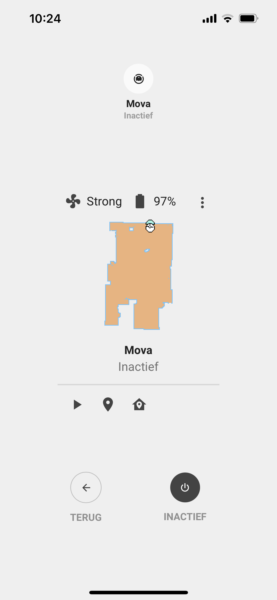
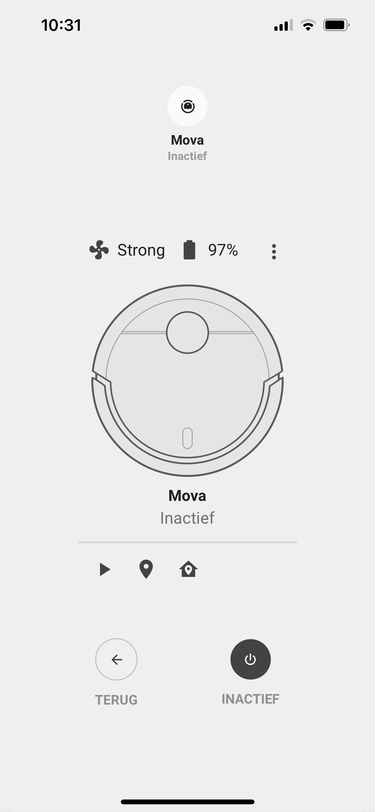

<!-- markdownlint-disable MD046 -->

### Vacuum popup

{ width="300" }
{ width="300" }

#### Requirements

This popup does not work without the following card from HACS:

- [Vacuum Card](https://github.com/denysdovhan/vacuum-card) (download from HACS)

##### Card compatibility

This popup is displayed using ``popup`` and it is compatible with the following cards/chips :

- card_vacuum

##### How to use

To enable this popup, add the variable ``ulm_card_vacuum_enable_popup`` and set to ``true``.

!!! warning
    This is a different approach as the other `popup_cards` use.

For example :

```yaml
- type: "custom:button-card"
  template: card_vacuum
  entity: vacuum.garage
  variables:
    ulm_card_vacuum_enable_popup: true
    uml_card_vacuum_camera: camera.vacuum
```

## Credits

- Designed by Basbruss
