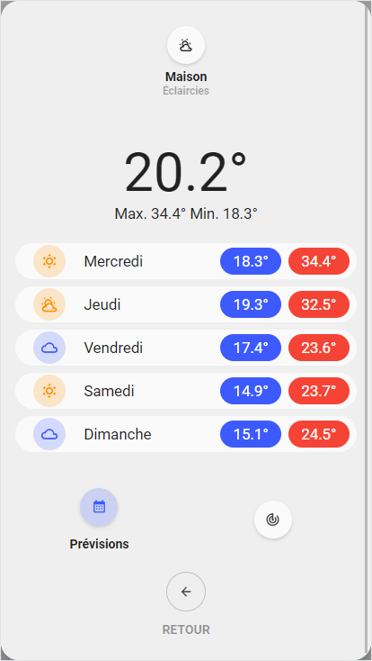
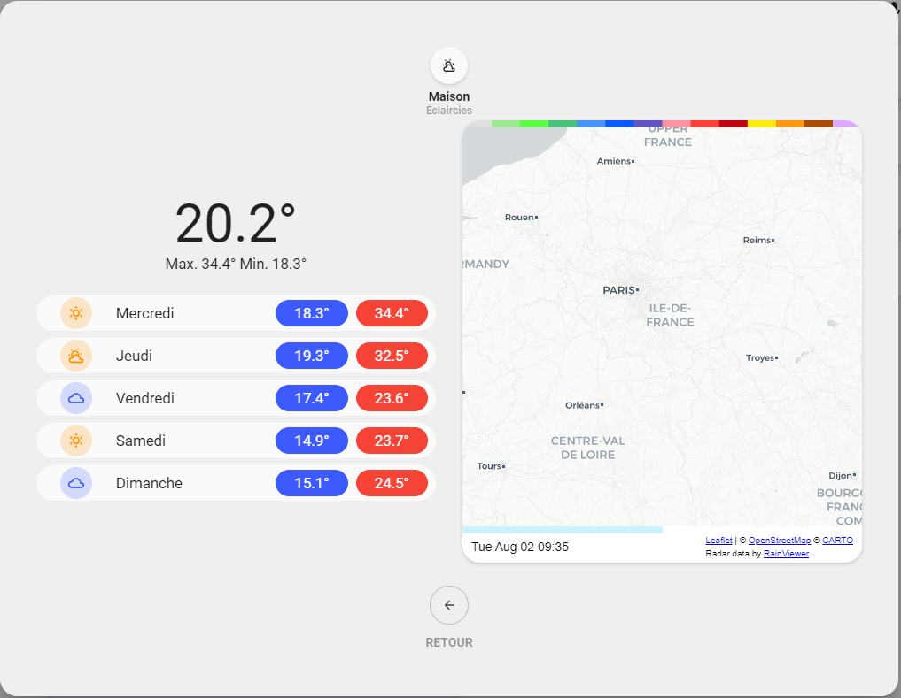

<!-- markdownlint-disable MD046 -->

### Weather popup

{ width="500" }
{ width="500" }

#### Requirements

- weather-radar-card (download for HACS)

##### How to use

To enable this popup, add the following code to your card:

```yaml
  ulm_custom_popup:
      template: "popup_weather_forecast"
      popup_variables:
          ulm_popup_weather_entity: weather.xxx
```

## Credits

- Designed by schumijo
